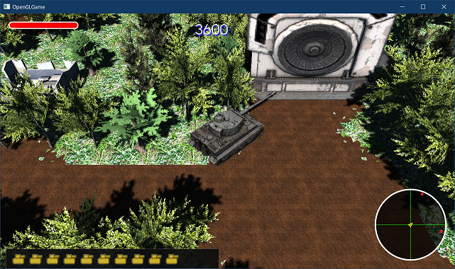

[OpenGL 3D 2021後期 第10回(マップエディタ編)]

# 死亡フラグ

## 習得目標

* 「フラグ」という考え方を理解する。
* フラグ変数を使ってゲームの動作を制御することができる。

## 1. 開閉する門(ゲート)を作る

### 1.1 ゲームマネージャにフラグ管理機能を追加する

２個目のマップ概要には、「ゲート」という要素がありました。今回はこのゲートを作成します。

<p align="center">
<br>
[白色がゲート]
</p>

ゲートは以下の性質を持ちます。

>1. 破壊不能。
>2. 近くの要塞を破壊すると開く。

「破壊不能」という性質は、オンコリジョン関数を定義しなければ自動的に達成されます。残る問題は2の「近くの要塞を破壊すると開く」という性質です。

多くのゲームでは、このような「特定の条件によってプログラムを実行する処理」を「フラグ(<ruby>旗<rt>はた</rt></ruby>)」という手法を使って管理しています。

フラグは主に`bool`型の変数として表現されます。フラグ変数を`true`にすることを「フラグを立てる」、`false`にすることを「フラグを降ろす(または下げる)))」と言います。

クラス定義でよく見かける`bool isVisible`のような変数もフラグの一種です。

次のように、フラグ変数の値を`if`文の条件にすることで処理を分岐させます。

>```c++
>if (フラグが立っている) {
>  〇〇を実行
>} else {
>  △△を実行
>}
>```

機能的には、「立っている」「降りている」の2つの状態を表現できるものならば、すべてフラグとして使えます。

例えば、`int`型を使って`0`と`0以外`で判定することもできます。整数型の1ビットごとに異なる意味のフラグを割り当てることもできます。

>ビットを使ったフラグは、必要とするメモリ量が非常に少ないため、ゲームや家電などの組み込みプログラムでよく利用されます。

さて、フラグはゲーム進行に関わるデータなので、ゲームマネージャクラスで管理することにします。

まずフラグを操作するメンバ関数を宣言します。`GameManager.h`を開き、ゲームマネージャクラスの定義に次のプログラムを追加してください。

```diff
   void UpdateUI();

   void AddScore(int n) { score += n; }
+
+  // ゲームフラグの操作
+  size_t GetGameFlagCount() const;
+  void SetGameFlagCount(size_t size);
+  bool GetGameFlag(size_t no) const;
+  void SetGameFlag(size_t no, bool value);
+  std::string GetGameFlagDesc(size_t no) const;
+  void SetGameFlagDesc(size_t no, std::string desc);

 private:
   GameManager() = default;
   ~GameManager() = default;
```

ゲームフラグの操作は以下の3種類です。

>* 「ゲームフラグ数」の取得・設定
>* 「ゲームフラグ状態」の取得・設定
>* 「ゲームフラグの説明」の取得・設定

関数名は操作をそのまま表した名前にしました。なお、`Desc`(デスク)は`description`(デスクリプション)の短縮形で、「説明、描写」という意味です。

次にフラグ変数を追加します。ゲームマネージャクラスの定義に次のプログラムを追加してください。

```diff
   int score = 0;
   size_t stageNo = 0;
+
+  // ゲームフラグ
+  struct GameFlag
+  {
+    std::string description; // 説明文
+    bool value = false; // フラグの値
+  };
+  std::vector<GameFlag> gameFlags;

   // タイトル画面の動作状態
   enum class TitleState {
```

説明文は、主にマップエディタでフラグを設定するときに使います。ゲーム実行時には説明文を使うすることはまずないでしょうが、デバッグには役に立つかもしれません。

### 1.2 フラグの数を操作するメンバ関数を定義する

それでは、宣言したメンバ関数を定義しましょう。`GameManager.cpp`を開き、アップデートタイトルユーアイ関数の定義の下に、次のプログラムを追加してください。

```diff
   // フェードアウト用の黒い平面
   GetForegroundDrawList()->AddRectFilled(screenMin, screenMax,
     ImColor(0.0f, 0.0f, 0.0f, fadeAlpha));
 }
+
+/**
+* フラグの総数を取得する
+*/
+size_t GameManager::GetGameFlagCount() const
+{
+  return gameFlags.size();
+}
+
+/**
+* フラグの総数を設定する
+*/
+void GameManager::SetGameFlagCount(size_t size)
+{
+  gameFlags.resize(size);
+}

 /**
 * プレイヤーの戦車を生成する
```

フラグの数は`vector`クラスの`size`メンバ関数と`resize`メンバ関数で制御します。

### 1.3 フラグの値を操作するメンバ関数を定義する

次にフラグの値を操作するメンバ関数を定義します。セットゲームフラグカウント関数の定義の下に、次のプログラムを追加してください。

```diff
 {
   gameFlags.resize(size);
 }
+
+/**
+* フラグの値を取得する
+*/
+bool GameManager::GetGameFlag(size_t no) const
+{
+  if (no >= gameFlags.size()) {
+    std::cerr << "[警告]" << __func__ << "添字" << no <<
+      "は範囲" << gameFlags.size() << "を超えています\n";
+    return false;
+  }
+  return gameFlags[no].value;
+}
+
+/**
+* フラグに値を設定する
+*/
+void GameManager::SetGameFlag(size_t no, bool value)
+{
+  if (no >= gameFlags.size()) {
+    std::cerr << "[警告]" << __func__ << "添字" << no <<
+      "は範囲" << gameFlags.size() << "を超えています\n";
+    return;
+  }
+  gameFlags[no].value = value;
+}

 /**
 * プレイヤーの戦車を生成する
```

基本的には`value`(バリュー)変数の値を取得、または設定するだけです。エラー対策として、添字が範囲外にある場合はエラーメッセージを出力しています。

### 1.4 フラグの説明を操作するメンバ関数を定義する

最後に、フラグの説明を操作するメンバ関数を定義します。セットゲームフラグ関数の定義の下に、次のプログラムを追加してください。

```diff
+
+/**
+* フラグの説明を取得する
+*/
+std::string GameManager::GetGameFlagDesc(size_t no) const
+{
+  if (no >= gameFlags.size()) {
+    std::cerr << "[警告]" << __func__ << "添字" << no <<
+      "は範囲" << gameFlags.size() << "を超えています\n";
+    return "";
+  }
+  return gameFlags[no].description;
+}
+
+/**
+* フラグの説明を設定する
+*/
+void GameManager::SetGameFlagDesc(size_t no, std::string desc)
+{
+  if (no >= gameFlags.size()) {
+    std::cerr << "[警告]" << __func__ << "添字" << no <<
+      "は範囲" << gameFlags.size() << "を超えています\n";
+    return;
+  }
+  gameFlags[no].description = desc;
+}

 /**
 * プレイヤーの戦車を生成する
```

値の操作と同じく最初に添字の範囲チェックを行います。その後で`description`(デスクリプション)変数の値を取得、または設定をするだけです。これでフラグを操作できるようになりました。

### 1.5 マップエディタにフラグ操作機能を追加する

マップエディタにフラグの説明を設定する機能を追加しましょう。この機能はImGuiを使って作り、アップデートユーアイ関数に追加することにします。

しかし、アップデートユーアイ関数には既に多数のプログラムが書かれていて、関数の流れが分かりにくくなってきています。これ以上プログラムを増やすと、関数を理解することがより困難になってしまいます。

そこで、フラグを操作するだけのメンバ関数を作り、それをアップデートユーアイ関数から呼び出すようにします。

それでは、フラグ操作用のメンバ関数を宣言しましょう。関数名は`ShowGameFlag`(ショウ・ゲーム・フラグ)とします。`MapEditor.h`を開き、マップエディタクラスの定義に次のプログラムを追加してください。

```diff
   void InitActorList();
   void InitEditor();
   bool ShowFileListBox(std::string& filename);
+  void ShowGameFlag();

   const SystemType systemType;             // 動作タイプ
   glm::vec2 gridSize = glm::vec2(4.0f);    // マス目のサイズ(m)
```

次に`MapEditor.cpp`を開き、ゲームマネージャヘッダをインクルードしてください。

```diff
 #include "Actor/RepairItem.h"
 #include "Actor/Boss01.h"
 #include "GameEngine.h"
+#include "GameManager.h"
 #include <imgui.h>
 #include <glm/glm.hpp>
```

そして、ショウファイルリストボックス関数の定義の下に、次のプログラムを追加してください。

```diff
     EndListBox();
   }

   return selected;
 }
+
+/**
+* ゲームフラグ管理用のGUIを表示する
+*/
+void MapEditor::ShowGameFlag()
+{
+  using namespace ImGui;
+
+  GameManager& manager = GameManager::Get();
+  static std::string gameFlagDesc;
+  static int gameFlagNo = 0;
+  static int gameFlagCount =
+    static_cast<int>(manager.GetGameFlagCount());
+
+  SetNextWindowPos(ImVec2(1000, 30), ImGuiCond_Once);
+  SetNextWindowSize(ImVec2(250, 200), ImGuiCond_Once);
+  Begin(u8"ゲームフラグ");
+
+  // ゲームフラグの選択
+
+  // 説明文の設定
+
+  // フラグ数の変更(ボタン)
+
+  // フラグ数の変更(ポップアップ)
+
+  End();
+}

 /**
 * マップエディタの状態を更新する
```

コメントにあるように、ゲームフラグ管理用GUIには4つの項目があります。ひとつずつ作成していきましょう。まず操作するゲームフラグを選択するリストボックスを表示します。

リストボックスを作成するには、`BeginListBox`(ビギン・リストボックス)と`EndListBox`(エンド・リストボックス)関数を使います。項目の表示には`Selectable`(セレクタブル)関数を使います。

ショウゲームフラグ関数に次のプログラムを追加してください。

```diff
   SetNextWindowSize(ImVec2(250, 200), ImGuiCond_Once);
   Begin(u8"ゲームフラグ");

   // ゲームフラグの選択
+  const float windowHeight =
+    GetWindowContentRegionMax().y - GetWindowContentRegionMin().y;
+  const float itemHeight = GetFrameHeightWithSpacing();
+  const ImVec2 listBoxSize(
+    -1, // 項目の幅をウィンドウに合わせる
+    windowHeight - itemHeight * 2); // 説明とボタンの領域を残す
+  if (BeginListBox("##gameFlags", listBoxSize)) {
+    const size_t size = manager.GetGameFlagCount();
+    for (int i = 0; i < size; ++i) {
+      const std::string desc = manager.GetGameFlagDesc(i);
+      char label[256];
+      snprintf(label, 255, "%04d: %s", i, desc.c_str());
+      const bool isSelected = i == gameFlagNo;
+      if (Selectable(label, isSelected)) {
+        gameFlagNo = i;
+        gameFlagDesc = desc;
+      }
+    }
+    EndListBox();
+  }

   // 説明文の設定

   // フラグ数の変更(ボタン)
```

次に、説明文を設定するGUIを追加します。テキスト入力は`InputText`(インプット・テキスト)関数で作成できます。リストボックスを表示するプログラムの下に、次のプログラムを追加してください。

```diff
     EndListBox();
   }

   // 説明文の設定
+  Text(u8"説明:");
+  SameLine();
+  SetNextItemWidth(-1); // 項目の幅をウィンドウに合わせる
+  gameFlagDesc.resize(255); // 入力用に長さを確保
+  if (InputText("##desc", gameFlagDesc.data(), gameFlagDesc.size())) {
+    gameFlagDesc.resize(gameFlagDesc.find_first_of('\0')); // 長さを戻す
+    manager.SetGameFlagDesc(gameFlagNo, gameFlagDesc);
+  }

   // フラグ数の変更(ボタン)

   // フラグ数の変更(ポップアップ)
```

続いて、フラグ数を変更するボタンを表示します。説明文を設定するプログラムの下に、次のプログラムを追加してください。

```diff
     manager.SetGameFlagDesc(gameFlagNo, gameFlagDesc);
   }

   // フラグ数の変更(ボタン)
+  if (Button(u8"最大数の変更")) {
+    maxFlags = static_cast<int>(manager.GetGameFlagCount());
+    OpenPopup(u8"最大数の変更##popup");
+  }

   // フラグ数の変更(ポップアップ)

   End();
```

このボタンを押すと、次で作成する「フラグ数を変更するポップアップウィンドウ」が開きます。フラグ数を変更するボタンを配置するプログラムの下に、次のプログラムを追加してください。

```diff
     OpenPopup(u8"最大数の変更##popup");
   }

   // フラグ数の変更(ポップアップ)
+  if (BeginPopupModal(u8"最大数の変更##popup")) {
+    InputInt("##maxFlags", &maxFlags);
+    if (Button(u8"決定")) {
+      manager.SetGameFlagCount(maxFlags);
+      CloseCurrentPopup();
+    }
+    if (Button(u8"キャンセル")) {
+      CloseCurrentPopup();
+    }
+    EndPopup();
+  }

   End();
 }
```

これでフラグを操作するGUIは完成です。最後にこのGUIを呼び出します。アップデートユーアイ関数に次のプログラムを追加してください。

```diff
   SameLine();
   Checkbox("##randomScale", &randomScaleFlag);
   End();
+
+  ShowGameFlag();

   if (mode == Mode::groundPaint) {
     SetNextWindowSize(ImVec2(300, 0), ImGuiCond_Once);
     Begin(u8"地面テクスチャ選択");
```

プログラムが書けたら、`Main.cpp`のエディットモードフラグを`true`に書き換えたあと、ビルドして実行してください。右上にゲームフラグ用のウィンドウが表示されていたら成功です。

### 1.6 ゲームフラグをマップデータに保存する

設定したフラグの情報をゲームで使えるように、ゲームフラグをマップデータに保存しましょう。セーブ関数に次のプログラムを追加してください。

```diff
     ofs << '\n';
   }
   ofs << "]\n";
+
+  ofs << "gameFlags: {\n";
+  GameManager& manager = GameManager::Get();
+  const size_t gameFlagCount = manager.GetGameFlagCount();
+  for (int i = 0; i < gameFlagCount; ++i) {
+    char tmp[256];
+    snprintf(tmp, 255, "  %d: \"%s\",\n", i,
+      manager.GetGameFlagDesc(i).c_str());
+    ofs << tmp;
+  }
+  ofs << "}\n";
 }

 /**
 * アクターリストからアクターを取得する
```

これでゲームフラグがマップデータに記録されるはずです。

### 1.7 ゲームフラグをマップデータから読み込む

次に、保存したゲームフラグを読み込みます。ロード関数に次のプログラムを追加してください。

```diff
     }
   }
   tmpGroundMap.resize(tmpMapSize.x * tmpMapSize.y, 0);
+
+  // ゲームフラグを読み込む
+  std::vector<std::string> tmpGameFlags;
+  tmpGameFlags.reserve(20);
+  std::getline(ifs, line);
+  if (line == "gameFlags: {") {
+    while (!ifs.eof()) {
+      std::getline(ifs, line);
+
+      // データの終了チェック
+      if (line[0] == '}') {
+        break;
+      }
+      // 行を解析
+      char* p = line.data();
+      int no = 0; // いまのところ未使用
+      char name[256];
+      name[0] = '\0';
+      if (sscanf(p, " %d : \"%255[^\"]\" ,", &no, name) < 1) {
+        std::cerr << "[警告]" << __func__ << ": " <<
+          tmpGameFlags.size() << "番目のゲームフラグを正しく読み込めませんでした\n";
+      }
+      name[255] = '\0';
+      tmpGameFlags.push_back(name);
+    }
+  }

   // 読み込んだデータをメンバ変数に反映する
   mapSize = tmpMapSize;
```

次に、読み込んだデータをゲームマネージャに反映します。地面マップのデータを反映するプログラムの下に、次のプログラムを追加してください。

```diff
   GameEngine& engine = GameEngine::Get();
   engine.ResizeGroundMap(mapSize.x, mapSize.y, groundMap.data());
+
+  // ゲームフラグを設定
+  GameManager& manager = GameManager::Get();
+  manager.SetGameFlagCount(tmpGameFlags.size());
+  for (int i = 0; i < tmpGameFlags.size(); ++i) {
+    manager.SetGameFlagDesc(i, tmpGameFlags[i]);
+  }

   // ゲームエンジンのアクターを更新
   engine.ClearAllActors();
   InitGroundActor();
```

これでゲームフラグがロードできるようになりました。

<pre class="tnmai_assignment">
<strong>【課題01】</strong>
いくつかのゲームフラグに、適当な説明文を設定してセーブしなさい。次にセーブしたマップデータを読み込み、説明文が正しく読み込めることを確認しなさい。
</pre>

<p align="center">
<br>
[フラグの説明文を設定]
</p>

>**【1章のまとめ】**<br>
>
>* 「フラグ」は「立っている」、「降りている」の2種類の状態を持つ。
>* 一般的に、フラグは`bool`型を使って作られる。しかし、2種類の状態を表現できる型なら、なにを使ってもよい。
>* `bool isVisible`のような`is`で始まる変数もフラグである。

<div style="page-break-after: always"></div>

## 2. フラグを使う

### 2.1 フラグを使うアクターを作成する

フラグを追加しただけでは役に立ちません。何らかの方法でフラグを操作したり、フラグを参照してゲームの状態を変化させなくてはなりません。

そこで、以下の2種類のアクターを追加することにします。

>* 死亡時にフラグを`true`に変更するアクター。
>* フラグが`true`になったら座標が変わるアクター。

それぞれ、`FlagIfDied`(フラグ・イフ・ダイド、「死んだらフラグを立てる」という意味)と`MoveIfFlagged`(ムーブ・イフ・フラグド、「フラグが立っていたら移動する」)という名前にしましょう。

プロジェクトの`Src\Actor`フォルダに`FlagIfDied.h`というヘッダファイルを追加してください。追加したファイルを開き、次のプログラムを追加してください。

```diff
+/*
+* @file FlagIfDied.h
+*/
+#ifndef FLAGIFDIED_H_INCLUDED
+#define FLAGIFDIED_H_INCLUDED
+#include "../Actor.h"
+
+/**
+* 死んだらフラグを立てるアクター
+*/
+class FlagIfDied : public Actor
+{
+public:
+  FlagIfDied(
+    const std::string& name,
+    const Primitive& prim,
+    std::shared_ptr<Texture> tex,
+    const glm::vec3& position,
+    const glm::vec3& scale,
+    float rotation,
+    const glm::vec3& adjustment);
+
+  virtual ~FlagIfDied() = default;
+  virtual std::shared_ptr<Actor> Clone() const override;
+
+  virtual void OnCollision(const struct Contact& contact) override;
+
+  void SetFlagNo(int no) { flagNo = no; }
+  int GetFlagNo() const { return flagNo; }
+  void SetScore(int score) { this->score = score; }
+  int GetScore() const { return score; }
+
+private:
+  int flagNo = 0; // 操作するフラグ番号
+  int score = 500; // このアクターを破壊したときの得点
+};
+
+#endif // FLAGIFDIED_H_INCLUDED
```

次にプロジェクトの`Src\Actor`フォルダに`FlagIfDied.cpp`というファイルを追加してください。追加したファイルを開き、次のコンストラクタを追加してください。

```diff
+/**
+* @file FlagIfDied.cpp
+*/
+#include "FlagIfDied.h"
+#include "../GameManager.h"
+
+/**
+* コンストラクタ
+*/
+FlagIfDied::FlagIfDied(
+  const std::string& name,
+  const Primitive& prim,
+  std::shared_ptr<Texture> tex,
+  const glm::vec3& position,
+  const glm::vec3& scale,
+  float rotation,
+  const glm::vec3& adjustment) :
+  Actor(name, prim, tex, position, scale, rotation, adjustment)
+{
+  isStatic = true;
+}
```

続いてクローン関数を定義します。コンストラクタの定義の下に、次のプログラムを追加してください。

```diff
   Actor(name, prim, tex, position, scale, rotation, adjustment)
 {
   isStatic = true;
 }
+
+/**
+* アクターの複製を作る
+*/
+std::shared_ptr<Actor> FlagIfDied::Clone() const
+{
+  return std::make_shared<FlagIfDied>(*this);
+}
```

最後にオンコリジョン関数を定義します。クローン関数の定義の下に、次のプログラムを追加してください。

```diff
 {
   return std::make_shared<FlagIfDied>(*this);
 }
+
+/**
+* 衝突を処理する
+*/
+void FlagIfDied::OnCollision(const struct Contact& contact)
+{
+  if (contact.b->name == "Bullet") {
+    // 耐久値を減らす
+    health -= 1;
+    if (health <= 0) {
+      isDead = true;
+      GameManager& manager = GameManager::Get();
+      manager.AddScore(score); // スコアを増やす
+      manager.SetGameFlag(flagNo, true); // フラグを立てる
+    }
+    contact.b->isDead = true; // 弾を消去する
+  }
+}
```

### 2.2 MoveIfFlaggedクラスを追加する

続いて、もうひとつのクラスを作成しましょう。プロジェクトの`Src\Actor`フォルダに`MoveIfFlagged.h`(ムーブ・イフ・フラグド)というヘッダファイルを追加してください。追加したファイルを開き、次のプログラムを追加してください。

```diff
+/**
+* @file MoveIfFlagged.h
+*/
+#ifndef MOVEIFFLAGGED_H_INCLUDED
+#define MOVEIFFLAGGED_H_INCLUDED
+#include "../Actor.h"
+
+/**
+* フラグの状態を見て位置を変えるアクター
+*/
+class MoveIfFlagged : public Actor
+{
+public:
+  MoveIfFlagged(
+    const std::string& name,
+    const Primitive& prim,
+    std::shared_ptr<Texture> tex,
+    const glm::vec3& position,
+    const glm::vec3& scale,
+    float rotation,
+    const glm::vec3& adjustment);
+
+  virtual ~MoveIfFlagged() = default;
+  virtual std::shared_ptr<Actor> Clone() const override;
+
+  virtual void OnUpdate(float deltaTime) override;
+
+  void SetFlagNo(int no) { flagNo = no; }
+  int GetFlagNo() const { return flagNo; }
+  void SetPosition(bool flag, const glm::vec3& p) { pos[flag] = p; }
+  const glm::vec3& GetPosition(bool flag) const { return pos[flag]; }
+
+private:
+  int flagNo = 0;
+  glm::vec3 pos[2] = {};
+};
+
+#endif // MOVEIFFLAGGED_H_INCLUDED
```

それではコンストラクタから定義していきましょう。プロジェクトの`Src\Actor`フォルダに`MoveIfFlagged.cpp`というファイルを追加してください。追加したファイルを開き、次のプログラムを追加してください。

```diff
+/**
+* @file MoveIfFlagged.cpp
+*/
+#include "MoveIfFlagged.h"
+#include "../GameManager.h"
+
+/**
+* コンストラクタ
+*/
+MoveIfFlagged::MoveIfFlagged(
+  const std::string& name,
+  const Primitive& prim,
+  std::shared_ptr<Texture> tex,
+  const glm::vec3& position,
+  const glm::vec3& scale,
+  float rotation,
+  const glm::vec3& adjustment) :
+  Actor(name, prim, tex, position, scale, rotation, adjustment)
+{
+  isStatic = true;
+}
```

次にクローン関数を定義します。コンストラクタの定義の下に、次のプログラムを追加してください。

```diff
   Actor(name, prim, tex, position, scale, rotation, adjustment)
 {
   isStatic = true;
 }
+
+/**
+* 自分のクローンを作成する
+*/
+std::shared_ptr<Actor> MoveIfFlagged::Clone() const
+{
+  return std::make_shared<MoveIfFlagged>(*this);
+}
```

最後にオンアップデート関数を定義します。クローン関数の定義の下に、次のプログラムを追加してください。

```diff
 {
   return std::make_shared<MoveIfFlagged>(*this);
 }
+
+/**
+* アクターの状態を更新する
+*/
+void MoveIfFlagged::OnUpdate(float deltaTime)
+{
+  // フラグに対応する位置を設定する
+  GameManager& manager = GameManager::Get();
+  const bool flag = manager.GetGameFlag(flagNo);
+  position = pos[flag];
+}
```

これでフラグを使うアクターは完成です。

### 2.3 アクターを配置できるようにする

フラグを使うアクターを、マップエディタで配置できるようにしましょう。`MapEditor.cpp`を開き、次のヘッダファイルをインクルードしてください。

```diff
 #include "Actor/T34TankActor.h"
 #include "Actor/RepairItem.h"
 #include "Actor/Boss01.h"
+#include "Actor/FlagIfDied.h"
+#include "Actor/MoveIfFlagged.h"
 #include "GameEngine.h"
 #include "GameManager.h"
 #include <imgui.h>
```

次に、追加するアクターを表す列挙値を追加します。イニットアクターリスト関数にある`ActorType`列挙型の定義に、次のプログラムを追加してください。

```diff
   // アクターの型
   enum class ActorType {
     actor,
     player,
     t34tank,
     boss01,
+    flagIfDied,
+    moveIfFlagged,
   };
```

続いて、フラグを使うアクターのデータを追加します。`objectList`配列に次のプログラムを追加してください。

```diff
       ActorType::actor, "BrokenHouse",
       "Res/house/broken-house.obj", "Res/house/broken-house.tga",
       Box::Create(glm::vec3(-2, 0, -2), glm::vec3(2, 2, 2)),
       glm::vec3(1.00f) },
+    {
+      ActorType::moveIfFlagged, "Gate",
+      "Res/Warehouse.obj", "Res/Building.tga",
+      Box{ glm::vec3(-2, 0, -2), glm::vec3(2, 2, 2) }, glm::vec3(1.0f) },
+    {
+      ActorType::flagIfDied, "TargetObject",
+      "Res/Warehouse.obj", "Res/Building.tga",
+      Box{ glm::vec3(-2, 0, -2), glm::vec3(2, 2, 2) }, glm::vec3(1.0f) },
     {
       ActorType::t34tank, "T-34",
       "Res/tank/T34.obj", "Res/tank/T-34.tga",
```

<pre class="tnmai_assignment">
<strong>【課題02】</strong>
インターネットから「ゲートっぽいモデル」をダウンロードし、上記の<code>ActorType::moveIfFlagged</code>が設定されているデータのOBJファイルとテクスチャを差し替えなさい。
</pre>

<pre class="tnmai_assignment">
<strong>【課題03】</strong>
インターネットから「破壊するとゲートが開きそうなモデル」をダウンロードし、上記の<code>ActorType::flagIfDied</code>が設定されているデータのOBJファイルとテクスチャを差し替えなさい。
</pre>

さて、フラグを使うアクターには専用の初期化処理が必要です。イニットアクターリスト関数にあるポスを初期化するプログラムの下に、次のプログラムを追加してください。

```diff
       actor.reset(new Boss01(
         glm::vec3(0), e.scale, e.rotation, nullptr));
       actor->collider = e.collider;
       break;
+
+    case ActorType::flagIfDied:
+      actor.reset(new FlagIfDied(
+        e.name,
+        engine.GetPrimitive(e.primitiveFilename),
+        engine.LoadTexture(e.textureFilename),
+        glm::vec3(0), e.scale, e.rotation, e.adjustment));
+      actor->collider = e.collider;
+      break;
+
+    case ActorType::moveIfFlagged:
+      actor.reset(new MoveIfFlagged(
+        e.name,
+        engine.GetPrimitive(e.primitiveFilename),
+        engine.LoadTexture(e.textureFilename),
+        glm::vec3(0), e.scale, e.rotation, e.adjustment));
+      actor->collider = e.collider;
+      break;

     case ActorType::actor:
       actor.reset(new Actor(
         e.name,
```

これで、フラグを使うアクターをマップに配置できるようになりました。

### 2.4 フラグを選択できるようにする

フラグを使うアクターの場合、配置できるだけでなく、使用するフラグを選択できる必要があります。また、フラグを使うアクターを2種類作成したので、どちらの場合でも設定できるようにしなくてはなりません。

似たようなプログラムを2回書くことを避けるため、`std::function`(エスティーディ・ファンクション)クラスを使うことにします。`std::function`型の変数には、ラムダ式を代入することができます。

`std::function`を使うには、`functional`(ファンクショナル)ヘッダをインクルードします。`MapEditor.cpp`に次のヘッダファイルをインクルードしてください。

```diff
 #include "Actor/MoveIfFlagged.h"
 #include "GameEngine.h"
 #include "GameManager.h"
+#include <functional>
 #include <imgui.h>
 #include <glm/glm.hpp>
```

それでは、`std::function`を使ってフラグを操作するUIを作成しましょう。ラムダ式を使って、異なるメンバ関数を同じように呼び出せるようにします。アップデートユーアイ関数に次のプログラムを追加してください。

```diff
   Text(u8"ランダム:");
   SameLine();
   Checkbox("##randomScale", &randomScaleFlag);
+
+  // フラグアクターが使うフラグを選択する
+  std::function<int()> getFlagNo;
+  std::function<void(int)> setFlagNo;
+  {
+    FlagIfDied* p = dynamic_cast<FlagIfDied*>(actor.get());
+    if (p) {
+      Text(u8"操作するフラグ:");
+      getFlagNo = [p]() { return p->GetFlagNo(); };
+      setFlagNo = [p](int no) { p->SetFlagNo(no); };
+    }
+  }
+  {
+    MoveIfFlagged* p = dynamic_cast<MoveIfFlagged*>(actor.get());
+    if (p) {
+      Text(u8"ゲートを開くフラグ:");
+      getFlagNo = [p]() { return p->GetFlagNo(); };
+      setFlagNo = [p](int no) { p->SetFlagNo(no); };
+    }
+  }
```

ラムダ式は`std::function`型の変数に代入します。ラムダ式と`std::function`を使うことで、異なる型のメンバ関数を同じように扱えるようにしています。

次に`std::function`型の変数を使って、フラグを選択するUIを作成します。UIには「コンボボックス」を使います。コンボボックスは、クリックされたときだけ選択肢をリスト表示するUIです。

ラムダ式を変数に代入するプログラムの下に、次のプログラムを追加してください。

```diff
       setFlagNo = [p](int no) { p->SetFlagNo(no); };
     }
   }
+
+  // フラグ選択コンボボックスを表示
+  if (getFlagNo&& setFlagNo) {
+    GameManager& manager = GameManager::Get();
+    SameLine();
+    const int flagNo = getFlagNo(); // 現在選択しているフラグ番号
+
+    // コンボボックスに表示する文字列を設定
+    char preview[256];
+    snprintf(preview, 255, "%04d: %s", flagNo, manager.GetGameFlagDesc(flagNo).c_str());
+
+    // コンボボックスを表示
+    if (BeginCombo("##flag", preview)) {
+      // 選択可能なフラグのリストを表示
+      const size_t size = manager.GetGameFlagCount();
+      for (int i = 0; i < size; ++i) {
+        char label[256];
+        snprintf(label, 255, "%04d: %s", i, manager.GetGameFlagDesc(i).c_str());
+        const bool isSelected = flagNo == i;
+        if (ImGui::Selectable(label, isSelected)) {
+          setFlagNo(i);
+        }
+        // 次にリストを開くとき、選択されている項目の位置を開くようにする
+        if (isSelected) {
+          SetItemDefaultFocus();
+        }
+      }
+      EndCombo();
+    }
+  }

   End();

   if (mode == Mode::groundPaint) {
     SetNextWindowSize(ImVec2(300, 0), ImGuiCond_Once);
```

プログラムが書けたらビルドして実行してください。芥リストから「ゲート」または「破壊するとゲートが開くアクター」を選択したとき、フラグを選択するコンボボックスが表示されており、実際にフラグを選択することができれば成功です。

### 2.5 フラグ番号をセーブする

選択したフラグ番号をセーブします。フラグ番号をセーブする必要があるのは、`FlagIfDied`と`MoveIfFlagged`の2種類のアクター派生クラスだけです。

また今後、もし新しい派生クラスを作ったとき、そのクラス専用のデータをセーブしたいとことがあるかもしれません。

そのため、クラス固有のデータは、アクターの共通データとは扱い方を変えることにします。

今回、クラス固有のデータは、共通データの直後に`{ データ名: 値 }`の形で追記することにします。

データ名を見ることで、必要なデータかどうか、正しくセーブできているかどうかを判定することができます。

それでは、この仕様をプログラムしていきましょう。セーブ関数を次のように変更してください。

```diff
     char tmp[256];
     snprintf(tmp, std::size(tmp),
-      "  [ %s, %.03f, %.03f, %.03f, %.03f, %.03f, %.03f, %.03f ],\n",
+      "  [ %s, %.03f, %.03f, %.03f, %.03f, %.03f, %.03f, %.03f",
       e->name.c_str(), e->position.x, e->position.y, e->position.z,
       e->scale.x, e->scale.y, e->scale.z, glm::degrees(e->rotation));
     ofs << tmp;
+
+    // フラグ番号を書き出す
+    {
+      FlagIfDied* p = dynamic_cast<FlagIfDied*>(e.get());
+      if (p) {
+        ofs << ", { flagNo: " << p->GetFlagNo() << " }";
+      }
+    }
+    {
+      MoveIfFlagged* p = dynamic_cast<MoveIfFlagged*>(e.get());
+      if (p) {
+        ofs << ", { flagNo: " << p->GetFlagNo() << " }";
+      }
+    }
+
+    ofs << " ],\n";
   }
   ofs << "],\n";
```

これでフラグ番号が保存されるようになりました。

### 2.6 フラグ番号をロードする

セーブしたフラグ番号をロードできるようにしましょう。ロード関数の「行を解析」するプログラムを、次のように変更してください。

```diff
     char name[256];
     glm::vec3 position(0);
     glm::vec3 scale(1);
     float rotation = 0;
+    int n = 0; // 読み込んだバイト数
-    if (sscanf(line.data(), " [ %255[^,], %f, %f, %f, %f, %f, %f, %f ], ",
+    if (sscanf(line.data(), " [ %255[^,], %f, %f, %f, %f, %f, %f, %f%n",
       name, &position.x, &position.y, &position.z,
-      &scale.x, &scale.y, &scale.z, &rotation) < 4) {
+      &scale.x, &scale.y, &scale.z, &rotation, &n) < 4) {
       std::cerr << "[警告]" << __func__ << ": 配置データの読み込みに失敗\n" <<
         "  " << line << "\n";
     }
     rotation = glm::radians(rotation);
     name[255] = '\0';
+
+    // アクターの追加データを読み込む
+    int flagNo = 0; // フラグ番号
+    const char* p = line.data() + n;
+    for (;;) {
+      char dataName[100]; // データの名前
+      char data[100];     // データの値
+      if (sscanf(p, " , { %99[^: ] : %99[^} ] }%n", dataName, &data, &n) < 2) {
+        break; // 読み込みに失敗したので、追加データの読み込みを終了する
+      }
+      dataName[99] = '\0';
+      data[99] = '\0';
+      p += n;
+
+      // フラグ番号の場合
+      if (strcmp("flagNo", dataName) == 0) {
+        flagNo = std::stoi(data);
+      }
+    }

     // アクターを取得
     int actorNo = 0;
```

次にフラグ番号をアクターに反映します。ロード関数に次のプログラムを追加してください。

```diff
     newActor->position = position;
     newActor->scale = scale;
     newActor->rotation = rotation;
+    // フラグ番号を反映する
+    {
+      FlagIfDied* p = dynamic_cast<FlagIfDied*>(newActor.get());
+      if (p) {
+        p->SetFlagNo(flagNo);
+      }
+    }
+    {
+      MoveIfFlagged* p = dynamic_cast<MoveIfFlagged*>(newActor.get());
+      if (p) {
+        p->SetFlagNo(flagNo);
+        p->SetPosition(false, position);
+        // とりあえずの移動先として、地面の下100mの位置を設定
+        p->SetPosition(true, position + glm::vec3(0, -100, 0));
+      }
+    }

    tmpMap[x + y * tmpMapSize.x] = newActor;
    tmpGameMap[x + y * tmpMapSize.x] = actorNo;
```

これでフラグ番号をロードできるようになりました。

<pre class="tnmai_assignment">
<strong>【課題04】</strong>
ステージ２のマップに、ゲートと破壊対象のオブジェクトを追加しなさい。
</pre>

課題04が完了したら、`Main.cpp`のエディットモードフラグを`false`にしてプログラムを実行してください。

「破壊するとゲートが開くアクター」を破壊したとき、同じフラグ番号を設定した「ゲートアクター」がマップから見えなくなっていたら成功です。

<pre class="tnmai_assignment">
<strong>【課題05】</strong>
<code>FlagIfDied</code>クラスのオンコリジョン関数に、以下の2つのプログラムを追加しなさい。
- 爆発エフェクトを表示するプログラム。
- 爆発音を再生するプログラム。
</pre>

<p align="center">
 <br>
[左=ゲートで道がふさがれている 右=別の場所にいるアクターを破壊するとゲートが消える]
</p>

>**【2章のまとめ】**<br>
>
>* アクターのオンアップデート関数でフラグの状態を参照することで、アクターの動作を制御できる。
>* 特定の派生クラスだけが持つデータをセーブする場合、共通データと処理を分ける。
