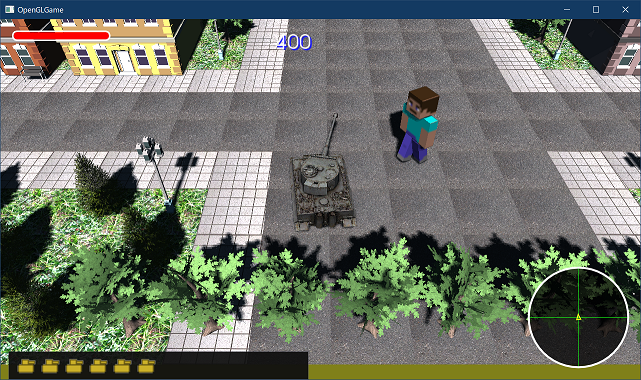

[OpenGL 3D 2021後期 第11回]

# 被写界深度(ひしゃかいしんど)

## 習得目標

* カメラパラメータによってボケ量を調整できる。
* 錯乱円(サークル・オブ・コンフュージョン)の直径の計算ができる。

## 1. 被写界深度シェーダー

### 1.1 カメラにピント合わせ用の変数を追加する

<p align="center">
<br>
[上下部分がピンボケしている]
</p>

今回は「被写界深度(ひ・しゃかい・しんど)」を表現するシェーダーを作成します。「被写界深度」とは、カメラのピントが合う範囲のことです。

被写界深度の外にある物体がピンぼけ表示される効果を、シェーダーで作り出そうというのが本テキストにおける目的となります。

さて、現実のカメラのようなボケを表現するには、現実のカメラを再現するためのパラメータが必要です。現実のカメラは以下のような構造になっています。

<p align="center">
<br>
</p>

どのようにカメラを再現するかによって、必要なパラメータは変化します。今回は、上の図にある「ピントが合う距離」、「センサーのサイズ」をパラメータ化します。それと、図にはありませんが、「しぼり」に相当する「F値」というパラメータも追加します。

その他のパラメータは、カメラの視野角と追加するパラメータから計算で求めます。それでは、`Camera.h`を開き、カメラクラスの定義に次のプログラムを追加してください。

```diff
   const glm::mat4& GetViewMatrix() const;
   const glm::mat4& GetProjectionMatrix() const;
+  const glm::mat4& GetShaderParameter() const;

   glm::vec3 position = glm::vec3(0, 0, 0);
   glm::vec3 up = glm::vec3(0, 1, 0);
   glm::vec3 target = glm::vec3(0, 0, -1);
   float aspectRatio = 1.0f;
   float fovy = glm::radians(45.0f);
   float zNear = 1.0f;
   float zFar = 400.0f;
+
+  // オートフォーカスの制御
+  // true:  focusDistanceを無視してtargetまでの距離を使う
+  // false: fucusDistanceに設定した距離を使う
+  bool isAutofocus = true;
+
+  float focusDistance = 10; // レンズからピントの合う位置までの距離(m単位)
+  float fNumber = 1.4f;     // F値(小さくするとボケが強くなる)
+  float sensorWidth = 36;   // 光を受けるセンサーの横幅(mm単位)
+  glm::vec2 screenSize = glm::vec2(1280, 720); // 画面のピクセル数

 private:
   glm::mat4 matView = glm::mat4(1);
   glm::mat4 matProj = glm::mat4(1);
+  glm::mat4 shaderParameter = glm::mat4(0);
 };

 #endif // CAMERA_H_INCLUDED
```

ピント合わせ機能は`focusDistance`(フォーカス・ディスタンス)、`fNumber`(エフ・ナンバー)、`sensorWidth`(センサー・ウィス)の3つのパラメータで制御します。

`isAutofocus`(イズ・オートフォーカス)が`true`の場合、自動的に`target`の位置にピントを合わせます。

`fNumber`はカメラの「F値(エフ・ち)」のことです。F値は、ボケ量を制御するパラメータで、F値が小さいほどボケが強くなり、大きいほどボケが弱くなります。

現実のカメラでは以下の式で表されます。

>F値 = 焦点距離(レンズからセンサーまでに距離) ÷ 開口(絞りで作られる穴の直径)

F値を小さくするには、焦点距離を短くするか、開口を大きくするしかありません。現実のカメラの場合、これらの操作を行うと入射する光の量が増えるため、映像が明るくなります。

しかし、ゲームグラフィックスでは明るさを変化させないことがほとんどです。画角やボケの調整だけでも大変なのに、明るさまで変化させてしまうと、思い通りの映像を作ることがより難しくなってしまうからです。

`sensorWidth`は、通常は36mmのままにします。36mmはいわゆる「35mm判フルサイズ」のセンサーの大きさで、広く普及しているセンサーサイズのひとつです。

特定のカメラの見え方を真似する場合をのぞいて、`sensorWidth`を変更する必要はありません。

プライベート変数`shaderParameter`(シェーダーパラメータ)は、シェーダに送るためのデータを格納します。行列として定義していますが、実際には「`float`型が16個いれられるデータ」として使います。

シェーダーが同時に扱えるユニフォーム変数の最大数は決まっているため、データを`float`型などでひとつずつ定義すると効率が悪いのです。

>参考URL:<br>
>`https://www.khanacademy.org/science/physics/geometric-optics/lenses/v/object-image-and-focal-distance-relationship-proof-of-formula`<br>
>`https://docs.unrealengine.com/4.27/ja/RenderingAndGraphics/PostProcessEffects/DepthOfField/CinematicDOFMethods/`

### 1.3 GetShaderParameterメンバ関数を定義する

次に`Camera.cpp`を開き、`GetProjectionMatrix`メンバ関数の定義の下に、次のプログラムを追加してください。

```diff
 const glm::mat4& Camera::GetProjectionMatrix() const
 {
   return matProj;
 }
+
+/**
+* シェーダーに送るパラメータを取得する
+*/
+const glm::mat4& Camera::GetShaderParameter() const
+{
+  return shaderParameter;
+}

 /**
 * カメラの状態を更新する
```

### 1.4 shaderParameterに画面情報を設定する

続いてシェーダーに送るデータを設定します。このために、事前に「画面のピクセル数」を設定しておく必要があります。`GameEngine.cpp`を開き、`Initialize`メンバ関数の定義に次のプログラムを追加してください。

```diff
   // カメラのアスペクト比を設定
   Camera& camera = engine->GetCamera();
   camera.aspectRatio = engine->windowSize.x / engine->windowSize.y;
+    
+  // 画面のピクセル数を設定
+  camera.screenSize = engine->windowSize;

   // FBOを初期化する
```

シェーダーに送るデータは`Updata`メンバ関数で設定します。しかし、その前にオートフォーカスを実装しておきます。`Update`メンバ関数に次のプログラムを追加してください。

```diff
   // ビュー行列を作成
   matView = glm::lookAt(position, target, up);

   // プロジェクション行列を作成
   matProj = glm::perspective(fovy, aspectRatio, zNear, zFar);
+
+  // ピントが合う距離を計算
+  float distance = focusDistance;
+  if (isAutofocus) {
+    distance = glm::length(target - position);
+  }
+  distance *= 1000.0f; // mm(ミリメートル)単位に変換
```

それでは、シェーダーに送るデータの<ruby>内訳<rt>うちわけ</rt></ruby>を決めましょう。ピント合わせを実装するためには、画面とカメラの情報が必要です。

まず画面の情報を設定します。オートフォーカスのプログラムの下に、次のプログラムを追加してください。

```diff
     distance = glm::length(target - position);
   }
   distance *= 1000.0f; // mm(ミリメートル)単位に変換
+
+  // シェーダーに送る画面情報を設定
+  // [0][0] 1ピクセルの幅(1.0 / スクリーンの幅)
+  // [0][1] 1ピクセルの高さ(1.0 / スクリーンの高さ)
+  // [0][2] 近平面(m単位) 
+  // [0][3] 遠平面(m単位)
+  shaderParameter[0] = glm::vec4(glm::vec2(1) / windowSize, zNear, zFar);
 }
```

後述しますがボケ量はmm(ミリメートル)で計算されます。しかし、フラグメントシェーダではピクセルをNDC座標系で扱います。そのため、mmからNDC座標系へ変換しなくてはなりません。

これには「NDC座標における1ピクセルの幅と高さ」、「1mm平方に含まれるピクセル数」の2つの情報が必要です。ここではまず前者を設定しています。

また、ボケ量は「ピントが合う距離」と「ピクセルまでの距離」から計算されますが、「ピクセルまでの距離」は深度バッファから取得します。

ただし、深度バッファの値は0～1の範囲に変形されています。そこで、ニア平面とファー平面の距離を使ってカメラからの距離に変換します。

### 1.5 shaderParameterにカメラ情報を設定する

次にカメラの情報を設定します。具体的にはレンズの絞りやセンサーの大きさなどです。まず焦点距離(レンズから光が1点に集まる位置までの距離)を求めます。これは以下の手順で行います。

>1. FOV(視野角)からイメージセンサーの位置を求める。
>2. イメージセンサーの位置から焦点距離を求める。

画面情報を設定するプログラムの下に、次のプログラムを追加してください。

```diff
+
+  // FOVを再現できるイメージセンサーの位置を計算(mm単位)
+  const float fovx = fovy * aspectRatio;
+  const float imageDistance = (sensorWidth * 0.5f) / glm::tan(fovx * 0.5f);
+
+  // 焦点距離を計算
+  const float focalLength = 1.0f / ((1.0f / distance) + (1.0f / imageDistance));
 }
```

最初に、イメージセンサーまでの距離を表す`imageDistance`(イメージ・ディスタンス)を計算します。これはセンサーの幅と水平FOVから求められます。

カメラクラスが保持する`fovy`(エフオーブイ・ワイ)は垂直視野角なので、センサーの幅と合わせるために水平視野角(`fovx`(エフオーブイ・エックス))に変換する必要があります。

水平・垂直視野角の比率は「アスペクト比」として保持しているので、これを掛けるだけです。

また、距離を`tan`によって計算するために、視野角とセンサーサイズを1/2倍しなければならないことに注意します。

次に、焦点距離を表す`foccalLength`(フォーカル・レングス)を計算します。「焦点距離(F)」は「センサーまでの距離(I)」と「ピントの合う距離(P)」を使って、以下の式で求められます。

<p align="center">
<br>
</p>

この両辺に`F`を掛け、次に両辺を`1/P + 1/I`で割ると、

<p align="center">
<br>
</p>

となり、プログラムに書かれている焦点距離を求める式になります。

それではカメラの情報を設定しましょう。焦点距離を求めるプログラムの下に、次のプログラムを追加してください。

```diff
   // 焦点距離を計算
   const float focalLength = 1.0f / ((1.0f / distance) + (1.0f / imageDistance));
+
+  // シェーダーに送るカメラ情報を設定
+  // [1][0] レンズからピントの合う位置までの距離(mm単位)
+  // [1][1] 焦点距離(レンズから光が1点に集まる位置までの距離. mm単位)
+  // [1][2] しぼり(mm単位)
+  // [1][3] 光を受けるセンサーの横幅(mm単位)
+  shaderParameter[1] = glm::vec4(
+    distance, focalLength, focalLength / fNumber, sensorWidth);
 }
```

「しぼり」は「開口(かいこう)」とも呼ばれ、光を取り入れる穴の直径を表します。しぼりは以下の式で計算できます。

>しぼり(開口) = 焦点距離 ÷ F値

これでシェーダーパラメータの設定は完了です。

このパラメータをシェーダに送るプログラムが必要ですが、それはシェーダーを作成してから追加することにします。

>**【現実のカメラの視野角と焦点距離について】**<br>
>現実のカメラでは視野角(FOV)を直接指定することはできません。センサーまでの距離を変えることで、間接的にFOVが決まります。<br>
>また、現実のカメラでは「焦点距離 = センサーまでの距離」となっています。これは、センサーまでの距離に対して焦平面までの距離が十分に長い場合、この2つはほとんど同じ距離になるからです。<br>
>例えば、imageDistance=50mm, distance=4000mmとした場合、focalLengthは約49.4mmになります。このため、分かりやすさを優先してfocalLength = imageDistanceとしているのです。

### 1.6 頂点シェーダーを定義する

ここからは、画面とカメラの情報を受け取って、ピントを合わせるシェーダーを作っていきます。このシェーダーは「被写界深度(ひ・しゃかい・しんど)シェーダー」と呼ぶことにします。

>**【ひしゃかいしんど？】**<br>
>「被写界深度」は、「ピントの合う範囲」のことです。カメラの被写界深度の外側にある物体はピンボケになります。英語では`depth of field`(デプス・オブ・フィールド, DoF)と言います。

プロジェクトの`Res`フォルダに`DepthOfField.vert`(デプス・オブ・フィールド・バート)という名前のファイルを追加してください。追加したファイルを開き、次のプログラムを追加してください。

```diff
+#version 450
+
+// 入力変数
+layout(location=0) in vec3 vPosition;
+layout(location=2) in vec2 vTexCoord;
+
+// 出力変数
+layout(location=0) out vec2 outTexCoord;
+out gl_PerVertex {
+  vec4 gl_Position;
+};
+
+// ユニフォーム変数
+layout(location=0) uniform mat4 matMVP;
+
+// 頂点シェーダープログラム
+void main()
+{
+  outTexCoord = vTexCoord;
+  gl_Position = matMVP * vec4(vPosition, 1.0);
+}
```

被写界深度シェーダーのほとんどの作業はフラグメントシェーダーで行います。そのため、頂点シェーダーの仕事は、頂点データをフラグメントシェーダーへと出力することだけです。

なお、被写界深度エフェクトでは頂点カラーは使いません。、入力変数を定義していません。

### 1.7 フラグメントシェーダーを定義する

次にフラグメントシェーダーを作ります。とりあえず入力変数、出力変数、ユニフォーム変数を定義しましょう。

プロジェクトの`Res`フォルダに`DepthOfField.frag`という名前のファイルを追加してください。追加したファイルを開き、次のプログラムを追加してください。

```diff
+#version 450
+
+// 入力変数
+layout(location=0) in vec2 inTexCoord;
+
+// 出力変数
+out vec4 fragColor;
+
+// ユニフォーム変数
+layout(binding=0) uniform sampler2D texColor0;
+layout(binding=1) uniform sampler2D texColor1;
+layout(binding=2) uniform sampler2D texDepth;
+
+/**
+* 画面とカメラの情報
+*/
+layout(location=102) uniform mat4 camera;
+#define PIXEL_SIZE     (camera[0].xy) // NDC座標系における1ピクセルの幅と高さ
+#define NEAR_PLANE     (camera[0][2]) // 近平面(メートル単位) 
+#define FAR_PLANE      (camera[0][3]) // 遠平面(メートル単位)
+#define FOCUS_DISTANCE (camera[1][0]) // レンズからピントの合う位置までの距離(mm単位)
+#define FOCAL_LENGTH   (camera[1][1]) // 焦点距離(mm単位)
+#define APERTURE       (camera[1][2]) // しぼり(mm単位)
+#define SENSOR_WIDTH   (camera[1][3]) // 光を受けるセンサーの横幅(mm単位)
+
+/**
+* フラグメントシェーダープログラム
+*/
+void main()
+{
+  fragColor.rgb = texture(texColor, inTexCoord).rgb;
+  fragColor.a = 1.0;
+}
```

入力変数はテクスチャ座標だけです。テクスチャサンプラは3つ定義しました。

>* `texColor0`; 描画済みの3D画像のカラーテクスチャ
>* `texColor1`; `texColor0`を面積1/4に縮小したカラーテクスチャ
>* `texDepth`; `描画済みの3D画像の深度テクスチャ

これらの画像テクスチャは、のちほど3D画像をFBOに描画することで作成します。

カメラ情報は`Camera::Update`関数で設定したとおりになります。情報を`mat4`型にまとめることで、消費するユニフォーム変数の数は4つで済みます。

>現在`camera[2]`と`camera[3]`は未使用です。今後情報を追加したくなったら、この部分に格納するとよいでしょう。

それから、被写界深度シェーダーで使うユニフォーム変数のロケーション番号を定義しておきます。`Renderer.h`を開き、レンダラークラスの定義に次のプログラムを追加してください。

```diff
 public:
   static const GLint locMaterialColor = 10;
   static const GLint locMaterialTexture = 20;
   static const GLint locMatGroupModels = 30;
+  static const GLint locCamera = 102;
 
   Renderer() = default;
   virtual ~Renderer() = default;
```

### 1.8 錯乱円(さくらんえん)の大きさを計算する

次に、ボケ具合を計算する関数を定義します。光学系の用語では、ボケ具合のことを「錯乱円(さくらんえん)」と言います。

英語では「Circle of Confusion(サークル・オブ・コンフュージョン)」といいます。長い名前なので、省略して「CoC(しー・おー・しー)」と書くことも多いです。

それでは、錯乱円の大きさを計算する関数を定義しましょう。関数名は`CircleOfConfusion`とします。

`DepthOfField.frag`を開き、`camera`ユニフォーム変数の定義の下に、次のプログラムを追加してください。

```diff
 #define FOCAL_LENGTH   (camera[1][1]) // 焦点距離(mm単位)
 #define APERTURE       (camera[1][2]) // しぼり(mm単位)
 #define SENSOR_WIDTH   (camera[1][3]) // 光を受けるセンサーの横幅(mm単位)
+
+/**
+* 錯乱円の半径を計算する
+*
+* @param objectDistance 対象ピクセルのカメラ座標系におけるZ座標
+*
+* @return 錯乱円の半径(ピクセル単位)
+*/
+float CircleOfConfusion(float objectDistance)
+{
+  // センサー上の錯乱円のサイズを計算する(mm単位)
+  objectDistance *= 1000.0; // mm単位に変換する
+  float cocSize = abs(APERTURE * (FOCAL_LENGTH * (FOCUS_DISTANCE - objectDistance)) /
+    (objectDistance * (FOCUS_DISTANCE - FOCAL_LENGTH)));
+
+  // 1mmに含まれるピクセル数を計算
+  float pixelsPerMillimeter = 1.0 / (SENSOR_WIDTH * PIXEL_SIZE.x);
+
+  // mm単位からピクセル数に変換
+  return cosSize * pixelsPerMillimeter;
+}

 /**
 * フラグメントシェーダープログラム
```

`CircleOfConfusion`関数の引数はピクセルのZ値です。錯乱円の直径は、以下の計算式で求めることができます。

<p align="center">
<br>
</p>

>参考URL:<br>
>`https://developer.download.nvidia.com/books/HTML/gpugems/gpugems_ch23.html`

この式から、「錯乱円の直径」には以下のような傾向があることが分かります。

> * 物体までの距離Dとピントの合う位置Pが等しい場合、CoCは0になる。
> * ピントの合う位置Pがカメラに近いほどボケやすく、遠いほどボケにくい。
> * 焦点距離Fを大きくするほどボケやすく、小さくするほどボケにくい。
> * しぼりAを大きくするほどボケやすく、小さくするほどボケにくい。

また、入力パラメータがmm単位の場合、この計算式の結果もmm単位になります。実際の描画に使うには、mmからテクスチャ座標上の大きさに変換する必要があります。

`pixelsPerMillimeter`(ピクセルズ・パー・ミリメーター)変数は、名前のとおりミリメートルをピクセル数に変換するための係数で、上記の変換を行うために使います。

### 1.9 ピクセルのZ値を計算する

錯乱円の直径を求めるには、ピクセルのZ値が必要です。そのために、深度バッファの値をZ値に変換する関数を定義します。関数名は`ToRealZ`(トゥ・リアル・ゼット)とします。

`CircleOfConfusion`関数の定義の下に、次のプログラムを追加してください。

```diff
   // mm単位からテクスチャ座標系のサイズに変換
   return cosSize * pixelsPerMillimeter * PIXEL_SIZE;
 }
+
+/**
+* 深度バッファの深度値をビュー座標系の深度値に変換する
+*/
+float ToRealZ(float w)
+{
+  // 深度値をNDC座標系に戻す
+  float n = 2.0 * w - 1.0; // 0～1を-1～+1に変換
+
+  // パースペクティブ行列の逆の計算を行う
+  // これによってビュー座標系に変換される
+  return 2.0 * NEAR_PLANE * FAR_PLANE /
+    (FAR_PLANE + NEAR_PLANE - n * (FAR_PLANE - NEAR_PLANE));
+}

 /**
 * フラグメントシェーダープログラム
```

OpenGLのパースペクティブ行列は次のようになっています。

<p align="center">
<br>
</p>

このうち、Z値に影響するのは`-(far+near)/(far-near)`と`-(2*far*near)/(far-near)`の2つだけです。

`A = -(far+near)/(far-near)`、`B = -(2*far*near)/(far-near)`と置くと、`Z = Az + B`となります。

この計算の後、GPUがW値で全体を除算することで、クリップ座標系からNDC座標系に変換されます。パースペクティブ行列計算後は`W = -z`なので、この時点で`Z = -A - B/z`となります。

この時点でZ値の範囲は`-1～+1`です。深度バッファには`0～1`の値を書き込む必要があります。そこで、GPUはさらに`Z' = (Z + 1) / 2`という変換を行います。この`Z'`が、実際に深度バッファに格納されるZ値です。

`ToRealZ`はこの過程を逆にたどるようにして、`Z'`から`z`を計算しています。

>参考URL:<br>
>`https://stackoverflow.com/questions/6652253/getting-the-true-z-value-from-the-depth-buffer`

それでは錯乱円の直径を計算しましょう。メイン関数に次のプログラムを追加してください。

```diff
 void main()
 {
   fragColor.rgb = texture(texColor, inTexCoord).rgb;
   fragColor.a = 1.0;

+  float z = ToRealZ(texture(texDepth, inTexCoord).r);
+  float coc = CircleOfConfusion(z);
 }
```

これで、元のZ値を求め、そこから錯乱円の直径を求められるようになりました。

### 1.9 サンプリング点を定義する

画像をボカすには、ピクセルの中心から、錯乱円の直径の範囲内にあるピクセルをいくつか読み取り、その平均を求めます。今回は16箇所のピクセルを読み取ることにします。

まず直径1mmの場合の読み取るピクセルの位置を定義します。ユニフォーム変数の定義の下に、次のプログラムを追加してください。

```diff
 #define FOCAL_LENGTH   (camera[1][1]) // 焦点距離(mm単位)
 #define APERTURE       (camera[1][2]) // しぼり(mm単位)
 #define SENSOR_WIDTH   (camera[1][3]) // 光を受けるセンサーの横幅(mm単位)
+
+/**
+* ボケを作るためのサンプル点の座標
+*/
+const int bokehSampleCount = 16; // サンプル数
+const vec2 bokehDisk[bokehSampleCount] = {
+  {-0.116,-0.433 }, { 0.116,-0.433 }, { 0.317,-0.317 }, { 0.433,-0.116 },
+  {-0.317,-0.317 }, {-0.039,-0.144 }, { 0.144,-0.039 }, { 0.433, 0.116 },
+  {-0.433,-0.116 }, {-0.144, 0.039 }, { 0.039, 0.144 }, { 0.317, 0.317 },
+  {-0.433, 0.116 }, {-0.317, 0.317 }, {-0.116, 0.433 }, { 0.116, 0.433 },
+};

 /**
 * 錯乱円の半径を計算する
```

>**【錯乱円の直径が非常に大きくなる場合】**<br>
>錯乱円の直径が非常に大きくなると、読み取るピクセルの数が16箇所では隙間が空きすぎて、きれいにボケなくなっていきます。この場合、読み取る数を増やすと改善します。以下のURLのプログラムが参考になるでしょう。<br>
>`https://www.adriancourreges.com/blog/2018/12/02/ue4-optimized-post-effects/`

### 1.10 ぼかし処理を追加する

あとは`for`を使ってピクセルを読み取ります。メイン関数に次のプログラムを追加してください。

```diff
   float z = ToRealZ(texture(texDepth, inTexCoord).r);
   float coc = CircleOfConfusion(z);
+  // 錯乱円の直径が1ピクセルを超える場合、ぼかし処理を行う
+  const float minBokehSize = 1.0;
+  if (coc > minBokehSize) {
+    vec2 scale = PIXEL_SIZE * coc;
+    vec3 bokehColor = vec3(0);
+    for (int i = 0; i < bokehSampleCount; ++i) {
+      vec2 uv = inTexCoord + bokehDisk[i] * scale;
+      bokehColor += texture(texColor1, uv).rgb;
+    }
+    bokehColor *= 1.0 / bokehSampleCount;
+
+    // ぼかした色と元の色の間をなめらかに切り替える
+    fragColor.rgb = mix(fragColor.rgb, bokehColor,
+      clamp(coc - minBokehSize, 0.0, 1.0)); 
+  }
 }
```

直径が1ピクセル以下の場合、ぼかす必要はないので何もしません。1ピクセルを超える場合のみぼかし処理を行います。

`scale`(スケール)変数は錯乱円の直径をテクスチャ座標で表したものです。テクスチャ座標におけるピクセルの大きさは`PIXEL_SIZE`として定義済みなので、これを掛けるだけです。

あとは、`for`文によって16個のピクセルを読み取り、平均値を求めます。このとき、`texColor1`から読み取るようにします。縮小された画像を使うことで、ピクセルの読み取りコストが下がることが期待できます。

ただし、最初から少しボケた画像を使っていることになるため、CoCが2ピクセル未満の場合に本来よりも強くボケてしまいます。

そこで、`mix`関数を使ってボケていない色からボケた色へとなめらかに変化させています。

これで被写界深度シェーダーは完成です。

### 1.11 被写界深度シェーダーを読み込む

作成した被写界深度シェーダーをゲームエンジンに読み込みます。`GameEngine.h`を開き、ゲームエンジンクラスの定義に次のプログラムを追加してください。

```diff
   // パイプライン・オブジェクトを作成する
   std::shared_ptr<ProgramPipeline> pipeline;
   std::shared_ptr<ProgramPipeline> pipelineUI;
+  std::shared_ptr<ProgramPipeline> pipelineDoF;
   std::shared_ptr<Sampler> sampler;
   std::shared_ptr<Sampler> samplerUI;
+  std::shared_ptr<Sampler> samplerDoF;
 
   std::shared_ptr<FramebufferObject> fboShadow; // 影描画用FBO
```

追加したメンバ変数にシェーダーを読み込みます。`GameEngine.cpp`を開き、`Initialize`メンバ関数に次のプログラムを追加してください。

```diff
     engine->pipeline.reset(new ProgramPipeline(
       "Res/FragmentLighting.vert", "Res/FragmentLighting.frag"));
     engine->pipelineUI.reset(new ProgramPipeline("Res/Simple.vert", "Res/Simple.frag"));
+    engine->pipelineDoF.reset(new ProgramPipeline(
+      "Res/DepthOfField.vert", "Res/DepthOfField.frag"));
     engine->sampler = std::shared_ptr<Sampler>(new Sampler(GL_REPEAT));
     engine->samplerUI.reset(new Sampler(GL_CLAMP_TO_EDGE));
+    engine->samplerDoF.reset(new Sampler(GL_CLAMP_TO_EDGE));

     // 地面マップ用データを作成
     engine->pipelineGround.reset(new ProgramPipeline(
```

これでシェーダーが読み込まれるようになりました。

### 1.12 FBOを追加する

被写界深度シェーダーは、3Dモデルを描画したテクスチャを使います。現在はデフォルトフレームバッファに描画している3D画像を、FBOに描画するようにしましょう。

`GameEngine.h`を開き、ゲームエンジンクラスの定義に次のプログラムを追加してください。

```diff
   std::shared_ptr<ProgramPipeline> pipelineUI;
   std::shared_ptr<Sampler> sampler;
   std::shared_ptr<Sampler> samplerUI;

+  std::shared_ptr<FramebufferObject> fboColor0; // 等倍FBO
+  std::shared_ptr<FramebufferObject> fboColor1; // 縮小用FBO
   std::shared_ptr<FramebufferObject> fboShadow; // 影描画用FBO

   // 地面描画用
   glm::ivec2 mapSize = glm::ivec2(21, 21);
```

次に`GameEngine.cpp`を開き、`Initialize`メンバ関数を次のように変更してください。

```diff
     camera.aspectRatio = engine->windowSize.x / engine->windowSize.y;

     // FBOを初期化する
+    engine->fboColor0.reset(new FramebufferObject(w, h, FboType::colorDepth));
+    engine->fboColor1.reset(new FramebufferObject(w / 2, h / 2, FboType::color));
     engine->fboShadow.reset(new FramebufferObject(1024, 1024, FboType::depth));
-    if (!engine->fboShadow || !engine->fboShadow->GetId()) {
-      return false;
+    for (auto p : { engine->fboColor0.get(),
+      engine->fboColor1.get(), engine->fboShadow.get() }) {
+      if (!p || !p->GetId()) {
+        return false;
+      }
     }

     // ImGuiの初期化
     ImGui::CreateContext();
```

これで2つのFBOが追加されました。

### 1.13 FBOに描画する

それでは追加したFBOに3D画像を描画しましょう。`RenderDefault`メンバ関数に次のプログラムを追加してください。

```diff
   // デフォルトフレームバッファのビューポートを設定
   glViewport(0, 0,
     static_cast<GLsizei>(windowSize.x),
     static_cast<GLsizei>(windowSize.y));
+
+  // 描画先をフレームバッファオブジェクトに変更
+  fboColor0->Bind();

   glEnable(GL_DEPTH_TEST); // 深度バッファを有効にする
   //glEnable(GL_CULL_FACE);
```

これでアクターは`fboColor0`に描画されます。

### 1.14 縮小画像を作成する

次に縮小画像を作成します。`RenderUI`メンバ関数に次のプログラムを追加してください。

```diff
 * UIアクターを描画する
 */
 void GameEngine::RenderUI()
 {
+  const Primitive& primPlane = GetPrimitive("Res/Plane.obj");
+
+  // 縮小画像を作成
+  {
+    fboColor1->Bind();
+    glClear(GL_COLOR_BUFFER_BIT);
+
+    glDisable(GL_DEPTH_TEST);
+    glDisable(GL_CULL_FACE);
+    glDisable(GL_BLEND);
+
+    primitiveBuffer->BindVertexArray();
+    pipelineUI->Bind();
+    samplerUI->Bind(0);
+    fboColor0->BindColorTexture(0);
+
+    // Plane.objの半径は-0.5～+0.5なので、2倍して-1～+1にする
+    glm::mat4 m = glm::mat4(1);
+    m[0][0] = m[1][1] = 2;
+    pipelineUI->SetUniform(Renderer::locMatTRS, m);
+    primPlane.Draw();

+    fboColor0->UnbindColorTexture(0);
+    fboColor1->Unbind();
+  }
+
+  // 描画先をデフォルトのフレームバッファに戻す
+  fboColor1->Unbind();
+  glViewport(0, 0,
+    static_cast<GLsizei>(windowSize.x),
+    static_cast<GLsizei>(windowSize.y));
+
+  glClear(GL_COLOR_BUFFER_BIT | GL_DEPTH_BUFFER_BIT);
   glDisable(GL_DEPTH_TEST);
   glDisable(GL_CULL_FACE);
```

描画先をサイズの小さい`fboColor1`にすることで、`fboColor0`に描画された3D画像は、縮小して貼り付けられます。

### 1.15 被写界深度シェーダーを使う

いよいよ、被写界深度シェーダーを使って描画を行います。`RenderUI`メンバ関数に、次のプログラムを追加してください。

```diff
   glClear(GL_COLOR_BUFFER_BIT | GL_DEPTH_BUFFER_BIT);
   glDisable(GL_DEPTH_TEST);
   glDisable(GL_CULL_FACE);
+
+  // 被写界深度付きでFBOの内容を描画
+  {
+    pipelineDoF->Bind();
+    samplerDoF->Bind(0);
+    samplerDoF->Bind(1);
+    samplerDoF->Bind(2);
+    fboColor0->BindColorTexture(0);
+    fboColor1->BindColorTexture(1);
+    fboColor0->BindDepthTexture(2);
+
+    // Plane.objの半径は-0.5～+0.5なので、2倍して-1～+1にする
+    glm::mat4 m = glm::mat4(1);
+    m[0][0] = m[1][1] = 2;
+    pipelineDoF->SetUniform(Renderer::locMatTRS, m);
+    pipelineDoF->SetUniform(Renderer::locCamera, mainCamera.GetShaderParameter());
+    primPlane.Draw();
+
+    fboColor0->UnbindDepthTexture(2);
+    fboColor1->UnbindColorTexture(1);
+    fboColor0->UnbindColorTexture(0);
+    samplerDoF->Unbind(2);
+    samplerDoF->Unbind(1);
+    samplerDoF->Unbind(0);
+    pipelineDoF->Unbind();
+  }

   glEnable(GL_BLEND);
   glBlendFunc(GL_SRC_ALPHA, GL_ONE_MINUS_SRC_ALPHA);

   primitiveBuffer->BindVertexArray();
   pipelineUI->Bind();
```

プログラムが書けたらビルドして実行してください。普通に画面が描画されていたら成功です。視点を変更していない限り、この時点ではボケた部分はまったく見えないと思います。

<p align="center">
<br>
</p>

<div style="page-break-after: always"></div>

### 1.16 F値を調整する

ボケを大きくするには以下の方法があります。

>1. F値を小さくする。
>2. 画角を小さくする。
>3. ピントの合う位置をカメラに近づける。

2と3は見た目が変わってしまうので、とりあえず1の方法を試してみましょう。`GameManager.cpp`を開き、`UpdateCamera`メンバ関数に次のプログラムを追加してください。

```diff
     camera.position = target->position + glm::vec3(0, 20, 20);
     camera.target = target->position;
+
+    // F値を設定(小さいほどボケる)
+    camera.fNumber = 0.05f;
   }
 }

 /**
 * UIの状態を更新する
```

プログラムが書けたらビルドして実行してください。画面の上下が強くボケていたら成功です。

<p align="center">
<br>
</p>

>**【本来のF値はあまり小さくできない】**<br>
>現実のカメラのF値は1.4がほぼ下限です。特殊なレンズを使うと0.95くらいまで下げられますが、そのあたりが限界です。そのため、通常は画角を操作することでボケ量を調整します。
>映画的な画面を作りたい場合は、実際のカメラやレンズのデータを参考にして、画角を狭くするとよいでしょう。

<pre class="tnmai_assignment">
<strong>【課題01】</strong>
好みの画像になるように、F値と視野角を調整しなさい。
</pre>

>**【1章のまとめ】**<br>
>
>* カメラのピントが合う範囲のことを「被写界深度」という。
>* 現実のカメラのようなボケ感を作るには、実際のカメラと同様のパラメータを追加する必要がある。
>* FBOに3D画像を描画しておくことで、被写界深度のような画面効果を追加することができる。
