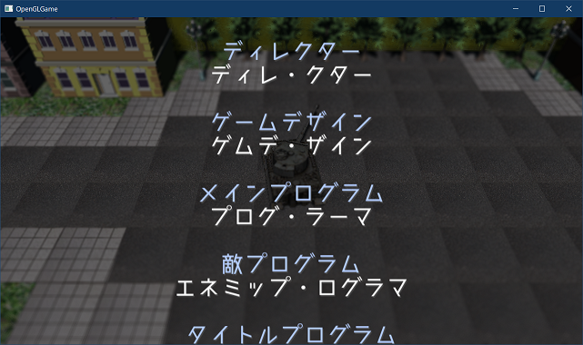
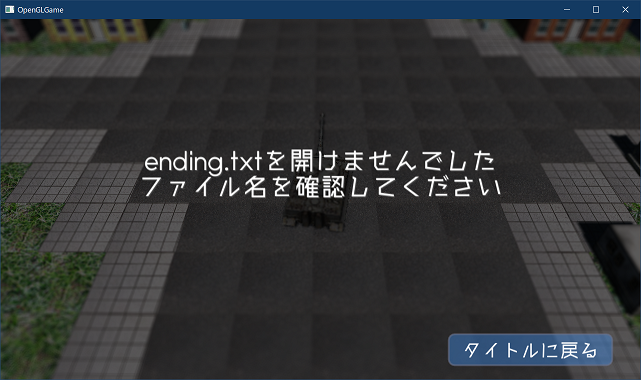
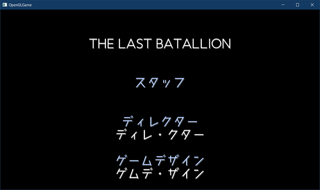
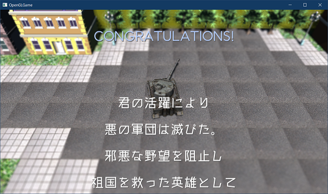

[OpenGL 3D 2021後期 第11回(マップエディタ編)]

# エンディングとスタッフロール

## 習得目標

* テキストファイルを読み込んでスタッフロールを表示することができる。
* アクターにフラグ変数を追加して、動作を制御することができる。

## 1. エンディング画面を作る

### 1.1 エンディングを表示するための準備

<p align="center">
<br>
[こういうのを作ります]
</p>

本テキストでは、簡単な「エンディング画面」を作成します。エンディング画面の内容は以下の通りです。

>1. 表示内容が書かれたテキストファイルを読み込む。
>2. ImGuiを使ってテキストを表示する。テキストは下から上へスクロールさせる。
>3. Enterキーまたはボタンクリックでタイトル画面に戻る。

とりあえず、ゲームの動作状態に「エンディング」を追加します。`GameManager.h`を開き、ステート列挙型の定義に次のメンバを追加してください。

```diff
     playing,   // ゲームプレイ中
     gameclear, // ゲームクリア
     gameover,  // ゲームオーバー
+    ending,    // エンディング画面
   };

   void Update(float deltaTime);
   void UpdateCamera();
```

次に、エンディングのためのメンバ関数を定義します。ゲームマネージャクラスの定義に、次のプログラムを追加してください。

```diff
   void UpdateGameUI();
   void UpdateTitle(float deltaTime);
   void UpdateTitleUI();
+
+  // エンディング用メンバ関数
+  void InitializeEnding();
+  void UpdateEnding(float deltaTime);
+  void UpdateEndingUI();

   State state = State::title; // 現在の動作状態
   std::shared_ptr<Actor> playerTank;
```

`InitializeEnding`(イニシャライズ・エンディング)はエンディング画面の準備をする関数です。`UpdateEnding`(アップデート・エンディング)はエンディングの状態を更新します。

そして、`UpdateEndingUI`(アップデートエンディング・ユーアイ)において、ImGuiを使ってエンディングのテキストを表示します。

続いて、エンディング画面で使うメンバ変数を定義します。ゲームマネージャクラスの定義に、次のプログラムを追加してください。

```diff
   float fadeAlpha = 0;      // フェードイン・アウトの不透明度
   bool startHovered = false;
   bool exitHovered = false;
+
+  // エンディング用メンバ変数
+  struct EndingText
+  {
+    uint32_t color;   // 色
+    std::string text; // 文章(1行分)
+  };
+  std::vector<EndingText> endingText;
+  bool isScrollFinished = false; // false=スクロール中 true=停止
+  float endingPosY = 0.0f; // スクロール量
+  float fontSize = 1.0f;   // エンディングの文字サイズ
 };

 #endif // GAMEMANAGER_H_INCLUDED
```

### 1.2 InitializeEndingメンバ関数を定義する

それでは、メンバ関数を定義していきます。その前に、ファイル読み込みを行うために`fstream`ヘッダをインクルードしておきます。`GameManager.cpp`を開き、次のプログラムを追加してください。

```diff
 #include <imgui.h>
 #include <glm/gtc/matrix_transform.hpp>
 #include <iostream>
+#include <fstream>

 namespace {

 GameManager* manager = nullptr;
```

まずは`InitializeEnding`(イニシャライズ・エンディング)メンバ関数から定義しましょう。アップデートタイトルユーアイ関数の定義の下に、次のプログラムを追加してください。

```diff
   // フェードアウト用の前景
   GetForegroundDrawList()->AddRectFilled(screenMin, screenMax,
     ImColor(0.0f, 0.0f, 0.0f, fadeAlpha));
 }
+
+/**
+* エンディングを初期化する
+*/
+void GameManager::InitializeEnding()
+{
+}

 /**
 * フラグの総数を取得する
```

イニシャライズエンディング関数は次のことを行います。

>* エンディング用テキストファイルを読み込んで、テキストデータを作成する。
>* スクロール用メンバ変数を初期化する。

早速、テキストファイルを読み込む処理を作っていきましょう。イニシャライズエンディング関数に次のプログラムを追加してください。

```diff
 void GameManager::InitializeEnding()
 {
+  // 念の為にテキストをクリアしておく
+  endingText.clear();
+
+  // エンディング用テキストを読み込む
+  std::ifstream ifs("Res/ending.txt");
+  if (ifs) {
+    while (!ifs.eof()) {
+      std::string line;
+      std::getline(ifs, line);
+      uint32_t color = ImColor(1.0f, 1.0f, 1.0f, 1.0f);
+      // 先頭に@があったら文字色を変える
+      if (line.size() > 0 && line[0] == '@') {
+        color = ImColor(0.7f, 0.8f, 1.0f, 1.0f);
+        line.erase(line.begin()); // @を除去
+      }
+      endingText.push_back(EndingText{ color, line });
+    }
+  }
 }

 /**
 * フラグの総数を取得する
```

このプログラムは、`ending.txt`というテキストファイルから1行ずつテキストを読み込み、それを`endingText`配列に追加します。

このとき、テキストの先頭が`@`(アットマーク)だった場合は色を変更します。エンディングではスタッフロールを表示する予定なのですが、役職と名前で色を変えることで、見分けやすくする意図があります。

さらに、ファイルが読み込めなかった場合の処理を追加します。ファイルを読み込むプログラムに次のプログラムを追加してください。

```diff
       }
       endingText.push_back(EndingText{ color, line });
     }
+  } else {
+    // 読み込みに失敗したのでエラーメッセージを設定
+    const uint32_t color = ImColor(1.0f, 1.0f, 1.0f, 1.0f);
+    endingText.push_back(EndingText{ color, u8"ending.txtを開けませんでした" });
+    endingText.push_back(EndingText{ color, u8"ファイル名を確認してください" });
   }
 }

/**
* フラグの総数を取得する
```

これでファイルの読み込みは完成です。次にメンバ変数を初期化します。ファイルを読み込むプログラムの下に、次のプログラムを追加してください。

```diff
     endingText.push_back(EndingText{ color, u8"ending.txtを開けませんでした" });
     endingText.push_back(EndingText{ color, u8"ファイル名を確認してください" });
   }
+
+  // フォントサイズを設定
+  const float defaultFontPixels = 13.0f; // ImGui標準のフォントサイズ(ピクセル)
+  fontSize = defaultFontPixels * 4.0f;   // 適当なサイズを設定
+
+  // 画面下をスクロール開始位置に設定
+  GameEngine& engine = GameEngine::Get();
+  const glm::vec2 windowSize = engine.GetWindowSize();
+  endingPosY = windowSize.y;
+
+  isScrollFinished = false; // スクロール開始
+  fadeAlpha = 0; // フェードアウト無効
+
+  // [課題01]
+  // ここにエンディング用BGMを再生するプログラムを追加すること。
+
+  // ゲーム状態を「エンディング」にする
+  std::cout << "playing->ending\n";
+  state = State::ending;
 }

 /**
 * フラグの総数を取得する
```

`endingPosY`の値はスタッフロールの先頭の文字列の位置になります。この変数の初期値を画面の一番下(`windowSize.y`)に設定し、アップデート関数で徐々に値を減らすことで、スクロールを実現します。

`isScrollFinished`(イズ・スクロール・フィニッシュド)は、スクロールの終了を判定するための変数です。この変数の値が`true`になるとスクロールが停止します。

`fadeAlpha`(フェード・アルファ)は、以前、タイトル画面を作成するときに追加したメンバ変数です。エンディングのフェードアウトでも使えそうだったので、流用することにしました。

この変数が`0`以下ならば「フェードアウトしていない」ことになります。

<pre class="tnmai_assignment">
<strong>【課題01】</strong>
<code>InitializeEnding</code>メンバ関数に、エンディング用のBGMを再生するプログラムを追加しなさい。
</pre>

### 1.3 UpdateEndingメンバ関数を定義する

次に`UpdateEnding`(アップデート・エンディング)メンバ関数を定義します。イニシャライズエンディング関数の定義の下に、次のプログラムを追加してください。

```diff
   std::cout << "playing->ending\n";
   state = State::ending;
 }
+
+/**
+* エンディングの状態を更新する
+*/
+void GameManager::UpdateEnding(float deltaTime)
+{
+}

 /**
 * フラグの総数を取得する
```

この関数は、エンディング画面の「スクロール」と「フェードアウト」を行います。まずはスクロール処理を書きましょう。アップデートエンディング関数の定義に次のプログラムを追加してください。

```diff
 void GameManager::UpdateEnding(float deltaTime)
 {
+  GameEngine& engine = GameEngine::Get();
+
+  // スクロール処理
+  if (!isScrollFinished) {
+    const float speed = 8.0f; // スクロール速度(秒毎スクリーン)
+    const glm::vec2 windowSize = engine.GetWindowSize();
+    endingPosY -= (windowSize.y / speed) * deltaTime;
+
+    // 最後の行の位置が、画面中央に到達したらスクロールを止める
+    const float lastY = endingPosY + endingText.size() * fontSize;
+    if (lastY <= windowSize.y * 0.5f) {
+      isScrollFinished = true; // スクロール停止
+    }
+  }
 }

 /**
 * フラグの総数を取得する
```

スクロール処理では`endingPosY`(エンディング・ポス・ワイ)を少しずつ減らしていきます。

次にフェードアウト処理を追加します。スクロールを行うプログラムの下に、次のプログラムを追加してください。

```diff
       isScrollFinished = true; // スクロール停止
     }
   }
+
+  // フェードアウトが開始されていなければ、キー入力を受け付ける
+  if (fadeAlpha <= 0) {
+    if (engine.GetKey(GLFW_KEY_ENTER)) {
+      fadeAlpha += deltaTime;
+    }
+  } else {
+    // フェードアウトが完了したらタイトル画面に戻る
+    fadeAlpha += deltaTime;
+    if (fadeAlpha >= 1) {
+      engine.ClearAllActors(); // アクターを削除
+      endingText.clear();      // エンディング用テキストを削除
+
+      // タイトル画面に戻る
+      std::cout << "ending->title\n";
+      state = State::title;
+    }
+  } // fadeAlpha
 }

 /**
 * フラグの総数を取得する
```

上のプログラムでは、エンディングの状態を制御するために`fadeAlpha`(フェードアルファ)変数をフラグとして使っています。エンディングは`fadeAlpha`の値に応じて、以下の3種類の状態を取ります。

| fadeAlhaの値 | 状態 |
|:-:|:--|
| 0以下 | Enterキー入力待機 |
| 0より大きい | フェードアウト実行中 |
| 1以上 | フェードアウト完了(タイトル画面に戻る) |

このように、ある変数の値によって、シーンの状態を表すことができる場合、その変数の値を「シーンの状態」として利用することができます。

>**【変数に複数の役割を持たせる場合の問題点】**<br>
>変数に複数の役割を与えると、役割の一部を個別に変更することが難しくなったり、プログラムの読みやすさが低下することが多いです。特に、状態のバリエーションが多かったり、状態の切り替え条件が複雑な場合は、状態を表す専用の変数を用意するべきです。
>しかし、変数を追加することでもプログラムが複雑になります。そのため、取りうる状態の数が少なく、切り替え条件が単純な場合は、ひとつの変数に複数の役割を持たせてもよいでしょう。プログラムを変更していくうちに、状態が増えたり条件が複雑化したときは、新しい変数を追加して役割を分離するべきです。

### 1.4 UpdateEndingUIメンバ関数を定義する

最後に`UpdateEndingUI`(アップデート・エンディング・ユーアイ)メンバ関数を定義します。アップデートエンディング関数の定義の下に、次のプログラムを追加してください。

```diff
       state = State::title;
     }
   } // fadeAlpha
 }
+
+/**
+* エンディング画面UIの更新
+*/
+void GameManager::UpdateEndingUI()
+{
+}

 /**
 * フラグの総数を取得する
```

エンディングでは以下の演出を行います。

>* 背景を徐々にフェードアウトする。
>* 「ゲームクリアのメッセージ＋スタッフロール」を、下から上にスクロールして表示する。
>* スタッフロールを最後まで表示したら、右下に「タイトルに戻る」ボタンを表示する。
>* 「タイトルに戻る」ボタンが押されるか、Enterキーが押されたら、スタッフロールを徐々にフェードアウトする。

それでは、背景のフェードアウトから作成していきます。アップデートエンディングユーアイ関数の定義に、次のプログラムを追加してください。

```diff
 void GameManager::UpdateEndingUI()
 {
+  using namespace ImGui;
+
+  GameEngine& engine = GameEngine::Get();
+  const glm::vec2 windowSize = engine.GetWindowSize();
+
+  // 背景を徐々に消していく
+  const float alpha = 1.0f - glm::max(endingPosY / windowSize.y, 0.0f);
+  GetBackgroundDrawList()->AddRectFilled(ImVec2(0, 0),
+    ImVec2(windowSize.x, windowSize.y), ImColor(0.0f, 0.0f, 0.0f, alpha));
 }

 /**
 * フラグの総数を取得する
```

フェードアウトのアルファ値は、スクロール座標`endingPosY`が画面上まで達した時点で`1.0`となるようにしてみました。このあたりの仕様は雰囲気でやっているので、しっくり来なかったら適当に調整してください。

次にテキストを表示します。背景をフェードアウトするプログラムの下に、次のプログラムを追加してください。

```diff
   const float alpha = 1.0f - glm::max(endingPosY / windowSize.y, 0.0f);
   GetBackgroundDrawList()->AddRectFilled(ImVec2(0, 0),
     ImVec2(windowSize.x, windowSize.y), ImColor(0.0f, 0.0f, 0.0f, alpha));
+
+  // テキストを表示
+  ImFont* font = GetFont();
+  ImDrawList* drawList = GetForegroundDrawList();
+  ImVec2 pos(0, endingPosY);
+  ImVec2 posShadow(0, endingPosY + fontSize * 0.05f);
+  const ImU32 colorShadow = ImColor(0.0f, 0.0f, 0.0f, 0.8f);
+  for (const auto& e : endingText) {
+    // テキストが1文字以上ある場合だけ描画する
+    if (e.text.size() >= 1) {
+      // 表示位置が画面の上端より下、下端より上の場合だけ描画する
+      if (pos.y >= -fontSize && pos.y <= windowSize.y) {
+        const char* textBegin = e.text.data();
+        const char* textEnd = textBegin + e.text.size();
+
+        // テキストを中央寄せで表示
+        const ImVec2 textSize = font->CalcTextSizeA(
+          fontSize, FLT_MAX, -1.0f, textBegin, textEnd);
+        pos.x = (windowSize.x - textSize.x) * 0.5f;
+        posShadow.x = pos.x + fontSize * 0.05f;
+        drawList->AddText(font, fontSize, posShadow,
+          colorShadow, textBegin, textEnd);
+        drawList->AddText(font, fontSize, pos,
+          e.color, textBegin, textEnd);
+      }
+    }
+    // 次の表示位置を設定
+    pos.y += fontSize;
+    posShadow.y += fontSize;
+  }
 }

 /**
 * フラグの総数を取得する
```

スタッフロールは「中央寄せ」で表示したかったので、`CaclTextSizeA`(カルク・テキスト・サイズ・エー)関数を使ってテキストの幅を取得し、ちょうど中央に表示できる座標を計算しています。

この仕様も雰囲気でやっているので、好みに応じて調整してください。

続いて「タイトルに戻る」ボタンを表示します。スタッフロールを表示するプログラムの下に、次のプログラムを追加してください。

```diff
     pos.y += fontSize;
     posShadow.y += fontSize;
   }
+
+  // タイトルに戻るボタンを表示
+  if (isScrollFinished && fadeAlpha <= 0) {
+    Begin("button", nullptr,
+      ImGuiWindowFlags_NoBackground | ImGuiWindowFlags_NoDecoration);
+
+    // ボタンのスタイルを設定
+    PushStyleVar(ImGuiStyleVar_FrameRounding, 12);
+    PushStyleVar(ImGuiStyleVar_FrameBorderSize, 4);
+    ImDrawList* drawList = GetWindowDrawList();
+    SetWindowFontScale(3.0f); // スタッフロールより小さめに設定
+
+    // ボタンを右下端に表示
+    const char text[] = u8" タイトルに戻る ";
+    const ImVec2 textSize = CalcTextSize(text);
+    const ImVec2 buttonSize(textSize.x + 32, textSize.y + 24);
+    SetWindowPos(ImVec2(
+      windowSize.x * 0.95f - buttonSize.x,
+      windowSize.y * 0.95f - buttonSize.y));
+    if (Button(text, buttonSize)) {
+      fadeAlpha = 0.0001f; // ボタンが押されたらフェードアウト開始
+    }
+
+    PopStyleVar(2); // スタイルを元に戻す
+    End();
+  }
 }

 /**
 * フラグの総数を取得する
```

「タイトルに戻る」ボタンは、スクロールが停止したあとで表示しています。これは、スタッフロール中にボタンが表示されると見栄えがよくないと考えたからです。

この仕様については、ユーザーの利便性を優先して、ボタンが常に表示されるように変更してもよいでしょう。なおEnterキーは常に有効なので、そちらを使えばいつでもスタッフロールを終了できます。

ボタンのデザイン、フォントサイズについては好みに合うように変更してください。

最後にスタッフロールのフェードアウトを作ります。「タイトルに戻る」ボタンを表示するプログラムの下に、次のプログラムを追加してください。

```diff
     PopStyleVar(2); // スタイルを元に戻す
     End();
   }
+
+  // フェードアウト
+  if (fadeAlpha > 0) {
+    drawList->AddRectFilled(ImVec2(0, 0), ImVec2(windowSize.x, windowSize.y),
+      ImColor(0.0f, 0.0f, 0.0f, fadeAlpha));
+  }
 }

 /**
 * フラグの総数を取得する
```

`fadeAlpha`が0より大きければ、フェードアウト用の黒い平面を描画します。

これで、エンディング用のすべてのメンバ関数を定義することができました。

### 1.5 エンディング関数を呼び出す

定義したメンバ関数を呼び出して、エンディングを表示できるようにしましょう。

まずイニシャライズエンディング関数を呼び出します。アップデート関数の`State::playing`ケース文を次のように変更してください。

```diff
           break;
         }
       }
       if (allKill) {
+        // 最終ステージをクリアしたらエンディングへ
+        if (stageNo + 1 >= std::size(mapFiles)) {
+          InitializeEnding();
+        } else {
+          // ステージクリア画像を表示
           std::shared_ptr<Actor> gameclear(new Actor{ "GameClear",
             engine.GetPrimitive("Res/Plane.obj"),
             engine.LoadTexture("Res/GameClear.tga"),
             glm::vec3(0), glm::vec3(700, 200, 1), 0.0f, glm::vec3(0) });
           gameclear->isStatic = true;
           gameclear->layer = Layer::UI;
           engine.AddActor(gameclear);

           Audio::Play(AUDIO_PLAYER_ID_BGM, BGM_GAMECLEAR);

           std::cout << "playing->ending\n";
           state = State::gameclear;
         }
+      } // allKill
     }
     break;
```

次にアップデートエンディング関数を呼び出します。`State::gameover`ケース文の下に、次のプログラムを追加してください。

```diff
       state = State::title;
     }
     break;
+
+  case State::ending:
+    UpdateEnding(deltaTime);
+    break;
   }
}

/**
* カメラの状態を更新する
```

最後にアップデートエンディングユーアイ関数を呼び出します。アップデートユーアイ関数に、次のプログラムを追加してください。

```diff
 void GameManager::UpdateUI()
 {
   switch (state) {
   case State::title: UpdateTitleUI(); break;
+  case State::ending: UpdateEndingUI(); break;
   default:           UpdateGameUI(); break;
   }
 }
```

これで、すべてのマップをクリアしたらエンディングが表示されるようになりました。

プログラムが書けたらビルドして実行してください。すべてのステージをクリアすると、エンディングが表示されるはずです。

<p align="center">

</p>

### 1.6 エンディング用のテキストファイルを用意する

エンディング用のテキストファイルを作成して、エンディングらしいスタッフロールを表示しましょう。

プロジェクトの`Res`フォルダに`ending.txt`というファイルを追加してください。追加したファイルを開き、以下のような内容を入力してください。

>**【ending.txt作成時の注意点】**
>
>* `@`は半角で入力すること。
>* ファイルは`UTF-8(BOMなし)`で保存すること。<br>
> Visual Studioの場合、まず`ファイル→名前をつけてending.txtを保存`を選択します。ウィンドウが開くので、右下の「上書き保存」ボタンの横にある三角アイコンをクリックし、`エンコード付きで保存`を選択します。「上書きしますか？」というウィンドウが表示されるので「はい」を選択します。エンコード選択ウィンドウが開くので、`Unicode(UTF-8 シグネチャなし)`を選び、OKをクリックします。<br>
>一度UTF-8で保存すれば、以後は普通に上書き保存できます(自動的にUTF-8として保存されます)。

```txt
@CONGRATULATIONS!

※以下のテキストを自分で考えた文章で置き換えること
あなたはラスボスを倒した！
世界に再び平和がおとずれた。

※ゲームのタイトル

@スタッフ

@ゲームデザイン
※あなたの名前

@プログラム
※あなたの名前

@マップデザイン
※あなたの名前

@テクスチャデザイン
※あなたの名前

@3Dモデル
※使用したモデルの名前、製作者、提供サイト名など
Tiger I Heavy Tank
(wampir88/free3d.com)

@サウンド
※使用した音声のタイトル、製作者、提供サイト名など
Break-In
(Eric Matyas/soundimage.org)

@スペシャルサンクス
※ちょっとでも協力してくれた家族、クラスメイトの名前

Thank you for playing!

@Presented by

※あなたの名前
```

<pre class="tnmai_assignment">
<strong>【課題02】</strong>
映画や市販ゲームのスタッフロールを参考にして、<code>ending.txt</code>を完成させなさい。
表示間隔を調整するには空行を追加します。
</pre>

`ending.txt`が完成したら、プログラムを実行してエンディングまで進めてください。テキストに書いたとおりにスタッフロールが表示されたら成功です。

<p align="center">

</p>

### 1.7 プレイヤーを操作できなくする機能を追加する

スタッフロールが表示されてもプレイヤーの操作ができてしまっています。エンディング中にプレイヤーがやられてしまう、といった不慮の事故を避けるためにも、プレイヤーの操作を無効化しましょう。

`PlayerActor.h`を開き、プレイヤーアクタークラスの定義に次のプログラムを追加してください。

```diff
   virtual void OnUpdate(float deltaTime);
   virtual void OnCollision(const struct Contact& contact);
+
+  // ユーザー操作可能フラグの設定
+  void SetControlFlag(bool flag) { isControlable = flag; }
+  bool GetControlFlag() const { return isControlable; }

 private:
   int oldShotButton = 0;     // 前回のショットボタンの状態
+  bool isControlable = true; // ユーザー操作可能フラグ
 };

 #endif // PLAYERACTOR_H_INCLUDED
```

`isControlable`(イズ・コントローラブル)は「ユーザー操作を受け付けるかどうか」を制御するフラグ変数です。

この値が`true`のときはキーやマウスでプレイヤーを操作できて、`false`だと操作できないようにプログラムを作ります。

それでは、`isControlable`を使うプログラムを追加しましょう。`PlayerActor.cpp`を開き、アップデート関数に次のプログラムを追加してください。

```diff
 void PlayerActor::OnUpdate(float deltaTime)
 {
   GameEngine& engine = GameEngine::Get();
+
+  // ユーザー操作を受け付けないときは何もしない
+  if (!isControlable) {
+    oldShotButton = 0;
+    return;
+  }

  if (engine.GetKey(GLFW_KEY_A)) {
    rotation += glm::radians(90.0f) * deltaTime;
```

さらに、操作を受け付けないときはダメージを受けないようにします。オンコリジョン関数を次のように変更してください。

```diff
 void PlayerActor::OnCollision(const struct Contact& contact)
 {
   if (contact.b->name == "EnemyBullet") {
+    // ユーザー操作を受け付けないときはダメージを受けない
+    if (isControlable) {
       --health;
+    }
     if (health <= 0) {
       Audio::PlayOneShot(SE_EXPLOSION);
       isDead = true;
```

これで、プレイヤーアクターの変更は完了です。

### 1.8 エンディングでプレイヤーを操作禁止にする

追加したメンバ関数を使って、プレイヤーの操作受け付け状態を設定します。まずゲーム開始時に「操作を受け付ける状態」にします。

`GameManager.cpp`を開き、アップデート関数に次のプログラムを追加してください。

```diff
     // プレイヤーが操作するアクターを取得する
     playerTank = engine.FindActor("Tiger-I");
+    if (playerTank) {
+      static_cast<PlayerActor&>(*playerTank).SetControlFlag(true);
+    }

     // 敵アクターのポインタを配列にコピーする
     enemies.clear();
     for (auto& e : engine.GetNewActors()) {
```

次に、エンディング初期化時に「操作を受け付けない状態」にします。イニシャライズエンディング関数に次のプログラムを追加してください。

```diff
   isScrollFinished = false; // スクロール開始
   fadeAlpha = 0; // フェードアウト無効
+
+  // プレイヤーを操作不能にする
+  if (playerTank) {
+    static_cast<PlayerActor&>(*playerTank).SetControlFlag(false);
+  }

   // エンディング用BGMを再生する
   Audio::Play(AUDIO_PLAYER_ID_BGM, BGM_ENDING);

   // ゲーム状態を「エンディング」にする
```

プログラムが書けたらビルドして実行してください。スタッフロールが表示されると同時に、プレイヤーが操作を受け付けなくなっていたら成功です。

<p align="center">

</p>

>**【1章のまとめ】**<br>
>
>* 変数に複数の役割を持たせることで、プログラムを簡略化することができる。やりすぎると逆に複雑になるので注意する。
>* フェードアウトをうまく使うことで、簡単な演出効果が出せる。
>* スタッフロールのようなテキスト情報は、テキストファイルから読み込むようにする。テキストを変更するためだけにプログラムを変更する必要がなくなり、扱いやすくなる。

<br>

>**【コンソールウィンドウを消す方法】**<br>
>Main.cppに`Windows.h`をインクルードし、`main`関数の先頭で`FreeConsole()`関数を呼び出す。
>Visual Studioから起動した場合は消えないが、`exe`ファイルを直接実行するとちゃんと消える。
