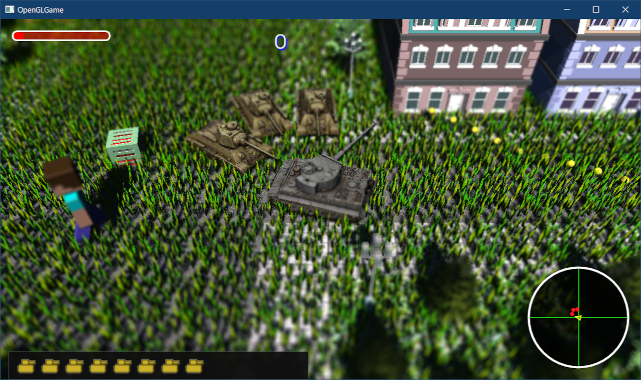

[OpenGL 3D 2021 Tips 第05回]

# インスタンシング

## 習得目標

* インスタンシングの特徴と制限を説明できる。
* SSBOを作成し、インスタンシングに適用できる。
* SSBOに、自分が必要とするデータを定義できる。

## 1. シェーダ・ストレージ・バッファ・オブジェクト

### 1.1 インスタンシングの必要性

現代のGPUには、効率よくポリゴンを描画するために大量のパラメータが存在します。これらのパラメータは、`glDrawElements`のような描画関数を呼び出すたびに初期化されます。

この初期化は描画を実行するたびに行われます。そのため、100万ポリゴンのメッシュを1個描画する場合は1回初期化するだけですが、1万ポリゴンのメッシュを100個描画する場合は100回の初期化が必要になります。

初期化にはある程度の時間がかかるため、初期化回数が多いと、それだけ本来の描画に使える時間が減ってしまいます。

初期化時間の問題があるため、現代のGPUは、一度に大量のポリゴンを描画することは得意ですが、そこそこの数のポリゴンを何回かに分けて描画するのは苦手です。

初期化時間を増やさない方法はいくつかあります。ひとつは、1万ポリゴンのメッシュ100個を、100万ポリゴンのメッシュ1個にまとめることです。

しかしこの方法は、初期化時間を減らす代わりに、データサイズが100倍になってしまいます。

もうひとつの方法では「インスタンシング」という機能を使います。インスタンシングを使うと、ひとつの描画関数で、同じメッシュを指定した回数だけ描画することができます。

GPUは同じメッシュを何度も描画することが分かっているため、新しいメッシュを描画するたびに最小限の初期化だけを行うことができます。

インスタンシングを使うことで、データサイズは同じままで、しかも初期化時間をほとんど増やすことなく、たくさんの数のメッシュを描画することができます。

>**【インスタンシングの制限】**<br>
>一度のインスタンシングで描画できるメッシュは1種類だけです。異なるメッシュを描画するには、メッシュの種類ごとに描画を行わなくてはなりません。

### 1.2 シェーダーストレージバッファオブジェクト

インスタンシングを使うと、大量のメッシュを効率よく描画できます。このとき、すべてのメッシュで描画前に設定したユニフォーム変数が使われます。

そのため、なにか工夫をしないと「同じ場所に大量のメッシュが描画されるだけ」という結果に終わります。

インスタンシング描画では、シェーダで`gl_InstanceID`(ジーエル・インスタンス・アイディ)という変数を使うことができます。

この変数は最初`0`になっていて、メッシュが描画されるたびに`1`ずつ増えていきます。簡単に思いつく方法は、`gl_InstanceID`を加工して頂点座標に加算することです。

例えば「`gl_InstanceID`を10倍してX座標に加算」すれば、X方向にずれて表示されます。

>**【インスタンス？】**<br>
>インスタンシングとは「何か元になるデータやクラスがあって、それを元にして実際に使用したり表示したりする実体を作り出す」ことです。こうして作られた個々の実体のことを「インスタンス」といいます。
>「インスタンス」は「実例、事例、出来事」という意味の英単語です。語源は「イン + スタンス」で、「～の上に立つ、～の<ruby>傍<rt>かたわ</rt></ruby>らに立つ」というイメージを持っています。コンピューター関係の文書では「実体」と訳されることが多いです。

より柔軟な方法は「`gl_InstanceID`を配列の添字にする」ことです。座標の配列を使えば、自由な座標にメッシュを表示できます。行列の配列なら移動だけでなく、回転、拡大縮小まで自在に変更できます。

添字にする方法では、シェーダに配列を用意する必要があります。しかし、ユニフォーム変数にはきびしい容量制限があるため、大きな配列を用意することができません。

シェーダで大きな配列を扱うには「シェーダーストレージバッファオブジェクト」、略して`SSBO`(エス・エス・ビー・オー)を使います。

`SSBO`はバッファオブジェクトの一種で、ユニフォーム変数ど同様にシェーダで読み出すことができます。また、特定のルールに従えばシェーダから書き込むことも可能です。

実際に、`gl_InstanceID`と`SSBO`を使ったシェーダを作成してみましょう。プロジェクトの`Res`フォルダに`InstancedMesh.vert`(インスタンスド・メッシュ・バート)という頂点シェーダファイルを追加してください。

基本的な機能は既存のシェーダからコピーすることにします。追加したファイルを開き、`FragmentLighting.vert`の内容をすべてコピーして、`InstancedMesh.vert`に貼り付けてください。

次に、貼り付けたシェーダプログラムを、次のように変更してください。

```diff
   vec4 gl_Position;
 };

 // ユニフォーム変数
-layout(location=0) uniform mat4 matTRS;
+layout(location=0) uniform mat4 matVP;
 layout(location=1) uniform mat4 matModel;
 layout(location=10) uniform vec4 materialColor[10];
 layout(location=20) uniform uint materialTextureNo[10];
 layout(location=30) uniform mat4 matGroupModels[32];
+
+// SSBO
+layout(std430, binding=0) buffer InstanceDataBuffer
+{
+  mat4 matInstance[]; // インスタンスのモデル行列(可変長配列)
+};

 // 頂点シェーダプログラム
 void main()
 {
-  mat4 matGroup = matGroupModels[vMaterialGroup.y];
-  mat4 matGM = matModel * matGroup;
+  mat4 matInstanceModel = matModel * matInstance[gl_InstanceID];

   // 回転行列を取り出す.
-  mat3 matNormal = transpose(inverse(mat3(matGM)));
+  mat3 matNormal = transpose(inverse(mat3(matInstanceModel)));

   // ワールド座標系の法線を計算.
   vec3 worldNormal = normalize(matNormal * vNormal);

   uint materialNo = vMaterialGroup.x;
   outColor = vColor * materialColor[materialNo];
   outTexcoord = vTexcoord;
   outNormal = worldNormal;
-  outPosition = vec3(matGM * vec4(vPosition, 1.0));
+  outPosition = vec3(matInstanceModel * vec4(vPosition, 1.0));
   outTextureNo = materialTextureNo[materialNo];
-  gl_Position = matTRS * (matGroup * vec4(vPosition, 1.0));
+  gl_Position = matVP * vec4(outPosition, 1.0);
 }
```

シェーダに`SSBO`を定義するには、`buffer`(バッファ)キーワードを使います。

<pre class="tnmai_code"><strong>【書式】</strong><code>
layout(レイアウト修飾子) buffer ブロック名<br>
{<br>
&emsp;SSBOのデータメンバ;<br>
&emsp;&emsp;・<br>
&emsp;&emsp;・<br>
&emsp;&emsp;・<br>
};
</code></pre>

`std430`(エスティディー・よん・さん・ぜろ)は、データメンバの配置方法(メモリレイアウト)を指定する修飾子です。`std430`は`SSBO`専用の配置方法を使うことを示します。

>メモリレイアウトの詳細は、以下のURLを参照してください:<br>
>`https://www.khronos.org/opengl/wiki/Interface_Block_(GLSL)#Memory_layout`

`binding`(バインディング)修飾子は、`SSBO`のバインディングポイント番号を指定します。シェーダには複数の`SSBO`を割り当てることが可能で、個々の`SSBO`はこの番号を使って識別します。

「ブロック名」には、ほかのブロック名と重複しない名前を指定します(実は、ブロック名はまったく使われないのですが、残念ながら省略することはできません)。

`{`と`}`の内側には、構造体と同様の書式で複数のデータメンバを定義できます。最後のデータメンバは<ruby>可変長<rt>かへんちょう</rt></ruby>配列にすることができます。

データメンバの名前は直接プログラムで使用します。ブロック名で修飾することはできないので、ほかの変数と重複しない名前を指定する必要があります。

>**【SSBOのメンバに使える型について】**<br>
>`vec3`は使わないでください。必要な場合は`vec4`で代用してください。また、`mat3`や`mat4x3`のように、各行が`vec3`となる行列も使わないでください。それ以外の型は使っても大丈夫です。

### 1.3 ShaderStorageBufferクラスを定義する

`SSBO`は、C++プログラム側で作成したバッファオブジェクトを、シェーダ側の`SSBO`用のブロックに割り当てることで有効になります。そこで、`SSBO`用のバッファオブジェクトクラスを作成します。

プロジェクトの`Src`フォルダに、`ShaderStorageBuffer.h`(シェーダ・ストレージ・バッファ・エイチ)という名前のヘッダファイルを追加してください。

追加したファイルを開き、次のプログラムを追加してください。

```diff
+/**
+* @file ShaderStorageBuffer.h
+*/
+#ifndef SHADERSTORAGEBUFFER_H_INCLUDED
+#define SHADERSTORAGEBUFFER_H_INCLUDED
+#include "glad/glad.h"
+#include <memory>
+
+/**
+* SSBO
+*/
+class ShaderStorageBuffer
+{
+public:
+  explicit ShaderStorageBuffer(size_t size);
+  ~ShaderStorageBuffer();
+
+  void Bind(GLuint index, GLintptr offset = 0, GLsizeiptr size = 0);
+  void Unbind(GLuint index);
+  GLsizeiptr GetSize() const { return size; }
+  void BufferSubData(GLintptr offet, GLsizeiptr size, const void* data);
+  void FenceSync();
+  void SwapBuffers();
+
+private:
+  struct Buffer {
+    GLuint id = 0;   // バッファオブジェクトID
+    GLsync sync = 0; // 同期オブジェクト
+  } buffer[2];
+  size_t size = 0; // 格納できるバイト数
+  size_t bindingBufferIndex = 0; // 割り当て用バッファオブジェクトの番号
+};
+
+using ShaderStorageBufferPtr = std::shared_ptr<ShaderStorageBuffer>;
+
+#endif // SHADERSTORAGEBUFFER_H_INCLUDED
```

`SSBO`をGLコンテキストに割り当てると、シェーダから読み書きできるようになります。注意しなければならないのは、シェーダが読み書きしている最中の`SSBO`を上書きできてしまうことです。

上書きしてしまうと、表示がおかしくなってしまいます。これを防ぐために、2つのバッファを作成してダブルバッファを構成しています。

`GLsync`(ジーエル・シンク)は「<ruby>同期<rt>どうき</rt></ruby>オブジェクト」を管理するための型です。同期オブジェクトは、GPUの処理の進行状況をCPU側で検出するための機能です。

>同期オブジェクトについては、「2021後期 第07回」で解説しています。

### 1.4 コンストラクタを定義する

それでは、コンストラクタから定義していきましょう。プロジェクトの`Src`フォルダに`ShaderStorageBuffer.cpp`という名前のCPPファイルを追加してください。

追加したファイルを開き、次のプログラムを追加してください。

```diff
+/**
+* @file ShaderStorageBuffer.cpp
+*/
+#include "ShaderStorageBuffer.h"
+#include "GLContext.h"
+#include <iostream>
+
+/**
+* コンストラクタ
+*
+* @param size バッファオブジェクトに格納可能なバイト数
+*/
+ShaderStorageBuffer::ShaderStorageBuffer(size_t size) :
+  size(size)
+{
+  for (auto& e : buffer) {
+    glCreateBuffers(1, &e.id);
+    glNamedBufferStorage(e.id, size, nullptr, GL_DYNAMIC_STORAGE_BIT);
+  }
+}
```

`SSBO`もバッファオブジェクトなので、`glCreateBuffers`と`glNamedBufferStorage`の組み合わせで作成します。

このとき、`glNamedBufferStorage`に`SSBO`の用途に合わせたフラグを設定する必要があります。

`GL_DYNAMIC_STORAGE_BIT`(ジーエル・ダイナミック・ストレージ・ビット)は、`glBufferSubData`関数によってデータを更新できるようにするフラグです。

### 1.5 デストラクタを定義する

続いてデストラクタを定義します。コンストラクタの定義の下に、次のプログラムを追加してください。

```diff
     glNamedBufferStorage(e.id, size, nullptr, GL_DYNAMIC_STORAGE_BIT);
   }
 }
+
+/**
+* デストラクタ
+*/
+ShaderStorageBuffer::~ShaderStorageBuffer()
+{
+  for (auto& e : buffer) {
+    glDeleteBuffers(1, &e.id);
+    glDeleteSync(e.sync);
+  }
+}
```

デストラクタでは、バッファオブジェクトと同期オブジェクトを削除します。同期オブジェクトを削除するには`glDeleteSync`(ジーエル・デリート・シンク)関数を使います。

<pre class="tnmai_code"><strong>【書式】</strong><code>
void glDeleteSync(削除する同期オブジェクト);
</code></pre>

### 1.6 Bind関数を定義する

次に、`SSBO`をGLコンテキストに割り当てる`Bind`(バインド)関数を定義します。デストラクタの定義の下に、次のプログラムを追加してください。

```diff
     glDeleteSync(e.sync);
   }
 }
+
+/**
+* SSBOをGLコンテキストに割り当てる
+*
+* @param index  割り当て先のバインディングポイント番号
+* @param offset 割り当て開始オフセット(256バイト境界に合わせること)
+* @param size   割り当てるバイト数(0を指定すると全体を指定したことになる)
+*/
+void ShaderStorageBuffer::Bind(GLuint index, GLintptr offset, GLsizeiptr size)
+{
+  const Buffer& e = buffer[bindingBufferIndex];
+  if (e.id) {
+    if (size == 0) {
+      size = GetSize();
+    }
+    glBindBufferRange(GL_SHADER_STORAGE_BUFFER, index, e.id, offset, size);
+  }
+}
```

2つのバッファのうち、`bindingBufferIndex`(バインディング・バッファ・インデックス)が示すほうを割り当てます。

割り当てには`glBindBufferRange`(ジーエル・バインド・バッファ・レンジ)関数を使います。

<pre class="tnmai_code"><strong>【書式】</strong><code>
void glBindBufferRange(バインドするバッファの種類, バインディングポイント番号,<br>
&emsp;バッファオブジェクトID, 割り当て範囲の先頭オフセット, 割り当てるバイト数);
</code></pre>

この関数は、`SSBO`として確保したGPUメモリ領域のうち、「割り当て範囲の先頭オフセット」から「割り当てるバイト数」で示される範囲を、「バインディングポイント番号」に割り当てます。

また、わざわざ`SSBO`のサイズを指定するのは面倒なので、`size`引数に`0`を指定すると、`SSBO`のサイズを自動的に設定するようにしています。

>**【オフセットは256バイト単位で指定する】**<br>
>一部のGPUの実装上の都合により、オフセットに指定する数値は「256の倍数」で指定しなくてはなりません。

### 1.7 Unbind関数を定義する

割り当てた`SSBO`を使い終わったら、割り当てを解除しなくてはなりません。`Bind`関数の定義の下に、割り当てを解除する`Unbind`(アンバインド)関数を定義してください。

```diff
     glBindBufferRange(GL_SHADER_STORAGE_BUFFER, index, e.id, offset, size);
   }
 }
+
+/**
+* SSBOの割り当てを解除する
+*
+* @param index  割り当て先のバインディングポイント番号
+*/
+void ShaderStorageBuffer::Unbind(GLuint index)
+{
+  glBindBufferRange(GL_SHADER_STORAGE_BUFFER, index, 0, 0, 0);
+}
```

割り当てを解除するには、`glBindBufferRange`関数の「バッファオブジェクトID」引数に`0`を指定します。

### 1.8 BufferSubData関数を定義する

次に、データを`SSBO`(が管理するGPUメモリ)にコピーする`BufferSubData`(バッファ・サブ・データ)関数を定義します。`Unbind`関数の定義の下に、次のプログラムを追加してください。

```diff
   glBindBufferRange(GL_SHADER_STORAGE_BUFFER, index, 0, 0, 0);
 }
+
+/**
+* GPUメモリにデータをコピーする
+* 
+* @param offset コピー先の先頭オフセット(256バイト境界に合わせること)
+* @param size   コピーするバイト数
+* @param data   コピーするデータのアドレス
+*/
+void ShaderStorageBuffer::BufferSubData(
+  GLintptr offset, GLsizeiptr size, const void* data)
+{
+  // サイズが0のときは何もしない
+  if (size <= 0) {
+    return;
+  }
+
+  const size_t updatingBufferIndex =
+    (bindingBufferIndex + std::size(buffer) - 1) % std::size(buffer);
+  Buffer& e = buffer[updatingBufferIndex];
+  if (e.id) {
+    // 同期オブジェクトが存在する場合、処理の完了を待つ
+    if (e.sync) {
+      const GLenum result = glClientWaitSync(e.sync, 0, 0);
+      switch (result) {
+      case GL_ALREADY_SIGNALED:
+        // 既に完了している(正常)
+        break;
+      case GL_TIMEOUT_EXPIRED:
+        std::cerr << "[警告]" << __func__ << ":描画に時間がかかっています\n";
+        glClientWaitSync(e.sync, 0, 1'000'000); // 最大1秒間待つ
+        break;
+      default:
+        std::cerr << "[エラー]" << __func__ << ":同期に失敗(" << result << ")\n";
+        break;
+      }
+      // 同期オブジェクトを削除
+      glDeleteSync(e.sync);
+      e.sync = 0;
+    }
+    glNamedBufferSubData(e.id, offset, size, data);
+  }
+}
```

コピーする前に、同期オブジェクトを使って、コピー先の`SSBO`を使った描画が終わっていることを確認します。同期オブジェクトの状態を調べるには`glClientWaitSync`(ジーエル・クライアント・ウェイト・シンク)関数を使います。

<pre class="tnmai_code"><strong>【書式】</strong><code>
同期オブジェクトの状態 glClientWaitSync(同期オブジェクト, フラグ, 待機時間);
</code></pre>

同期オブジェクトは1度きりの使い捨てです。使い終わった同期オブジェクトは`glDeleteSync`で削除します。

使用中でないことが確認できたなら、`glNamedBufferSubData`(ジーエル・ネームド・バッファ・サブ・データ)関数を使ってデータをコピーします。

<pre class="tnmai_code"><strong>【書式】</strong><code>
void glNamedBufferSubData(バッファオブジェクトID, コピー先オフセット,<br>
&emsp;コピーするバイト数, コピーするデータのアドレス);
</code></pre>

`glBindBufferRange`関数と同様に、オフセットが「256の倍数でなければならない」ことに注意してください。

### 1.9 SwapBuffers関数を定義する

ダブルバッファを切り替える`SwapBuffers`(スワップ・バッファーズ)関数を定義します。`BufferSubData`関数の定義の下に、次のプログラムを追加してください。

```diff
     glNamedBufferSubData(e.id, offset, size, data);
   }
 }
+
+/**
+* ダブルバッファを切り替える
+*/
+void ShaderStorageBuffer::SwapBuffers()
+{
+  bindingBufferIndex = (bindingBufferIndex + 1) % std::size(buffer);
+}
```

ダブルバッファを切り替えるには、バインドするバッファを示す`bindingBufferIndex`を`1`増やすだけです。

### 1.10 FenceSync関数を定義する

最後に、同期オブジェクトを作成する`FenceSync`(フェンス・シンク)関数を定義します。`SwapBuffers`関数の定義の下に、次のプログラムを追加してください。

```diff
   bindingBufferIndex = (bindingBufferIndex + 1) % std::size(buffer);
 }
+
+/**
+* 同期オブジェクトを作成する
+*
+* SSBOを使う描画関数を実行した直後にこの関数を呼び出すこと。
+*/
+void ShaderStorageBuffer::FenceSync()
+{
+  GLsync& sync = buffer[bindingBufferIndex].sync;
+  glDeleteSync(sync);
+  sync = glFenceSync(GL_SYNC_GPU_COMMANDS_COMPLETE, 0);
+}
```

同期オブジェクトを作成するには`glFenceSync`(ジーエル・フェンス・シンク)関数を使います。

<pre class="tnmai_code"><strong>【書式】</strong><code>
同期オブジェクト glFenceSync(同期条件, フラグ);
</code></pre>

「同期条件：には、同期オブジェクトが「同期」したと判定される条件を指定します。OpenGL4.6で指定できる条件は`GL_SYNC_GPU_COMMANDS_COMPLETE`(ジーエル・シンク・ジーピーユー・コマンズ・コンプリート)だけです。

「フラグ」は、同期オブジェクトの動作を制御するために用意されています。ただし、OpenGL4.6ではフラグが定義されていないため、常に`0`を指定します。

また、`FenceSync`を連続で呼び出された場合など、前に作成した同期オブジェクトが残っている可能性があるため、既存のオブジェクトを削除してから作成しなおすようにしています。

これで`ShaderStorageBuffer`クラスは完成です。

>**【1章のまとめ】**
>
>* インスタンシングを使うと同じメッシュを大量に描画できる。インスタンシングの途中でメッシュを変更することはできない。
>* インスタンシングを行うには、インスタンシング用の描画関数を使う。
>* 座標や色などをインスタンスごとに制御するには`SSBO`(シェーダストレージバッファオブジェクト)を使う。
>* `SSBO`のオフセットは256バイト境界に合わせなくてはならない。

<div style="page-break-after: always"></div>

## 2. インスタンシング用のレンダラを作成する

### 2.1 Primitiveにインスタンス描画機能を追加する

インスタンシングは専用の描画関数を使います。そこで、`Primitive`クラスにインスタンシング用の描画関数を追加します。

`Primitive.h`を開き、`Primitive`クラスの定義に次のプログラムを追加してください。

```diff
   ~Primitive() = default;

   void Draw() const;
+  void DrawInstanced(size_t instanceCount) const;
   const std::string& GetName() const { return name; }

 private:
   std::string name;
```

次に`Primitive.cpp`を開き、`Draw`関数の定義の下に、次のプログラムを追加してください。

```diff
   glDrawElementsBaseVertex(mode, count, GL_UNSIGNED_SHORT, indices, baseVertex);
 }
+
+/**
+* インスタンシングありでプリミティブを描画する
+*
+* @param instanceCount 描画するインスタンス数
+*/
+void Primitive::DrawInstanced(size_t instanceCount) const
+{
+  glDrawElementsInstancedBaseVertex(mode, count, GL_UNSIGNED_SHORT, indices,
+    static_cast<GLsizei>(instanceCount), baseVertex);
+}

 /**
 * プリミティブ用のメモリを確保する
```

インスタンシングを行うには、`glDrawElementsInstancedBaseVertex`(ジーエル・ドロー・エレメンツ・インスンスド・ベース・バーテックス)という、やたら長い名前の関数を使います。

<pre class="tnmai_code"><strong>【書式】</strong><code>
void glDrawElementsInstancedBaseVertex(プリミティブの種類,<br>
&emsp;描画するインデックスの数, インデックスの型, インデックスデータの位置,<br>
&emsp;描画するインスタンスの数, 頂点データの位置);
</code></pre>

>インスタンシング用の描画関数の名前は、インスタンシングのない通常の関数名に`Instanced`(インスンスド)という単語を追加した名前になっています。

### 2.2 アクターにモデル行列を計算する関数を追加する

アクターのモデル行列の作り方は毎回同じなので、`Actor`クラスにモデル行列を計算する関数を追加しておきます。

`Actor.h`を開き、`Actor`クラスの定義に次のプログラムを追加してください。

```diff
   virtual void OnTrigger(std::shared_ptr<Actor> other) {}
   void SetAnimation(AnimationPtr a);
+  glm::mat4 GetModelMatrix() const;

   std::string name;                // アクターの名前
   RendererPtr renderer;            // 描画オブジェクト
```

次に`Actor.cpp`を開き、`SetAnimation`関数の定義の下に、次のプログラムを追加してください。

```diff
   animation = a;
   a->SetActor(this);
 }
+
+/**
+* モデル行列を取得する
+*/
+glm::mat4 Actor::GetModelMatrix() const
+{
+  glm::mat4 matT = glm::translate(glm::mat4(1), position);
+  glm::mat4 matR = glm::rotate(glm::mat4(1), rotation, glm::vec3(0, 1, 0));
+  glm::mat4 matS = glm::scale(glm::mat4(1), scale);
+  glm::mat4 matA = glm::translate(glm::mat4(1), adjustment);
+  return matT * matR * matS * matA;
+}

 /**
 * 名前の一致するアクターを検索する
```

### 2.3 InstancedMeshRendererクラスを追加する

`ShaderStorageBuffer`は直接`SSBO`を扱うためのクラスで、インスタンス専用というわけではありません。そのため、そのままでは扱いにくい部分があります。

そこで、インスタンシングを使ってメッシュを描画する、新しいレンダラクラスを追加します。インスタンシング用`SSBO`の管理は、このクラスの中で行います。

クラス名は`InstancedMeshRenderer`(インスタンスド・メッシュ・レンダラ)とします。`Renderer.h`を開き、次のプログラムを追加してください。

```diff
 #include "glad/glad.h"
 #include "Primitive.h"
+#include "ShaderStorageBuffer.h"
 #include <glm/glm.hpp>
 #include <vector>
 #include <memory>

 // 先行宣言
 class ProgramPipeline;
 class Actor;
 class Texture;
 class Renderer;
 class PrimitiveRenderer;
 class MeshRenderer;
+class InstancedMeshRenderer;
+using ActorPtr = std::shared_ptr<Actor>;
 using RendererPtr = std::shared_ptr<Renderer>;
 using PrimitiveRendererPtr = std::shared_ptr<PrimitiveRenderer>;
 using MeshRendererPtr = std::shared_ptr<MeshRenderer>;
+using InstancedMeshRendererPtr = std::shared_ptr<InstancedMeshRenderer>;

 /**
 * 描画機能の基本クラス
```

同じプログラムを何度も書きたくないので、メッシュを操作する機能は`MeshRenderer`クラスから流用することにします。

派生クラスが`MeshRenderer`のすべての機能を使えるように、アクセス権限を変更しましょう。`MeshRenderer`クラスの定義を次のように変更してください。

```diff
   // グループ数を取得する
   size_t GetGroupCount() const { return matGroupModels.size(); }

-private:
+protected:
   void CalcNthGroupMatrix(int n, std::vector<glm::mat4>& m,
     std::vector<bool>& b) const;
```

次に、`MeshRenderer`クラスの定義の下に、次のプログラムを追加してください。

```diff
   std::vector<glm::vec4> colors;
   std::vector<glm::mat4> matGroupModels; // グループ用の座標変換行列
 };
+
+/**
+* インスタンス化メッシュ描画クラス
+*/
+class InstancedMeshRenderer : public MeshRenderer
+{
+public:
+  InstancedMeshRenderer(size_t maxInstanceCount);
+  virtual ~InstancedMeshRenderer() = default;
+  virtual RendererPtr Clone() const override;
+  virtual void Draw(const Actor& actor,
+    const ProgramPipeline& pipeline,
+    const glm::mat4& matVP) override;
+
+  // インスタンスを追加する
+  size_t AddInstance(const ActorPtr& actor) {
+    instances.push_back(actor);
+    return instances.size() - 1;
+  }
+
+  // インスタンスを削除する
+  void RemoveInstance(size_t index) {
+    instances.erase(instances.begin() + index); }
+
+  // インスタンス数を取得する
+  size_t GetInstanceCount() const { return instances.size(); }
+
+  // インスタンスを取得する
+  const ActorPtr& GetInstance(size_t index) const {
+    return instances[index]; }
+
+  void UpdateInstanceTransforms();
+
+private:
+  std::vector<ActorPtr> instances;
+  size_t latestInstanceSize = 0; // 最終更新時のインスタンス数
+  ShaderStorageBufferPtr ssbo;
+};

 #endif // RENDERER_H_INCLUDED
```

これでインスタン寝具描画用のレンダラクラスを定義することができました。

### 2.4 コンストラクタを定義する

続いて、メンバ関数を定義していきます。`Renderer.cpp`を開き、`CalcGroupMatirices`関数の定義の下に、次のプログラムを追加してください。

```diff
   }
   return m;
 }
+
+/**
+* コンストラクタ
+*
+* @param maxInstanceCount 最大インスタンス数
+*/
+InstancedMeshRenderer::InstancedMeshRenderer(size_t maxInstanceCount)
+{
+  instances.reserve(maxInstanceCount);
+  ssbo = std::make_shared<ShaderStorageBuffer>(
+    maxInstanceCount * sizeof(glm::mat4));
+}
```

コンストラクタでは、最大インスタンス数のデータを扱える`SSBO`を作成します。

### 2.5 Clone関数を定義する

次にクローン関数を定義します。コンストラクタの定義の下に、次のプログラムを追加してください。

```diff
   ssbo = std::make_shared<ShaderStorageBuffer>(
     instanceCount * sizeof(glm::mat4));
 }
+
+/**
+* クローンを作成する
+*/
+RendererPtr InstancedMeshRenderer::Clone() const
+{
+  auto clone = std::make_shared<InstancedMeshRenderer>(*this);
+  clone->ssbo = std::make_shared<ShaderStorageBuffer>(ssbo->GetSize());
+  return clone;
+}
```

コピーコンストラクタによるクローンは、ポインタが指すオブジェクトを複製しません。今回のケースでは`SSBO`が該当するので、手動で複製を作成しています。

### 2.6 Draw関数を定義する

次に`Draw`関数を定義します。`Clone`関数の定義の下に、次のプログラムを追加してください。

```diff
   clone->ssbo = std::make_shared<ShaderStorageBuffer>(ssbo->GetSize());
   return clone;
 }
+
+/**
+* メッシュを描画する
+*/
+void InstancedMeshRenderer::Draw(const Actor& actor,
+  const ProgramPipeline& pipeline,
+  const glm::mat4& matVP)
+{
+  if (!mesh) {
+    return;
+  }
+  if (latestInstanceSize <= 0) {
+    return;
+  }
+
+  // GPUメモリに送るためのマテリアルデータを更新
+  if (materialChanged) {
+    materialChanged = false;
+    colors.resize(materials.size());
+    for (int i = 0; i < materials.size(); ++i) {
+      colors[i] = materials[i].color;
+    }
+    textures = GetTextureList(materials);
+    textureIndices = GetTextureIndexList(materials, textures);
+  }
+
+  // モデル行列をGPUメモリにコピーする
+  pipeline.SetUniform(locMatModel, actor.GetModelMatrix());
+  if (actor.layer == Layer::Default) {
+    // マテリアルデータを設定
+    pipeline.SetUniform(locMaterialColor, colors.data(), colors.size());
+    pipeline.SetUniform(locMaterialTexture,
+      textureIndices.data(), textureIndices.size());
+  }
+
+  const GLuint bindingPoints[] = { 0, 2, 3, 4, 5, 6, 7, 8 };
+  const size_t size = std::min(textures.size(), std::size(bindingPoints));
+  for (int i = 0; i < size; ++i) {
+    textures[i]->Bind(bindingPoints[i]);
+  }
+
+  // SSBOをバインドしてインスタンシング描画を実行
+  ssbo->Bind(0);
+  mesh->primitive.DrawInstanced(latestInstanceSize);
+  ssbo->FenceSync();
+  ssbo->Unbind(0);
+}
```

基本的な仕組みは`MeshRenderer::Draw`関数と同じです。違いは、グループ行列をなくして、インスタンシング描画を行っている点です(2つの`Draw`関数を比較してみてください)。

### 2.7 UpdateInstanceTransforms関数を定義する

最後に、インスタンスのモデル行列を`SSBO`にコピーする関数を定義します。名前は`UpdateInstanceTransforms`(アップデート・インスタンス・トランスフォームズ)としました。

`Draw`関数の定義の下に、次のプログラムを追加してください。

```diff
   ssbo->FenceSync();
   ssbo->Unbind(0);
 }
+
+/**
+* インスタンスのモデル行列を更新する
+*/
+void InstancedMeshRenderer::UpdateInstanceTransforms()
+{
+  // 死んでいるインスタンスを削除する
+  const auto i = std::remove_if(instances.begin(), instances.end(),
+    [](const ActorPtr& e) { return e->isDead; });
+  instances.erase(i, instances.end());
+
+  // インスタンス数を計算
+  latestInstanceSize = std::min(
+    ssbo->GetSize() / sizeof(glm::mat4), instances.size());
+  if (latestInstanceSize <= 0) {
+    return;
+  }
+
+  // モデル行列を計算
+  std::vector<glm::mat4> transforms(latestInstanceSize);
+  for (size_t i = 0; i < latestInstanceSize; ++i) {
+    transforms[i] = instances[i]->GetModelMatrix();
+  }
+
+  // モデル行列をGPUメモリにコピー
+  ssbo->BufferSubData(0, latestInstanceSize * sizeof(glm::mat4), transforms.data());
+  ssbo->SwapBuffers();
+}
```

最初に、死んでいるインスタンス(アクター)を配列から削除します。これには`remove_if`と`erase`の組み合わせを使います。

`latestInstanceSize`(レイテスト・インスタンス・サイズ)変数には、「この関数でコピーしたモデル行列の数」が格納されます。この変数は`DrawInstanced`関数の引数になります。

インスタンシングでは、`SSBO`にコピーしたモデル行列の数と、描画するインスタンス数が一致している必要があります。しかし、インスタンス数は`AddInstance`や`RemoveInstance`関数で容易に変化します。

そのため、コピーした時点でのインスタンス数を覚えておく必要があります。

現在の仕様では、`instances`には`SSBO`に入り切らない数のインスタンスを追加することができます。しかし、実際に描画されるのは`SSBO`に入り切るサイズまでです。

これで`InstancedMeshRenderer`クラスは完成です。

>**【2章のまとめ】**
>
>* `SSBO`はインスタンシング専用ではないので、インスタンシング描画を行うクラスを作って管理をまかせる。
>* GPUが読み書きしている最中の`SSBO`をCPUから書き換えると、メッシュが正しく描画されない可能性がある。
>* `SSBO`に対するGPUとCPUの競合は、GPUが読み書きする`SSBO`とCPUが書き換える`SSBO`を分ける「ダブルバッファ」技法によって回避できる。

<div style="page-break-after: always"></div>

## 3. インスタンシングによる描画

### 3.1 描画されないアクターを作れるようにする

インスタンシングでは、実際の描画を行うアクターはひとつだけです。しかし、インスタンスの位置や衝突判定を扱うには、インスタンスごとにアクターを割り当てる必要があります。

そこで、レンダラを持たないアクターを作るコンストラクタを追加します。`Actor.h`を開き、`Actor`クラスの定義に次のプログラムを追加してください。

```diff
     const glm::vec3& scale,
     float rotation,
     const glm::vec3& adjustment);
+
+  Actor(
+    const std::string& name,
+    bool isStatic = false,
+    const glm::vec3& position = glm::vec3(0),
+    const glm::vec3& scale = glm::vec3(1),
+    float rotation = 0,
+    const glm::vec3& adjustment = glm::vec3(0));

   virtual ~Actor() = default;
   virtual std::shared_ptr<Actor> Clone() const {
```

次に`Actor.cpp`を開き、メッシュ用コンストラクタの定義の下に、次のプログラムを追加してください。

```diff
   p->SetMesh(mesh);
   renderer = p;
 }
+
+/**
+* コンストラクタ
+*
+* プリミティブもメッシュも持たないアクターを作成する
+*/
+Actor::Actor(
+  const std::string& name,
+  bool isStatic,
+  const glm::vec3& position,
+  const glm::vec3& scale,
+  float rotation,
+  const glm::vec3& adjustment) :
+  name(name),
+  position(position),
+  scale(scale),
+  rotation(rotation),
+  adjustment(adjustment),
+  isStatic(isStatic)
+{
+}

 /**
 * アクターの状態を更新する
```

このコンストラクタは座標などを設定するだけで、それ以外は何もしません。

### 3.2 パイプラインオブジェクトを追加する

ここまでで最低限の部品は用意できたので、ゲームエンジンにインスタンシング機能を追加しましょう。`GameEngine.h`を開き、インスタンシングのプログラムパイプライン用のメンバ変数を追加してください。

```diff
   std::shared_ptr<ProgramPipeline> pipelineUI;
   std::shared_ptr<ProgramPipeline> pipelineDoF;
+  std::shared_ptr<ProgramPipeline> pipelineInstancedMesh;
   std::shared_ptr<Sampler> sampler;
   std::shared_ptr<Sampler> samplerUI;
```

変数名は`pipelineInstancedMesh`(パイプライン・インスタンスド・メッシュ)とします(「インスタンス化したメッシュ用のパイプライン」のような意味です)。

次に`GameEngine.cpp`を開き、`Initialize`関数の定義に次のプログラムを追加してください。

```diff
     engine->pipelineUI.reset(new ProgramPipeline("Res/Simple.vert", "Res/Simple.frag"));
     engine->pipelineDoF.reset(new ProgramPipeline(
       "Res/DepthOfField.vert", "Res/DepthOfField.frag"));
+    engine->pipelineInstancedMesh.reset(new ProgramPipeline(
+      "Res/InstancedMesh.vert", "Res/FragmentLighting.frag"));
     engine->sampler = std::shared_ptr<Sampler>(new Sampler(GL_REPEAT));
     engine->samplerUI.reset(new Sampler(GL_CLAMP_TO_EDGE));
```

### 3.3 アクターが使うシェーダを設定できるようにする

考えてみれば当然のことですが、シェーダの種類が増えると、シェーダを切り替える回数が増えます。そして、シェーダを切り替えるとき、GPUはシェーダに関するさまざまなパラメータを初期化します。

そのため、シェーダパラメータの初期化には一定の時間がかかります。ということは、シェーダを切り替える回数を減らせばパラメータを初期化する回数が減り、結果として描画に使える時間が増えるわけです。

そこで、アクターを使用するシェーダごとにグループ分けして、グループ単位で描画を行うようにします。最初にシェーダの種類を識別する機能を追加します。

`Actor.h`を開き、`Layer`列挙型の定義の下に次のプログラムを追加してください(すでに`Shader`列挙型を定義している場合は、`InstacedMesh`と`shaderCount`だけ追加してください)。

```diff
   UI,
 };
 static const size_t layerCount = 3; // レイヤー数
+
+/**
+* シェーダの種類
+*/
+enum class Shader
+{
+  FragmentLighting,
+  InstancedMesh,
+  GroundMap,
+};
+static size_t shaderCount = 3; // シェーダの種類数

 /**
 * 衝突判定の種類
```

続いて、`Actor`クラスの定義に、次のプログラムを追加してください(すでに追加している場合は無視してください)。

```diff
   bool isStatic = false;           // false=動かせる物体 true=動かせない物体 

   Layer layer = Layer::Default;    // 表示レイヤー
+  Shader shader = Shader::FragmentLighting; // 使用するシェーダ

   // アニメーションを設定するときはSetAnimationを使うこと
   AnimationPtr animation;          // アニメーション
```

### 3.4 アクターをシェーダ単位で描画する

次に、`GameEngine.cpp`を開き、`RenderDefault`関数の定義に次のプログラムを追加してください。

```diff
 void GameEngine::RenderDefault()
 {
+  // シェーダの切り替えによる描画効率の低下を防ぐため、アクターをシェーダ別に分ける
+  std::vector<std::vector<Actor*>> shaderGroup;
+  shaderGroup.resize(shaderCount);
+  for (auto& e : shaderGroup) {
+    e.reserve(1024);
+  }
+  ActorList& defaultActors = actors[static_cast<int>(Layer::Default)];
+  for (auto& e : defaultActors) {
+    if (e->renderer) {
+      const size_t i = static_cast<int>(e->shader);
+      shaderGroup[i].push_back(e.get());
+    }
+  }
+
   // 平行光源の向き
   const glm::vec3 lightDirection = glm::normalize(glm::vec4(3,-2,-2, 0));
```

次に、アクターの描画プログラムを、`shaderGroup`(シェーダ・グループ)配列を使うように変更していきます。まず、影を描画するプログラムを次のように変更してください。

```diff
     glClear(GL_DEPTH_BUFFER_BIT);

     primitiveBuffer->BindVertexArray();
-    pipeline->Bind();
     sampler->Bind(0);

     // アクターを描画
-    const int layer = static_cast<int>(Layer::Default);
     const glm::mat4 matVP = matShadowProj * matShadowView;
-    for (auto& e : actors[layer]) {
-      if (e->renderer) {
-        e->renderer->Draw(*e, *pipeline, matVP);
-      }
-    }
+    pipelineInstancedMesh->Bind();
+    pipelineInstancedMesh->SetUniform(Renderer::locMatTRS, matVP);
+    for (Actor* e : shaderGroup[static_cast<size_t>(Shader::InstancedMesh)]) {
+      e->renderer->Draw(*e, *pipelineInstancedMesh, matVP);
+    }
+
+    pipeline->Bind();
+    for (Actor* e : shaderGroup[static_cast<size_t>(Shader::FragmentLighting)]) {
+      e->renderer->Draw(*e, *pipeline, matVP);
+    }
+
+    pipelineGround->Bind();
+    texMap->Bind(2);
+    for (Actor* e : shaderGroup[static_cast<size_t>(Shader::Ground)]) {
+      e->renderer->Draw(*e, *pipeline, matVP);
+    }
+    texMap->Unbind(2);
+
     // デフォルトのフレームバッファに戻す
     fboShadow->Unbind();
```

効率を求めるなら、描画順序にも気を配る必要があります。基本的には手前に表示される物体から表示します。Zバッファによって、手前の物体で隠されるピクセルは描画されないからです。

また、影の描画では地面シェーダを使っていません。地面シェーダはマップデータをもとにテクスチャを選択描画しますが、影の描画では違いが出ないからです。

続いて、通常の描画プログラムを次のように変更してください。

```diff
   const glm::mat4 matShadow = matShadowTex * matShadowProj * matShadowView;
   pipeline->SetUniform(locMatShadow, matShadow);
   pipelineGround->SetUniform(locMatShadow, matShadow);
+  pipelineInstancedMesh->SetUniform(locMatShadow, matShadow);
   fboShadow->BindDepthTexture(1);

   // アクターを描画する
+  // 半透明メッシュ対策として、先に地面を描く
-  const int layer = static_cast<int>(Layer::Default);
-  ActorList& defaultActors = actors[layer];
   const glm::mat4 matVP = matProj * matView;
-  for (auto& actor : defaultActors) {
-    if (actor->renderer) {
-      actor->renderer->Draw(*actor, *pipeline, matVP);
-    }
-  }
+  pipelineGround->Bind();
+  texMap->Bind(2);
+  for (Actor* e : shaderGroup[static_cast<size_t>(Shader::Ground)]) {
+    e->renderer->Draw(*e, *pipelineGround, matVP);
+  }
+  texMap->Unbind(2);
+
+  pipelineInstancedMesh->Bind();
+  pipelineInstancedMesh->SetUniform(Renderer::locMatTRS, matVP);
+  for (Actor* e : shaderGroup[static_cast<size_t>(Shader::InstancedMesh)]) {
+    e->renderer->Draw(*e, *pipelineInstancedMesh, matVP);
+  }
+
+  pipeline->Bind();
+  for (Actor* e : shaderGroup[static_cast<size_t>(Shader::FragmentLighting)]) {
+    e->renderer->Draw(*e, *pipeline, matVP);
+  }

   // 深度テクスチャの割り当てを解除する
   fboShadow->UnbindDepthTexture(1);

   // コライダーを表示する(デバッグ用)
```

半透明な部分を含むメッシュを描画する場合、奥に見えるアクターから先に描画しないと、Zバッファの影響で奥側のメッシュが描画されません。

そこで、先に地面を描画することで、建物などに半透明の部分がある場合に地面が透過して表示されるようにしています。

それから、上記のプログラムの少し前に、`pipeline`をバインドするプログラムがあるので削除してください。上記のプログラムでバインドしているため、ここのバインドは不要です。

```diff
   glEnable(GL_BLEND);
   glBlendFunc(GL_SRC_ALPHA, GL_ONE_MINUS_SRC_ALPHA);

   primitiveBuffer->BindVertexArray();
-  pipeline->Bind();
   sampler->Bind(0);
   samplerShadow->Bind(1);
```

これで、インスタンシングの準備は完了です。問題なく動作するかを確認するため、プログラムが書けたらビルドして実行してください。プログラムを変更する前と見た目が変わっていなければ大丈夫です。

### 3.5 インスタンシグを使う

それでは、自機の弾丸をインスタンシングで表示してみましょう。`PlayerActor.h`を開き、次のプログラムを追加してください。

```diff
   static const int gunGroup    = 0; // 砲身のグループ番号
   static const int turretGroup = 1; // 砲塔のグループ番号
+
+  InstancedMeshRendererPtr bulletRenderer;
 };

 #endif // PLAYERACTOR_H_INCLUDED
```

次に`PlayerActor.cpp`を開き、`OnUpdate`関数の定義に次のプログラムを追加してください。

```diff
 void PlayerActor::OnUpdate(float deltaTime)
 {
   GameEngine& engine = GameEngine::Get();
+
+  // 弾のインスタンシング描画用アクターを作成
+  if (!bulletRenderer) {
+    bulletRenderer = std::make_shared<InstancedMeshRenderer>(100);
+    bulletRenderer->SetMesh(engine.LoadMesh("Res/Bullet.obj"));
+    bulletRenderer->SetMaterial(0, { "bullet", glm::vec4(1), engine.LoadTexture("Res/Bullet.tga") });
+    std::shared_ptr<Actor> p = std::make_shared<Actor>("BulletInstancedActor");
+    p->renderer = bulletRenderer;
+    p->shader = Shader::InstancedMesh;
+    engine.AddActor(p); // インスタンシング用アクターを登録
+  }
+
+  // インスタンスのモデル行列を更新
+  bulletRenderer->UpdateInstanceTransforms();

   // ユーザー操作を受け付けないときは何もしない
   if (!isControlable) {
```

次に、弾をインスタンシングで描画するように設定します。弾を発射するプログラムを、次のように変更してください。

```diff
     // 発射位置を砲の先端に設定
     glm::vec3 position = this->position + direction * 6.0f;
     position.y += 2.0f;

+    // インスタンスとして描画するので、プリミティブは設定しない
-    std::shared_ptr<Actor> bullet(new Actor{
-      "Bullet",
-      engine.GetPrimitive("Res/Bullet.obj"),
-      engine.LoadTexture("Res/Bullet.tga"),
-      position, glm::vec3(0.25f), rotation, glm::vec3(0) });
+    std::shared_ptr<Actor> bullet = std::make_shared<Actor>(
+      "Bullet", false,
+      position, glm::vec3(0.25f), rotation, glm::vec3(0));

     // 1.5秒後に弾を消す
     bullet->lifespan = 1.5f;

     // 戦車の向いている方向に、30m/sの速度で移動させる
     bullet->velocity = direction * 30.0f;

     // 弾に衝突判定を付ける
     bullet->collider = Box::Create(glm::vec3(-0.25f), glm::vec3(0.25f));
     bullet->mass = 6.8f;
     bullet->friction = 1.0f;

+    bulletRenderer->AddInstance(bullet); // インスタンスとして登録
     engine.AddActor(bullet);
```

アクターをインスタンシングで描画するには、プリミティブ(メッシュ)を持たないアクターとして作成します。その後、`AddInstance`関数を使って`InstancedMeshRenderer`に登録します。

プログラムが書けたらビルドして実行してください。弾を発射して、これまで通りに表示されていたら成功です。

<p align="center">

</p>

### 3.6 アクターを使わないインスタンシング

現在、`InstancedMeshRenderer`はアクターのモデル行列を使ってインスタンシングを行っています。しかし、草のようにゲームには直接影響しない表示物の場合、アクターとして登録する必要はありません。

実際、`InstancedMesh.vert`に必要なのは、インスタンスのモデル行列だけです。そこで、モデル行列だけを設定できるようにします。

`Renderer.h`を開き、`InstancedMeshRenderer`クラスの定義に次のプログラムを追加してください。

```diff
   const ActorPtr& GetInstance(size_t index) const { return instances[index]; }
   void RemoveInstance(size_t index) { instances.erase(instances.begin() + index); }
   void UpdateInstanceTransforms();
+  void UpdateInstanceTransforms(size_t size, const glm::mat4* data);

 private:
   std::vector<ActorPtr> instances;
```

次に`Renderer.cpp`を開き、`UpdateInstanceTransforms`関数の定義の下に、次のプログラムを追加してください。

```diff
   ssbo->BufferSubData(0, latestInstanceSize * sizeof(glm::mat4), transforms.data());
   ssbo->SwapBuffers();
 }
+
+/**
+* インスタンスのモデル行列を更新する
+*/
+void InstancedMeshRenderer::UpdateInstanceTransforms(size_t size, const glm::mat4* data)
+{
+  // インスタンス数を計算
+  latestInstanceSize = std::min(
+    ssbo->GetSize() / sizeof(glm::mat4), size);
+  if (latestInstanceSize <= 0) {
+    return;
+  }
+
+  // モデル行列をGPUメモリにコピー
+  ssbo->BufferSubData(0, latestInstanceSize * sizeof(glm::mat4), data);
+  ssbo->SwapBuffers();
+}
```

### 3.7 草を生やす

それでは、アクターを使わないでインスタンシングをしてみます。インスタンシングに向いた題材として「草を生やす」ことにします。

<pre class="tnmai_assignment">
<strong>【課題01】</strong>
ブラウザで<code>https://github.com/tn-mai/OpenGL3D2021/tree/master/Res</code>を開き、以下の3つのファイルをダウンロードして、プロジェクトの<code>Res</code>フォルダにコピーしなさい。
grass.obj
grass.mtl
grass.tga
</pre>

続いて、草を生やす範囲を決めるためにマップサイズを取得できるようにします。`GameEngine.h`を開き、`GetWindowSize`メンバ関数の定義の下に次のプログラムを追加してください。

```diff
   {
     return windowSize;
   }
+
+  /**
+  * 地面マップのサイズを返す
+  */
+  glm::ivec2 GetGroundMapSize() const
+  {
+    return mapSize;
+  }

   /**
   * フロントバッファとバックバッファを交換する
```

>**【mapSizeメンバ変数が見つからない場合】**<br>
>`mapSize`メンバを定義していない場合、代わりに`glm::ivec2(21, 21)`を返すようにしてください。

それでは、インスタンシングによる草を追加しましょう。まず草を生やす関数を宣言します。`SpawnEnemies`メンバ関数宣言の下に、次のプログラムを追加してください。

```diff
   GameManager& operator=(const GameManager&) = delete;

   void SpawnPlayer();
   void SpawnEnemies();
+  void SpawnGrass();

   State state = State::title; // 現在の動作状態
   std::shared_ptr<Actor> playerTank;
```

`SpawnGrass`(スポーン・グラス)は草を生やすメンバ関数です。次に`GameManager.cpp`を開き、`SpawnEnemies`関数の定義の下に、次のプログラムを追加してください。

```diff
+/**
+* 草を生やす
+*/
+void GameManager::SpawnGrass()
+{
+  GameEngine& engine = GameEngine::Get();
+  const glm::ivec2 mapSize = engine.GetMapSize();
+
+  // 草のインスタンシング用レンダラを作成
+  InstancedMeshRendererPtr grassRenderer =
+    std::make_shared<InstancedMeshRenderer>(mapSize.x * mapSize.y);
+  grassRenderer->SetMesh(engine.LoadMesh("Res/grass.obj"));
+  grassRenderer->SetMaterial(0, { "grass", glm::vec4(1), engine.LoadTexture("Res/grass.tga") });
+
+  // 草インスタンスのモデル行列を設定
+  std::vector<glm::mat4> matGrassList(mapSize.x * mapSize.y, glm::mat4(1));
+  for (int y = 0; y < mapSize.y; ++y) {
+    for (int x = 0; x < mapSize.x; ++x) {
+      glm::vec3 pos(x * 4 - mapSize.x * 2, 0, y * 4 - mapSize.y * 2);
+      matGrassList[y * mapSize.x + x] = glm::translate(glm::mat4(1), pos);
+    }
+  }
+  grassRenderer->UpdateInstanceTransforms(matGrassList.size(), matGrassList.data());
+
+  // インスタンス描画用アクターを追加
+  auto grassActor = std::make_shared<Actor>("grass");
+  grassActor->renderer = grassRenderer;
+  grassActor->shader = Shader::InstancedMesh;
+  engine.AddActor(grassActor);
+}
```

続いて、`Update`関数のプレイヤーを作成するプログラムの下に、次のプログラムを追加してください。

```diff
   case State::start:
     score = 0;
     SpawnPlayer();
     SpawnEnemies();
+    SpawnGrass();

     Audio::Get().Play(0, CRI_BGM_MAINGAME);
     SetState(State::playing);
```

>**【case startにSpawnPlayer, SpawnEnemiesが見つからない場合】**<br>
>MapEditor編をある程度実装している場合、これらはマップをロードするプログラムに置き換わっていると思います。その場合は、`SpawnGrass`の呼び出しを、マップをロードするプログラムの下に追加してください。

プログラムが書けたらビルドして実行してください。地面に草が生えていたら成功です。

<p align="center">

</p>

<pre class="tnmai_assignment">
<strong>【課題02】</strong>
インスタンスごとに草丈が異なるように、モデル行列にランダムなサイズの拡大縮小行列を乗算しなさい。
あるいは、地面マップを参照して、地面の種類によって草の長さを変えたり、道路には草を生やさないようにしてもいいでしょう。
</pre>

### 3.7 SSBOに構造体を指定する

`SSBO`には構造体の配列を指定することもできます。`InstancedMesh.vert`を開き、`InstancedDataBuffer`の定義を次のように変更してください。

```diff
 layout(location=10) uniform vec4 materialColor[10];
 layout(location=20) uniform uint materialTextureNo[10];
+
+// インスタンスのデータ
+struct InstanceData
+{
+  mat4 matModel; // モデル行列
+  vec4 color;    // 色
+};

 // SSBO
 layout(std430, binding=0) buffer InstanceDataBuffer
 {
-  mat4 matInstance[]; // インスタンスのモデル行列(可変長配列)
+  InstanceData instances[]; // インスタンスデータ(可変長配列)
 };

 // 頂点シェーダプログラム
 void main()
```

それでは、以下の課題を完了させて、インスタンスごとに色を指定できるプログラムを完成させてください。

<pre class="tnmai_assignment">
<strong>【課題03】</strong>
シェーダ内の<code>matInsntace</code>を<code>instances</code>を使うように変更しなさい。
</pre>

<pre class="tnmai_assignment">
<strong>【課題04】</strong>
<code>outColor</code>に<code>instanced[gl_InstanceID].color</code>を乗算しなさい。
</pre>

<pre class="tnmai_assignment">
<strong>【課題05】</strong>
<code>InstancedMeshRenderer</code>を<code>InstanceData</code>構造体を使うように変更しなさい。
</pre>

<pre class="tnmai_assignment">
<strong>【課題06】</strong>
乱数などを利用して、草インスタンスごとに微妙に色が違うようにしなさい。
</pre>

>**【3章のまとめ】**
>
>* インスタンシングを行う場合、インスタンスの座標や色を管理するデータは別に持っておくとよい。本テキストではアクタークラスを使っている。
>* シェーダを切り替えると、GPUはシェーダ用のパラメータを初期化する。初期化時間を減らすには、シェーダを切り替える回数を減らす。
>* シェーダごとにメッシュ(アクター)をまとめて描画すると、上記のパラメータ初期化時間を最小化できる。
>* 描画の目的によって、効率のよい描画順序が異なる。
>* `SSBO`には構造体を指定できる。
