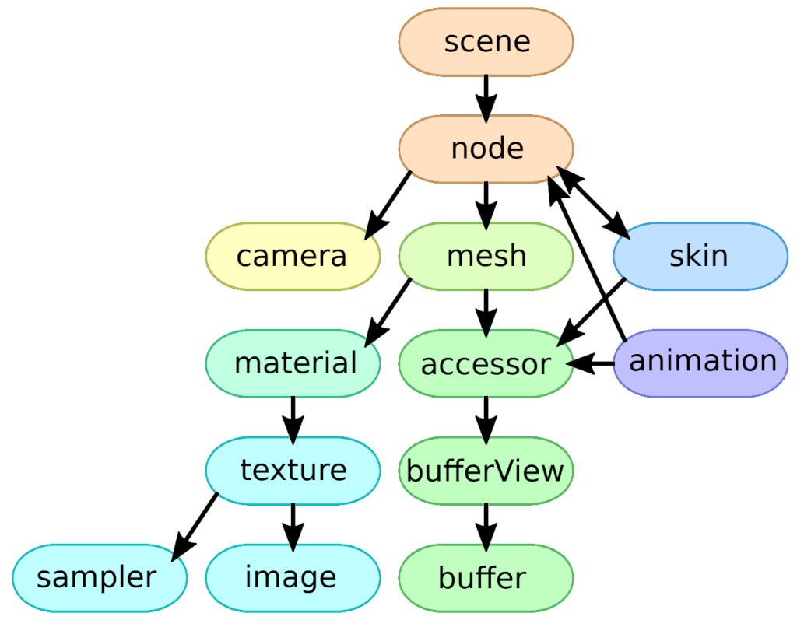
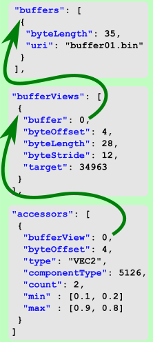
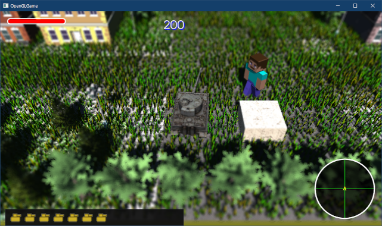

[OpenGL 3D 2022 Tips 第03回]

# 

## 習得目標

* 
* 
* 

## 1. 

### 1.1 

OBJファイルは仕様が比較的単純であり、しかもテキスト形式であることから、最初に扱う3Dモデル用のファイル形式としては優秀です。

ですが、なにぶんにも古くからある形式なので、近代的なグラフィックス機能には対応していません。そこで、より近代的なファイル形式を読み込む機能を追加します。

今回選んだのは`glTF`(ジーエル・ティー・エフ)というファイル形式です。

「glTF」は「GL Transmission Format(ジーエル・トランスミッション・フォーマット)」を略したもので、OpenGLの標準化団体である「クロノス・グループ」によって開発されました。

glTFは比較的新しいファイル形式で、バージョン1.0は2015年、バージョン2.0は2017に公開されています。

glTFの主要な特徴は以下の２つです。

>1. 「JSON(ジェイソン)」という、単純なデータ記述用の言語を元に作られている。
>2. OpenGLの標準化団体が開発しただけあって、OpenGL(およびその後継であるVulkan)との親和性が高いファイル形式になっている。

OpenGLとの親和性の高さは、今回扱うファイル形式としてglTFを選んだ理由でもあります。

### 1.2 JSONについて

JSON(ジェイソン)は`JavaScript Object Notation`(ジャバスクリプト・オブジェクト・ノーテーション)の略で、JavaScriptの文法からデータを定義する文法要素だけを取り出した「データ記述言語」です。

JSONは、人間にとってもコンピューターにとっても比較的簡単に読み書きが可能なため、さまざまな分野で利用されています。

JSONには６種類のデータ型が存在します。６種類のうち２つは構造を作るためのデータ型で、以下の２種類があります。

>* オブジェクト(名前/値のペアの集まり)。`{ "身長" : 129, "体重" : 24, "血液型" : "O" }`のように書き、名前と値を「：(コロン)」で、ペア同士を「，(かんま)」で区切り、全体を「｛」と「｝」で囲う。
>* 配列。`[ 2, 7, 1, 8, 2, 8 ]`のように、データ型同士を「，」で区切り、全体を「［」と「］」で囲う。

残りは数値や文字列などを直接に表すデータ型で、以下の４種類があります。

>* 文字列。`"これは文字列です"`のように、「”(だぶる・くぉーてーしょん)」で囲う(つまりC++言語と同じ)。
>* 数値。`57`や`3.14159`、のように、数値そのものを書く。小数も書ける。
>* 真偽値。`true`と`false`のこと(これもC++言語と同じ)。
>* null値。C++言語では`nullptr`と書くが、JSONでは単に`null`と書く。

JSONでは、これらを組み合わせて多様なデータを表現します。

>本テキストの主題はglTFなので、JSONの詳しい説明は行いません。詳細は以下のサイトを参照してください。<br>
>`https://www.json.org/json-ja.html`

ただ、いくらJSONが単純な言語だとはいっても、それを読み込むプログラムを書くにはある程度のプログラミングの知識と経験が必要となります。

それに、今回の目的はglTFを読み込むことで、JSONはそのための手段に過ぎません。そこで、JSONの取り扱いはライブラリに一任することにします。

JSONライブラリはいくつも存在しますが、今回は「json11」というライブラリを使います。以下のGitHubリポジトリから「Clone or download」ボタンでzipファイルをダウンロードしてください。

`https://github.com/dropbox/json11`

ダウンロードしたzipファイルをプロジェクトの`Src`フォルダに展開し、フォルダ名を`json11-master`から`json11`に改名してください。

次に、`json11`フォルダにある`json11.cpp`と`json11.hpp`の２つのファイルを、Visual Studioのプロジェクトに追加してください。

### 1.4 json11におけるJSONデータ型の扱い

JSONのデータは、JavaScriptで表現可能な型として定義されています。json11ライブラリでは、C++言語でJSONを扱うために、6つのデータ型を以下のC++言語の型に割り当てています。

| JSONの型 | 内容 | C++の型 |
|:-:|:-:|:-:|
| オブジェクト | 名前/値のペアの集まり | std::map |
| 配列 | 値の配列 | std::vector |
| 文字列 | 文字列 | std::string |
| 数値 | 数値 | double, int |
| 真偽値 | 真偽値 | bool |
| ヌル | null値 | nullptr |

おおむねなじみのある型ばかりですが、`std::map`(エスティーディ・マップ)は見慣れないと思われるため、ここで少し説明をしておきます。

### 1.4 mapクラスについて

`map`クラスは「キー(鍵)」と「値」のペアの集まりで、「連想配列」や「辞書」と呼ばれるデータ構造を表すクラスです。

JSONは名前と値のペアしか許されませんが、std::mapではどんな型でもキーとして指定できます。json11ではJSONのデータ型として使うので、キーはstd::stringクラスが指定されています。

`map`クラスの特徴は、キーに対応する値をすばやく見つけ出せることです。例えば`vector`クラスの場合、「10番目の値」などは簡単に取り出せます。

しかし、「名前が"吉良上野介"の値」を取り出そうと思ったら、先頭から(あるいは末尾から)ひとつずつデータの名前を調べていくしかありません。

これに対して`map`クラスでは、名前をキーとして設定しておけば、どんなにデータ数が多くても、非常に高速に目的の値を取り出すことが可能です。

以下に`map`クラスの使い方の例を示します。

```c++
// std::map型の変数を作成.
struct Soldier {
  std::string nickname;
  std::string weapon;
  int magazine = 0;
};
std::map<std::string, Soldier> soldiers;

// キーと値のペアを追加.
soldiers.insert(std::make_pair("パーキンス", Soldier{ "パッキー", "M16A1", 12}));
soldiers.insert(std::make_pair("ラッツ", Soldier{ "ラッツ", "M72", 4}));
soldiers.insert(std::make_pair("ボタスキー", Soldier{ "ボタ", "通信機", 1}));
soldiers.insert(std::make_pair("チコ", Soldier{ "チコ", "AK-47", 12}));

// キーから値を取得.
std::string k = "ボタスキー";
std::cout << k << "のニックネームは" << soldiers[k].nickname << "です\n";
```

このように、`map`クラスでは`[]`演算子を使うだけで対応する値が見つけられます。名前を検索する`for`を書く必要はありません。

もちろん、良いことばかりではありません。まず、キーを記録するために追加のメモリが必要です。

また、`vector`クラスは必要なメモリをひとつの連続した領域として確保します。対して、`map`クラスではキー/値のペアごとにメモリ領域が確保されるため、データがメモリ内でバラバラに配置されます。

これが問題なのは、現代のコンピューターは「データが近くに配置されているほど効率的に処理できる」設計になっているからです。

データ量が少ない場合は比較回数も少なくなるため、`vector`クラスを使うほうが効率が良くなります。

逆にデータ量が多くなると、`vector`クラスでは比較回数が飛躍的に増加します。この場合、比較回数がほとんど増えない`map`クラスが有利になります。

### 1.5 json11の使い方

json11ライブラリでは、データを`Json`というクラスに格納します。`Json`(ジェイソン)クラスは、JSONの6つの型のいずれかの値を保持することができます。

どの型のデータが格納されているかは`type`メンバ関数で調べることができます。型の値を取り出すには、以下のメンバ関数を使います。

| JSONの型 | 取得関数 |
|:-:|:--|
| オブジェクト | object_items |
| 配列 | array_items |
| 文字列 string_value |
| 数値(double) | number_value |
| 数値(int) | int_value |
| 真偽値 | bool_value |

>ヌル値は`type`メンバ関数で判別できるため、取得関数はありません。

<pre class="tnmai_assignment">
<strong>【課題01】</strong>
json11.hを開き、ライブラリで使える関数、定数について確認しなさい。
</pre>

>**【1章のまとめ】**
>
>* 
>* 
>* 

<div style="page-break-after: always"></div>

## 2. glTFを読み込む

### 2.1 VertexArrayBufferクラスを定義する

ここからは、glTFを読み込んでメッシュデータを構築する機能を作っていきます。glTFでは、プリミティブごとにVAOを作成するのが基本となります。

そこで、まずVAOを管理する`VertexArrayObject`(バーテックス・アレイ・オブジェクト)クラスを作成します。

プロジェクトの`Src`フォルダに`VertexArrayObject.h`というヘッダファイルを追加してください。追加したファイルを開き、次のプログラムを追加してください。

```diff
+/**
+* @file VertexArrayObject.h
+*/
+#ifndef VERTEXARRAYOBJECT_H_INCLUDED
+#define VERTEXARRAYOBJECT_H_INCLUDED
+#include "glad/glad.h"
+#include <memory>
+
+/**
+* 頂点属性配列オブジェクト(VAO)
+*/
+class VertexArrayObject
+{
+public:
+  VertexArrayObject();
+  ~VertexArrayObject();
+
+  // コピーを禁止
+  VertexArrayObject(const VertexArrayObject&) = delete;
+  VertexArrayObject& operator=(const VertexArrayObject&) = delete;
+
+  void SetAttribute(GLuint bindingPoint, GLuint index,
+    GLint size, GLenum type, GLboolean normalized, GLuint offset) const;
+  void SetVBO(GLuint bindingPoint, GLuint vbo,
+    GLintptr offset, GLsizei stride) const;
+  void SetIBO(GLuint ibo);
+
+  void Bind() const;
+  void Unbind() const;
+
+private:
+  GLuint vao = 0;
+};
+using VertexArrayObjectPtr = std::shared_ptr<VertexArrayObject>;
+
+#endif // VERTEXARRAYOBJECT_H_INCLUDED
```

`GLContext.cpp`に定義した`CreateVertexArray`関数では、すべての頂点アトリビュートを一括で設定していました。この方法では、複数の頂点アトリビュートを設定するとき、何度も同じプログラムを書く必要がありました。

今回は、「ひとつの頂点アトリビュートを設定する機能」を関数として定義することで、これを改善することにしました。

また、コピーコンストラクタとコピー代入演算子を`delete`宣言すると、オブジェクトのコピーを禁止することができます(コピー禁止クラスをコピーするコードを書くと、ビルドエラーになります)。

デストラクタで資源管理を行っている場合、コピーが作れてしまうと資源管理が破綻してしまいます。そこで、この方法を使ってコピーを作れなくします。

### 2.2 コンストラクタ、デストラクタを定義する

それでは、メンバ関数を定義していきましょう。プロジェクトの`Src`フォルダに`VertexArrayObject.cpp`というCPPファイルを追加してください。追加したファイルを開き、次のプログラムを追加してください。

```diff
+/**
+* @file VertexArrayObject.cpp
+*/
+#include "VertexArrayObject.h"
+
+/**
+* コンストラクタ
+*/
+VertexArrayObject::VertexArrayObject()
+{
+  glCreateVertexArrays(1, &vao);
+}
+
+/**
+* デストラクタ
+*/
+VertexArrayObject::~VertexArrayObject()
+{
+  glDeleteVertexArrays(1, &vao);
+}
```

コンストラクタでVAOを作成し、デストラクタでVAOを削除するようにしています。

### 2.3 SetAttribute関数を定義する

次に、頂点アトリビュートを設定する`SetAttribute`(セット・アトリビュート)関数を定義します。デストラクタの定義の下に、次のプログラムを追加してください。

```diff
   glDeleteVertexArrays(1, &vao);
 }
+
+/**
+* 頂点アトリビュートを設定する
+*
+* @param bindingPoint   アトリビュート番号を割り当てるバインディングポイント
+* @param index          設定するアトリビュート番号
+* @param size           データの要素数
+* @param type           要素の型
+* @param normalized     正規化の有無
+* @param relativeOffset データ単位の先頭からの相対オフセット
+*/
+void VertexArrayObject::SetAttribute(GLuint bindingPoint, GLuint index,
+  GLint size, GLenum type, GLboolean normalized, GLuint relativeOffset) const
+{
+  glEnableVertexArrayAttrib(vao, index);
+  glVertexArrayAttribBinding(vao, index, bindingPoint);
+  glVertexArrayAttribFormat(vao, index, size, type, normalized, relativeOffset);
+}
```

この関数は、頂点アトリビュートを設定するための3つの関数を呼び出します。なお、これら3つの関数は好きな順番で呼び出すことができます。

### 2.4 VBO, IBOを設定する関数を定義する

続いて、VBOとIBOを設定する関数を定義します。`SetAttribute`関数の定義の下に、次のプログラムを追加してください。

```diff
   glVertexArrayAttribBinding(vao, index, bindingPoint);
   glVertexArrayAttribFormat(vao, index, size, type, normalized, relativeOffset);
 }
+
+/**
+* VBOをバインディングポイントに割り当てる
+*
+* @param bindingPoint VBOを割り当てるバインディングポイント
+* @param vbo          バインディングポイントに割り当てるVBO
+* @param offset       VBO内の最初の要素までのオフセット
+* @param stride       ある要素の先頭から次の要素の先頭までのバイト数
+*/
+void VertexArrayObject::SetVBO(GLuint bindingPoint, GLuint vbo,
+  GLintptr offset, GLsizei stride) const
+{
+  glVertexArrayVertexBuffer(vao, bindingPoint, vbo, offset, stride);
+}
+
+/**
+* IBOを割り当てる
+*
+* @param ibo  VAOに割り当てるIBO
+*/
+void VertexArrayObject::SetIBO(GLuint ibo)
+{
+  glVertexArrayElementBuffer(vao, ibo);
+}
```

それぞれ`glVertexArrayVertexBuffer`と`glVertexArrayElementBuffer`を呼び出すだけです。このような、ある関数を呼び出すことを主目的とする関数は「ラッパー関数」と呼ばれます。

### 2.5 Bind, Unbind関数を定義する

最後に、VAOをバインド、及びアンバインドする関数を定義します。`SetIBO`関数の定義の、次のプログラムを追加してください。

```diff
   glVertexArrayElementBuffer(vao, ibo);
 }
+
+/**
+* VAOをグラフィックスパイプラインに割り当てる
+*/
+void VertexArrayObject::Bind() const
+{
+  glBindVertexArray(vao);
+}
+
+/**
+* VAOのグラフィックスパイプラインへの割り当てを解除する
+*/
+void VertexArrayObject::Unbind() const
+{
+  glBindVertexArray(0);
+}
```

これらは`glBindVertexArray`を呼び出すだけです。

### 2.6 glTFの構造を表すクラスを定義する

それでは、本丸のglTFを扱う機能を作っていきます。glTFは以下のような階層構造を持っています。本テキストでは、`mesh`(メッシュ)配下のオブジェクトだけを扱います。

<p align="center">

</p>

上図において、矢印の根本のオブジェクトが、矢印の指すオブジェクトを参照しています。

>これは概要図なので、ここに書かれていないオブジェクトがある点には注意してください。<br>
>glTFの概要については、以下のURLで公開されている「glTF 2.0の概要図の日本語訳」が参考になるでしょう。<br>
>`https://qiita.com/randall2835/items/ec911cb6b0f10677559b`

プロジェクトの`Src`フォルダに`GltfMesh.h`(ジーエルティーエフ・メッシュ・エイチ)という名前のヘッダファイルを追加してください。追加したファイルを開き、次のプログラムを追加してください。

```diff
+/**
+* @file GltfMesh.h
+*/
+#ifndef GLTFMESH_H_INCLUDED
+#define GLTFMESH_H_INCLUDED
+#include "glad/glad.h"
+#include <glm/glm.hpp>
+#include <unordered_map>
+#include <vector>
+#include <string>
+#include <memory>
+
+// 先行宣言
+class Texture;
+using TexturePtr = std::shared_ptr<Texture>;
+class VertexArrayObject;
+using VertexArrayObjectPtr = std::shared_ptr<VertexArrayObject>;
+
+#endif// GLTFMESH_H_INCLUDED
```

手始めに、マテリアル、プリミティブ、メッシュ、そしてこの3つをまとめて管理するファイル、という4つのクラスを定義します。

プリミティブはメッシュの内部データです。メッシュは複数のプリミティブを含むことができます。それでは、先行宣言の下に、次のプログラムを追加してください。

```diff
 using TexturePtr = std::shared_ptr<Texture>;
 class VertexArrayObject;
 using VertexArrayObjectPtr = std::shared_ptr<VertexArrayObject>;
+
+/**
+* マテリアルデータ
+*/
+struct GltfMaterial
+{
+  glm::vec4 baseColor = glm::vec4(1);
+  TexturePtr texBaseColor;
+};
+
+/**
+* プリミティブデータ
+*/
+struct GltfPrimitive
+{
+  GLenum mode = GL_TRIANGLES; // プリミティブの種類
+  GLsizei count = 0; // 描画するインデックス数
+  GLenum type = GL_UNSIGNED_SHORT; // インデックスデータ型
+  const GLvoid* indices = 0; // 描画開始インデックスのバイトオフセット
+  GLint baseVertex = 0; // インデックス0番とみなされる頂点配列内の位置
+
+  VertexArrayObjectPtr vao;
+  size_t materialNo = 0; // マテリアル番号
+};
+
+/**
+* メッシュデータ
+*/
+struct GltfMesh
+{
+  std::string name; // メッシュ名
+  std::vector<GltfPrimitive> primitives;
+};
+
+/**
+* ファイル
+*/
+struct GltfFile
+{
+  std::string name; // ファイル名
+  std::vector<GltfMesh> meshes;
+  std::vector<GltfMaterial> materials;
+};
+using GltfFilePtr = std::shared_ptr<GltfFile>;

 #endif// GLTFMESH_H_INCLUDED
```

glTFのマテリアルデータは、2010年代からゲームでの利用が進んでいる「物理ベースレンダリング(PBR)」を念頭に置いて設計されています。そのため、OBJファイルと比べるとデータの種類が多いです。

ただ、今回は物理ベースレンダリングには踏み込みません。そのため、最低限のデータとして、ベースカラー及びベースカラーテクスチャの2つだけを利用します。

プリミティブにはVAOと、描画に利用するマテリアルの番号を追加しています。glTFではプリミティブごとにVAOを定義するからです。マテリアルもプリミティブごとに切り替えます。

### 2.7 メッシュを管理するクラスを定義する

最後に、glTFファイルを読み込んだメッシュを管理する`GltfFileBuffer`(ジーエルティーエフ・ファイル・バッファ)クラスを追加します。`GltfFile`クラスの定義の下に次のプログラムを追加してください。

```diff
   std::vector<GltfMaterial> materials;
 };
 using GltfFilePtr = std::shared_ptr<GltfFile>;
+
+/**
+* glTFファイルから読み込んだメッシュを管理するクラス
+*/
+class GltfFileBuffer
+{
+public:
+  explicit GltfFileBuffer(size_t maxBufferSize);
+  ~GltfFileBuffer();
+
+  // コピーを禁止
+  GltfFileBuffer(const GltfFileBuffer&) = delete;
+  GltfFileBuffer& operator=(const GltfFileBuffer&) = delete;
+
+  bool AddFromFile(const char* filename);
+  GltfFilePtr GetFile(const char* filename) const;
+
+private:
+  // glTF用のバッファオブジェクト
+  GLuint buffer = 0;
+  GLsizei maxBufferSize = 0;
+  GLsizei curBufferSize = 0;
+
+  // メッシュファイル管理用の連想配列
+  std::unordered_map<std::string, GltfFilePtr> files;
+};
+using GltfFileBufferPtr = std::shared_ptr<GltfFileBuffer>;

 #endif// GLTFMESH_H_INCLUDED
```

`GltfFileBuffer`クラスの役割は、以前作成した`PrimitiveBuffer`とほぼ同じです。なお、今回は必要最小限のメンバ関数しか宣言しません。他に必要な関数は、みなさんの手で追加してください。

glTFファイルの読み込みは`AddFromFile`(アド・フロム・ファイル)メンバ関数で行います。読み込んだファイルを取得するには`GetFile`(ゲット・ファイル)メンバ関数を使います。

メッシュの管理には`unordered_map`(アンオーダード・マップ)クラスを使います。`unordered_map`は前に説明した`map`クラスの改良版で、C++11から追加されました。

### 2.8 GltfFileBufferコンストラクタを定義する

続いて、メンバ関数を定義します。プロジェクトの`Src`フォルダに`GltfMesh.cpp`というCPPファイルを追加してください。追加したファイルを開き、次のプログラムを追加してください。

```diff
+/**
+* @file GltfMesh.cpp
+*/
+#include "GltfMesh.h"
+#include "VertexArrayObject.h"
+#include "GLContext.h"
+#include "GameEngine.h"
+#include "json11/json11.hpp"
+#include <fstream>
+#include <filesystem>
+#include <iostream>
+
+using namespace json11;
```

とりあえず、glTFファイルからメッシュを作成するために必要なヘッダファイルをインクルードします。それから`using`指令によって、`json11`名前空間のメンバを修飾不要にしておきます。

json11ライブラリのメンバはすべて`json11`名前空間に格納されています。さらに、大半の機能は`Json`クラスのメンバなので、通常は毎回`json11::Json::parse`のように書く必要があります。

`using`指令を使うと、同じことを`Json::parse`と書けるようになります。これによって、コードが見やすくなり、さらにタイピング量を減らすことができます。

それでは、コンストラクタから定義していきましょう。`using`指令の下に、次のプログラムを追加してください。

```diff
 #include <iostream>

 using namespace json11;
+
+/**
+* コンストラクタ
+*
+* @param maxBufferSize メッシュ格納用バッファの最大バイト数
+*/
+GltfFileBuffer::GltfFileBuffer(size_t maxBufferSize)
+{
+  // ダミーデータ
+  static const struct {
+    glm::vec4 color = glm::vec4(1);
+    glm::vec4 texcoord = glm::vec4(0);
+    glm::vec4 normal = glm::vec4(0, 0, -1, 0);
+  } dummyData;
+  const GLsizei dummyDataSize = static_cast<GLsizei>(sizeof(dummyData));
+
+  this->maxBufferSize = static_cast<GLsizei>(maxBufferSize + dummyDataSize);
+  buffer = GLContext::CreateBuffer(this->maxBufferSize, nullptr);
+
+  // バッファの先頭にダミーデータを設定
+  CopyData(buffer, 1, 0, sizeof(dummyData), &dummyData);
+  curBufferSize = dummyDataSize;
+}
```

コンストラクタでは、メッシュデータを格納するバッファオブジェクトを作成します。このバッファオブジェクトには、VBOとIBOの両方が格納されます。

また、バッファオブジェクトの先頭にダミーデータを追加しています。このダミーデータは、色やテクスチャ座標を持たないメッシュのVAOに割り当てるためのものです。

### 2.9 GltfFileBufferデストラクタを定義する

コンストラクタの次は、デストラクタを定義します。コンストラクタの定義の下に、次のプログラムを追加してください。

```diff
   CopyData(buffer, 1, 0, sizeof(dummyData), &dummyData);
   curBufferSize = dummyDataSize;
 }
+
+/**
+* デストラクタ
+*/
+GltfFileBuffer::~GltfFileBuffer()
+{
+  glDeleteBuffers(1, &buffer);
+}
```

デストラクタはバッファオブジェクトを削除するだけです。

### 2.10 ファイルを読み込む関数を定義する

次は`AddFromFile`関数を定義するのですが、その前に「ファイルを読み込む」関数を定義しておきます。`GltfMesh.cpp`を開き、`iostream`のインクルード文の下に、次のプログラムを追加してください。

```diff
 #include <iostream>

 using namespace json11;

+namespace { // unnamed
+
+/**
+* ファイルを読み込む
+*
+* @param filename 読み込むファイル名
+*/
+std::vector<char> ReadFile(const char* filename)
+{
+  std::ifstream file(filename, std::ios::binary);
+  if (!file) {
+    std::cerr << "[エラー]" << __func__ << ": " << filename << "を開けません.\n";
+    return {};
+  }
+  std::vector<char> buf(std::filesystem::file_size(filename));
+  file.read(buf.data(), buf.size());
+  return buf;
+}
+
+} // unnamed namespace

 /**
 * メッシュを描画する
```

この関数は、指定されたファイルを`ifstream`で開き、`vector`配列に読み込む、という処理を行います。これはシェーダやテクスチャの読み込みとほぼ同じです。

関数が他のファイルから見えないように「無名名前空間」に入れています。名前を指定しない名前空間はすべて「無名名前空間」となり、コンパイラによってCPPファイルごとに自動的に異なる名前が付けられます。

C++の変数や関数は「グローバル名前空間」に作られます。そのため、異なるCPPファイルであっても同じ名前を使うことができません。

無名名前空間はCPPファイルごとに異なるため、同じ名前の変数や関数を書いても重複することはありません。

なお、プログラムからは、コンパイラが付けた名前を参照することはできません。また、無名名前空間のコメントに`unnamed`(アンネームド)と書いているのは、名前を付け忘れたわけではないことを示すためです。

>`unnamed`は「<ruby>無名<rt>むめい</rt></ruby>、名前のない」という意味です。

### 2.11 バッファのオフセットを計算する関数を定義する

>ここから先は、glTF概要図を見ながら読んでください。

glTFでは、頂点データやインデックスデータはglTFとは別のバイナリファイルに格納されます。必要なバイナリファイルの名前は`buffers`(バッファーズ)という配列に記録されます。

バイナリファイルにはさまざまなデータが格納されるので、どのデータがどの位置にあるかを示す情報が必要です。この情報は「バッファビュー」と「アクセッサ」に記録されています。

「バッファビュー」は、バイナリファイル内の「同じ性質を持つデータをまとめた領域」を表します。ひとつのバイナリファイルには、ひとつまたは複数のバッファビューが含まれます。

「アクセッサ」は、バッファビュー内の「個々のデータ領域」を表します(バイナリにアクセスするためのデータなので、アクセス+erで「アクセッサ」という名前になっている)。

一つのバッファビュー領域には、ひとつまたは複数のアクセッサが含まれます。

<p align="center">

</p>

アクセッサとバッファビューを参照することで、例えば頂点データがバイナリファイルの先頭から何バイト目にあるか(=オフセット)を知ることができます。

まず、バッファビューの`byteOffset`(バイト・オフセット)は、そのバッファビューがバイナリファイルのどの位置から始まるかを示します。

総バイト数は`byteLength`(バイト・レングス)で示されるので、バッファビューの範囲は「`byteOffset`から`byteOffset+byteLength`まで」ということになります。

さらに、アクセッサにも`byteOffset`があります。こちらは「バッファビューの先頭からのバイト位置」を示しています。

つまり、データの開始位置は「バッファビューの`byteOffset`＋アクセッサの`byteOffset`」になります。

また、アクセッサが示すデータの総バイト数は、アクセッサの`componentType`(コンポーネント・タイプ)と`count`(カウント)、それから`type`(タイプ)の3つを使って計算します。

`type`はデータがスカラーなのか、ベクトルなのか、あるいは行列なのかを示します。`componentType`は、`type`で示されたデータの各要素が`int`なのか`float`なのかを示します。

例えば`type`がVEC3で`componentType`がGL_FLOATだった場合、「`float`型の3要素ベクトル」が格納されている、といった具合です。そして、`count`にはデータの個数が記録されています。

この3つのパラメータをかけ合わせることで、アクセッサの総バイト数が計算できます。つまり、「`count`×`typeが示す要素数`×`componentTypeが示す型のバイト数`」とするわけです。

このように、オフセットの計算方法はすこし複雑です。そのうえ、オフセットは様々な場面で必要となります。そこで、オフセットを計算する関数を作成することにします。

関数名は`GetBufferOffset`(ゲット・バッファ・オフセット)とします。`ReadFile`関数の定義の下に、次のプログラムを追加してください。

```diff
   file.read(buf.data(), buf.size());
   return buf;
 }
+
+/**
+* アクセッサが示すバッファのオフセットを取得する
+*
+* @param accessor    アクセッサ
+* @param bufferViews バッファビュー配列
+* @param binOffset   バイナリデータの先頭オフセット配列
+*/
+GLsizeiptr GetBufferOffset(const Json& accessor,
+  const Json& bufferViews, const std::vector<GLsizeiptr>& binOffset)
+{
+  // アクセッサから必要な情報を取得
+  const int byteOffset = accessor["byteOffset"].int_value();
+  const int bufferViewId = accessor["bufferView"].int_value();
+
+  // バッファビューから必要な情報を取得
+  const Json bufferView = bufferViews[bufferViewId];
+  const int bufferId = bufferView["buffer"].int_value();
+  const int baesByteOffset = bufferView["byteOffset"].int_value();
+
+  // オフセットを計算
+  return binOffset[bufferId] + baesByteOffset + byteOffset;
+}

 } // unnamed namespace

 /**
 * メッシュを描画する
```

### 2.12 バッファビューのストライドを計算する関数を定義する

「ストライド」とは「次のデータまでのバイト数」を表すデータです。OpenGLにかぎらず、GPUメモリに配置されるデータ配列は、データとデータの間が詰まっているとは限りません。

そこで、次のデータへ到達できるようにストライドを設定する必要があります。そのために、ストライドを取得する関数を定義します。

>`stride`(ストライド)は「歩幅」を意味する英単語です。

`GetBufferOffset`関数の定義の下に、次のプログラムを追加してください。

```diff
   // オフセットを計算
   return binOffset[bufferId] + baesByteOffset + byteOffset;
 }
+
+/**
+* アクセッサが示すバッファのオフセットを取得する
+*
+* @param accessor    アクセッサ
+* @param bufferViews バッファビュー配列
+*/
+GLsizei GetBufferStride(const Json& accessor, const Json& bufferViews)
+{
+  const int bufferViewId = accessor["bufferView"].int_value();
+  const Json bufferView = bufferViews[bufferViewId];
+
+  // byteStrideが0より大きい値で定義されていたら、その値を返す
+  const GLsizei stride = bufferView["byteStride"].int_value();
+  if (stride > 0) {
+    return stride;
+  }
+  // byteStrideが未定義または0だった場合、データ1個分のサイズを計算して返す
+}

 } // unnamed namespace

 /**
 * メッシュを描画する
```

ストライドは`byteStride`(バイト・ストライド)という名前で取得できます。ただし、`byteStride`は定義されていないことも多いです。

定義されていない場合は、アクセッサに定義されている情報からデータ1個分のサイズを計算し、そのサイズを使う必要があります。

まず要素型のサイズを計算します。「byteStrideが未定義または0だった場合～」のコメントの下に、次のプログラムを追加してください。

```diff
     return stride;
   }
   // byteStrideが未定義または0だった場合、データ1個分のサイズを計算して返す
+
+  // 要素型のサイズ
+  const int componentType = accessor["componentType"].int_value();
+  switch (componentType) {
+  case GL_BYTE:           componentSize = 1; break;
+  case GL_UNSIGNED_BYTE:  componentSize = 1; break;
+  case GL_SHORT:          componentSize = 2; break;
+  case GL_UNSIGNED_SHORT: componentSize = 2; break;
+  case GL_UNSIGNED_INT:   componentSize = 4; break;
+  case GL_FLOAT:          componentSize = 4; break;
+  default:
+    std::cerr << "[エラー]" << __func__ << ":glTFの仕様にない型" <<
+      componentType << "が使われています\n";
+    break;
+  }
 }

 } // unnamed namespace
```

glTFバージョン2.0では上記の6種類の要素型を使うことができます。ご覧のとおり、`GL_INT`と`GL_DOUBLE`は使えません(将来のバージョンで追加される可能性はあります)。

次に要素数を求めます。要素型のサイズを求めるプログラムの下に、次のプログラムを追加してください。

```diff
       componentType << "が使われています\n";
     break;
   }
+
+  // 型名と要素数の対応表
+  const struct {
+    const char* type; // 型の名前
+    int elementCount; // 要素数
+  } elementCountList[] = {
+    { "SCALAR", 1 },
+    { "VEC2", 2 }, { "VEC3", 3 }, { "VEC4", 4 },
+    { "MAT2", 4 }, { "MAT3", 9 }, { "MAT4", 16 },
+  };
+
+  // 要素数
+  const std::string& type = accessor["type"].string_value();
+  int elementCount = 1;
+  for (const auto& e : elementCountList) {
+    if (type == e.type) {
+      elementCount = e.elementCount;
+      break;
+    }
+  }
+
+  // 型のサイズをストライドとする
+  return componentSize * elementCount;
 }

 } // unnamed namespace
```

glTFバージョン2.0では上記の7種類の型名を使うことができます。

型名はアクセッサに`type`という名前で定義されていますので、`elementCountList`から同じ名前の要素を探して要素数を取得します。

要素型のサイズと要素数が求まったら、その2つを掛けると型のサイズが得られるので、これを「ストライド」として返します。

### 2.13 頂点アトリビュートを設定する関数を定義する

glTFのプリミティブには頂点アトリビュートに関する情報が含まれています。そこからVAOを作成し、頂点アトリビュートを設定します。

ただ、頂点アトリビュートは複数設定する必要があるうえに設定項目が多いので、扱いやすくするために関数として定義します。

`GetBufferStride`関数の定義の下に、次のプログラムを追加してください。

```diff
   // 要素のサイズをストライドとする
   return componentSize * elementCount;
 }
+
+/**
+* 頂点アトリビュートを設定する
+* 
+* @param vao         頂点アトリビュートを設定するVAO
+* @param index       頂点アトリビュート番号及びバインディングポイント
+* @param buffer      VBOとして扱うバッファオブジェクト
+* @param accessor    頂点アトリビュートデータを持つアクセッサ
+* @param bufferViews バッファビュー配列
+* @param binOffset   バイナリデータのオフセット配列
+*/
+bool SetAttribute(VertexArrayObjectPtr& vao, int index, GLuint buffer,
+  const Json& accessor, const Json& bufferViews,
+  const std::vector<GLsizeiptr>& binOffset)
+{
+  // 型名と要素数の対応表(頂点アトリビュート用)
+  const struct {
+    const char* type; // 型の名前
+    int elementCount; // 要素数
+  } elementCountList[] = {
+    { "SCALAR", 1 }, { "VEC2", 2 }, { "VEC3", 3 }, { "VEC4", 4 },
+  };
+
+  const std::string& type = accessor["type"].string_value();
+  int elementCount = -1;
+  for (const auto& e : elementCountList) {
+    if (type == e.type) {
+      elementCount = e.elementCount;
+      break;
+    }
+  }
+  if (elementCount < 0) {
+    std::cerr << "[エラー]" << __func__ << ": " << type << "は頂点属性に設定できません.\n";
+    return false;
+  }
+
+  // VAOに頂点アトリビュートを設定する
+  const GLsizei byteStride = GetBufferStride(accessor, bufferViews);
+  const GLsizeiptr offset = GetBufferOffset(accessor, bufferViews, binOffset);
+  const GLenum componentType = accessor["componentType"].int_value();
+  vao->SetAttribute(index, index, elementCount, componentType, GL_FALSE, 0);
+  vao->SetVBO(index, buffer, offset, byteStride);
+
+  return true;
+}

 } // unnamed namespace

 /**
 * メッシュを描画する
```

この関数では、頂点アトリビュートの番号とバインディングポイントを同じ数値にしています。glTFはこの2つを個別に指定する機能を持たないので、同じ番号を使うほうが合理的です。

なお、頂点アトリビュートには行列型を指定できません。そのため、`elementCountList`配列には行列を入れていません。これは、glTFというよりOpenGLの仕様です。

### 2.14 AddFromFile関数を定義する

それでは、今回の目玉となる`AddFromFile`(アド・フロム・ファイル)関数を定義します。行数の多い関数になるので、注意して作成してください。関数内では次の処理を行います。

>1. glTFファイルを読み込む
>2. バイナリファイルを読み込む
>3. プリミティブデータを解析してVAOを作成する
>4. マテリアルを読み込む
>5. `StaticMesh`を作成する

まずはglTFファイルを読み込みます。デストラクタの定義の下に、次のプログラムを追加してください。

```diff
 {
   glDeleteBuffers(1, &buffer);
 }
+
+/**
+* ファイルからメッシュを読み込む
+*
+* @param filename glTFファイル名
+*
+* @retval true  読み込み成功
+* @retval false 読み込み失敗
+*/
+bool GltfFileBuffer::AddFromFile(const char* filename)
+{
+  // glTFファイルを読み込む
+  std::vector<char> buf = ReadFile(filename);
+  if (buf.empty()) {
+    return false;
+  }
+  buf.push_back('\0');
+
+  return true;
+}
```

もし読み込んだデータ数が`0`だった場合、読み込み失敗とみなして`false`を返します。また、JSONとして解析するには文字列になっている必要があるため、末尾に`\0`を追加しています。

### 2.15 JSONを解析する

次にJson11ライブラリを使ってJSONを解析します。JSONを解析するには`parse`(パース)メンバ関数を使います。glTFファイルを読み込むプログラムの下に、次のプログラムを追加してください。

```diff
     return false;
   }
   buf.push_back('\0');
+
+  // JSON解析
+  std::string err;
+  const Json gltf = Json::parse(buf.data(), err);
+  if (!err.empty()) {
+    std::cerr << "[エラー]" << __func__ << " '" << filename << "'の読み込みに失敗しました.\n";
+    std::cerr << err << "\n";
+    return false;
+  }

   return true;
 }
```

`parse`関数の戻り値は`Json`(ジェイソン)型の変数です。ここでは`gltf`という名前の変数に格納しています。glTFファイルの場合、解析結果の値は常に「オブジェクト型」になります。

`parse`中に何かエラーが発生した場合、エラー引数にエラーメッセージが格納されます。エラーが起きなければエラー引数は空になるので、`empty`メンバ関数でエラーの有無を判定できます。

そこで、`err`(エラー)変数が空でない場合は解析失敗として`false`を返しています。

### 2.16 ファイル名からフォルダ部分を取り出す

次に、ファイル名のフォルダ部分(ファイル名が`abc/def/file.glTF`の場合、`abc/def/`の部分)を取り出します。取り出したフォルダ名は、バイナリファイルやテクスチャを読み込むために使います。

JSON解析を行うプログラムの下に、次のプログラムを追加してください。

```diff
     std::cerr << err << "\n";
     return false;
   }
+
+  // フォルダ名を取り出す
+  std::string foldername(filename);
+  const size_t lastSlashPos = foldername.find_last_of("/￥￥");
+  if (lastSlashPos == std::string::npos) {
+    foldername.clear();
+  } else {
+    foldername.resize(lastSlashPos + 1);
+  }

   return true;
 }
```

上のプログラムでは、`find_last_of`(ファインド・ラスト・オブ)関数を使うことで、ファイル名に含まれる最後の区切り記号(`/`または`￥`)を検索しています。

検索結果が`npos`(エヌ・ポス)だった場合、区切り記号はなく、ファイル名だけだったことを示します。この場合、フォルダ名は<ruby>空<rt>から</rt></ruby>です。

`npos`以外の場合は最後に見つかった区切り記号の位置を示します。この場合、区切り記号より後ろを削除するようにリサイズします。

`￥￥`のように円記号を2重にしている部分は、文字列中で`￥`を表すための書き方です。このように書かなければならないのは、￥記号が`￥n`などの特殊文字を表すために使われているからです。

そのため、￥記号自身を表すには「特殊文字の開始を示す￥」、「文字としての￥」の2つを連続して書く必要があるわけです。

### 2.17 バイナリファイルを読み込む

glTFファイルの仕様では、glTFファイルには「シーン」、「頂点データ」、「テクスチャ」などのあらゆるデータを格納できます。

しかし、一般的なglTFファイルの場合、拡張子`glTF`のファイルにはシーン構造などの基本的なデータだけを格納します。

頂点データは拡張子`bin`(ビン)のバイナリファイルとして、`glTF`ファイルとセットで作成されます。テクスチャはOBJファイルなどと同様に、独立したファイルとして用意します。

glTFの描画に必要な外部ファイルは、glTFファイル内の`buffers`配列や`images`配列にファイル名が書き込まれます。

JSONの解析が完了したので、これらのファイル名を取得できるようになりました。ファイル名を取り出して、頂点データが含まれるバイナリファイルを読み込みましょう。

フォルダ名を取り出すプログラムの下に、次のプログラムを追加してください。

```diff
   } else {
     foldername.resize(lastSlashPos + 1);
   }
+
+  // バイナリファイルを読み込む
+  const GLsizei prevBufferSize = curBufferSize;
+  std::vector<GLsizeiptr> binOffset;
+  for (const Json& e : gltf["buffers"].array_items()) {
+    const Json& uri = e["uri"];
+    if (!uri.is_string()) {
+      std::cerr << "[エラー]" << __func__ << ": " << filename << "に不正なURIがあります.\n";
+      return false;
+    }
+
+    // ファイルを読み込む
+    const std::string binPath = foldername + uri.string_value();
+    const std::vector<char> bin = ReadFile(binPath.c_str());
+    if (bin.empty()) {
+      curBufferSize = prevBufferSize;
+      return false; // バイナリファイルの読み込みに失敗
+    }
+
+    // バイナリデータをGPUメモリにコピー
+    CopyData(buffer, 1, curBufferSize, bin.size(), bin.data());
+    binOffset.push_back(curBufferSize); // バイナリデータのオフセットを設定
+    curBufferSize += static_cast<GLsizei>(bin.size());
+  }

   return true;
 }
```

`gltf`変数は常にオブジェクト型、つまり連想配列なので、配列の要素は名前を使って参照します。バイナリファイル名の配列は`buffers`(バッファーズ)という名前で参照できます。

外部のバイナリファイルを使用している場合、外部ファイル名は`uri`(ユー・アール・アイ)という名前で取得できます。

`uri`で取得するファイル名は、元になるglTFファイルからの相対パスとなっていることに注意してください。性格なファイル名を得るには、フォルダ名を加える必要があります。

バイナリファイルを読み込んだら、`Primitive.h`で定義している`CopyData`関数を使ってGPUメモリへ転送します。転送先は`GltfFileBuffer`コンストラクタで作成したバッファオブジェクトです。

転送後、`curBufferSize`(カー・バッファ・サイズ)を転送したデータサイズだけ増加させます。この変数は全体の転送量を示すとともに、次の転送位置をも示します。

`curBufferSize`はglTFファイルを読み込むたびに増加することになります。

`binOffset`(ビン・オフセット)配列には、バッファオブジェクト先頭からバイナリファイルまでの距離が格納されます。N番目のバイナリデータの位置は`binOffset[N]`で取得できます。

### 2.18 プリミティブ配列にアクセスする

メッシュデータの配列を取得するには`meshes`(メッシュズ)という名前を使います。それぞれのメッシュにはプリミティブの配列`primitives`(プリミティブズ)が含まれます。

個々のプリミティブには、頂点アトリビュートに対応する`attributes`(アトリビューツ)配列が格納されています。

`attributes`には、データの詳細を示す「アクセッサ」の番号が記録されています。そして、アクセッサは「バッファビュー」を参照してデータを特定します。

つまり、メッシュデータを読み込むには「アクセッサ」と「バッファビュー」も必要になります。

アクセッサの配列は`accessors`(アクセッサーズ)、バッファビュー配列は`bufferViews`(バッファ・ビューズ)という名前で取得できます。

バイナリデータをGPUメモリにコピーするプログラムの下に、次のプログラムを追加してください。

```diff
     binOffset.push_back(curBufferSize); // バイナリデータのオフセットを設定
     curBufferSize += static_cast<GLsizei>(bin.size());
   }
+
+  // アクセッサとバッファビューを取得
+  const Json& accessors = gltf["accessors"];
+  const Json& bufferViews = gltf["bufferViews"];
+
+  // メッシュを作成
+  GltfFilePtr file = std::make_shared<GltfFile>();
+  const std::vector<Json>& mesheArray = gltf["meshes"].array_items();
+  file->meshes.reserve(mesheArray.size());
+  for (const Json& currentMesh : mesheArray) {
+    GltfMesh mesh;
+
+    // メッシュ名を取得
+    mesh.name = currentMesh["name"].string_value();
+
+    // プリミティブを作成
+    const std::vector<Json>& primitiveArray = currentMesh["primitives"].array_items();
+    mesh.primitives.reserve(primitiveArray.size());
+    for (const Json& currentPrim : primitiveArray.size()) {
+      GltfPrimitive prim;
+
+      // 作成したプリミティブを配列に追加
+      mesh.primitives.push_back(prim);
+    }
+
+    // 作成したメッシュを配列に追加
+    file->meshes.push_back(mesh);
+  }

   return true;
 }
```

なお、上記のプログラムでは、glTFから取得した配列変数の名前を意図的に`～Array`のようにしています。一般的には、要素名と同じ`meshes`や`primitives`という名前を付けるところです。

しかし、この名前はメンバ変数名と同じなので、打ち間違える可能性があります。そこで、名前を変えることで間違える可能性を下げています。

### 2.19 インデックスデータを読み取る

次に、プリミティブのデータを読み取っていきます。まず「インデックスデータ」を読み取ります。インデックスデータは`indices`(インディシーズ)という名前で取得できます。

プリミティブを作成する`for`ループの内側に、次のプログラムを追加してください。

```diff
     mesh.primitives.reserve(primitiveArray.size());
     for (const Json& currentPrim : primitiveArray.size()) {
       GltfPrimitive prim;
+
+      // インデックスデータ
+      {
+        const int id = currentPrim["indices"].int_value();
+        const Json& accessor = accessors[id];
+        if (accessor["type"].string_value() != "SCALAR") {
+          std::cerr << "[エラー]" << __func__ << "インデックスデータ・タイプはSCALARでなくてはなりません\n";
+          std::cerr << "  type = " << accessor["type"].string_value() << "\n";
+          return false;
+        }
+
+        // プリミティブの種類
+        const Json& mode = currentPrim["mode"];
+        if (mode.is_number()) {
+          prim.mode = mode.int_value();
+        }
+
+        // インデックス数
+        prim.count = accessor["count"].int_value();
+
+        // インデックスデータの型
+        prim.type = accessor["componentType"].int_value();
+
+        // オフセット
+        const GLsizeiptr offset = GetBufferOffset(accessor, bufferViews, binOffset);
+        prim.indices = reinterpret_cast<const GLvoid*>(offset);
+      }

       // 作成したプリミティブを配列に追加
       mesh.primitives.push_back(prim);
     }
```

glTFの`indices`要素に格納されているのは整数なので、`int_value`メンバ関数で取り出すことができます。この整数は「アクセッサ配列のインデックス」です。

インデックスデータのオフセットは、アクセッサ、バッファビュー、バッファの3つのデータから計算する必要があります。

### 2.20 頂点アトリビュートを設定する

続いて、頂点アトリビュートを設定していきます。インデックスデータを読み取るプログラムの下に、次のプログラムを追加してください。

```diff
         const GLsizeiptr offset = GetBufferOffset(accessor, bufferViews, binOffset);
         prim.indices = reinterpret_cast<const GLvoid*>(offset);
       }
+
+      // 頂点アトリビュート(頂点座標)
+      prim.vao = std::make_shared<VertexArrayObject>();
+      const Json& attributes = currentPrim["attributes"];
+      if (attributes["POSITION"].is_number()) {
+        const int id = attributes["POSITION"].int_value();
+        SetAttribute(prim.vao, 0, buffer, accessors[id], bufferViews, binOffset);
+      }

       // 作成したプリミティブを配列に追加
       mesh.primitives.push_back(prim);
     }
```

頂点アトリビュートは`attributes`オブジェクトに格納されています。頂点アトリビュートとして有効な名前は、glTFの仕様で決められています。`POSITION`(ポジション)はそのひとつで、頂点座標を表します。

頂点アトリビュートのバインディングポイントは、シェーダと一致させるために`0`を指定しています。

さらに、`COLOR`(カラー)、`TEXCOORD_0`(テックスコード・ゼロ)、`NORMAL`(ノーマル)の3つの頂点アトリビュートを設定します。

頂点座標の頂点アトリビュートを設定するプログラムの下に、次のプログラムを追加してください。

```diff
         const int id = attributes["POSITION"].int_value();
         SetAttribute(prim.vao, 0, buffer, accessors[id], bufferViews, binOffset);
       }
+
+      // 頂点アトリビュート(頂点の色)
+      if (attributes["COLOR"].is_number()) {
+        const int id = attributes["COLOR"].int_value();
+        SetAttribute(prim.vao, 1, buffer, accessors[id], bufferViews, binOffset);
+      } else {
+        // 属性が未定義なのでダミーデータを使う
+        prim.vao->SetAttribute(1, 1, 4, GL_FLOAT, GL_FALSE, 0);
+        prim.vao->SetVBO(1, buffer, 0, 0);
+      }
+
+      // 頂点アトリビュート(テクスチャ座標)
+      if (attributes["TEXCOORD_0"].is_number()) {
+        const int id = attributes["TEXCOORD_0"].int_value();
+        SetAttribute(prim.vao, 2, buffer, accessors[id], bufferViews, binOffset);
+      } else {
+        // 属性が未定義なのでダミーデータを使う
+        prim.vao->SetAttribute(2, 2, 4, GL_FLOAT, GL_FALSE, 0);
+        prim.vao->SetVBO(2, buffer, 16, 0);
+      }
+
+      // 頂点アトリビュート(法線)
+      if (attributes["NORMAL"].is_number()) {
+        const int id = attributes["NORMAL"].int_value();
+        SetAttribute(prim.vao, 3, buffer, accessors[id], bufferViews, binOffset);
+      } else {
+        // 属性が未定義なのでダミーデータを使う
+        prim.vao->SetAttribute(3, 3, 4, GL_FLOAT, GL_FALSE, 0);
+        prim.vao->SetVBO(3, buffer, 32, 0);
+      }

       // 作成したプリミティブを配列に追加
       mesh.primitives.push_back(prim);
     }
```

これらの頂点アトリビュートのバインディングポイント番号

頂点座標以外の頂点アトリビュートは、プリミティブによっては定義されていないことがあります。しかし、定義されている頂点アトリビュートごとに異なるシェーダを使うことは現実的とはいえません。

そこで、定義されていない場合はダミーデータを設定するようにしています。このとき、ストライドを`0`に設定することで、すべての頂点に対して同じデータを使わせるようにしています。

### 2.21 IBOとマテリアル番号を設定する

あとプリミティブに設定する必要があるのは、IBOとマテリアル番号の2つです。頂点アトリビュートを設定するプログラムの下に、次のプログラムを追加してください。

```diff
         prim.vao->SetAttribute(3, 3, 4, GL_FLOAT, GL_FALSE, 0);
         prim.vao->SetVBO(3, buffer, 32, 0);
       }
+
+      // IBOを設定
+      prim.vao->SetIBO(buffer);
+
+      // プリミティブが使用するマテリアルの番号
+      prim.materialNo = currentPrim["material"].int_value();

       // 作成したプリミティブを配列に追加
       mesh.primitives.push_back(prim);
     }
```

これでプリミティブを作成することができました。

### 2.22 マテリアルを作成する

次は、マテリアルデータを読み取ってマテリアルを作成します。マテリアルは`materials`(マテリアルズ)という名前で取得できます。

プリミティブを作成するプログラムの下に、次のプログラムを追加してください。

```diff
     // 作成したメッシュを配列に追加
     file->meshes.push_back(mesh);
   }
+
+  // マテリアル
+  GameEngine& engine = GameEngine::Get();
+  const std::vector<Json>& materials = gltf["materials"].array_items();
+  const std::vector<Json>& textures = gltf["textures"].array_items();
+  const std::vector<Json>& images = gltf["images"].array_items();
+  file->materials.reserve(materials.size());
+  for (const Json& material : materials) {
+    const Json& pbr = material["pbrMetallicRoughness"];
+
+    // テクスチャを読み込む
+    std::shared_ptr<Texture> texBaseColor;
+    const Json& textureNo = pbr["baseColorTexture"]["index"];
+    if (textureNo.is_number()) {
+      const Json& texture = textures[textureNo.int_value()];
+      const int imageSourceNo = texture["source"].int_value();
+      const Json& imageUri = images[imageSourceNo]["uri"];
+      if (imageUri.is_string()) {
+        std::string filename = foldername + imageUri.string_value();
+
+        // 拡張子をtgaに変更
+        const size_t n = filename.find_last_of('.');
+        if (n != std::string::npos) {
+          filename.resize(n);
+        }
+        filename += ".tga";
+
+        // テクスチャを読み込む
+        texBaseColor = engine.LoadTexture(filename.c_str());
+      }
+    }
+
+    // マテリアルカラーを取得
+    glm::vec4 baseColor(1);
+    const std::vector<Json>& baseColorFactor = pbr["baseColorFactor"].array_items();
+    if (baseColorFactor.size() >= 4) {
+      for (int i = 0; i < 4; ++i) {
+        baseColor[i] = static_cast<float>(baseColorFactor[i].number_value());
+      }
+    }
+
+    // 取得したデータからマテリアルを作成
+    file->materials.push_back({ baseColor, texBaseColor });
+  }

   return true;
 }
```

glTFのマテリアル情報は`pbrMetallicRoughness`(ピービーアール・メタリック・ラフネス)という名前で取得できます。

>`pbr`は`Physically Based Rendering`(フィジカリー・ベースド・レンダリング、物理ベースレンダリング)の略称です。
>「メタリック・ラフネス」は、PBRの実現方法として「メタリック=金属・非金属の二択」と「ラフネス=表面の粗さ」の2パラメータ方式を使うことを意味しています。

マテリアルにはさまざまな情報が含まれますが、今回は`baseColorTexture`(ベースカラーテクスチャ)と`baseColorFactor`(ベースカラーファクター)の2つだけを取り出します。

この2つはマテリアルの最も基本的な色を決める情報です。マテリアルの色は`baseColorFactor`(ベース・カラー・ファクター)から取得します。ベースカラーファクターはRGBAの4要素の配列になっています。

マテリアルのテクスチャは`baseeColorTexture`(ベース・カラー・テクスチャ)で取得しますが、ここにはテクスチャのインデックスしか記録されていません。

画像ファイル名は、このインデックスを添え字にして、`images`(イメージズ)で取得できる画像データ配列から取得します。ただ、glTFバージョン2.0で使える画像形式はPNG, JPGだけです。

しかし、本テキストで作成したプログラムはTGA形式にしか対応していません。そこで、拡張子を無理やり`.tga`に変更することで対処しています。

>画像形式をTGAに変換するのを忘れないようにしてください。

### 2.23 メッシュをメッシュバッファに追加する

最後に、作成したファイルオブジェクトを連想配列に追加します。マテリアルを作成するプログラムの下に、次のプログラムを追加してください。

```diff
     // 取得したデータからマテリアルを作成
     file->materials.push_back({ baseColor, texBaseColor });
   }
+
+  // 作成したメッシュを連想配列に追加
+  file->name = filename;
+  files.emplace(filename, file);
+
+  // 読み込んだメッシュ名をデバッグ情報として出力
+  std::cout << "[情報]" << __func__ << ": '" << filename << "'を読み込みました\n";
+  for (size_t i = 0; i < file->meshes.size(); ++i) {
+    std::cout << "  [" << i << "] " << file->meshes[i].name << "\n";
+  }

   return true;
 }
```

`unordered_map`クラスに要素を追加する方法は複数ありますが、最も簡単なのは`emplace`(エンプレイス)メンバ関数を使うことでしょう。

<pre class="tnmai_code"><strong>【書式】</strong><code>
std::pair std::unordered_map::emplace(キー, 値);
</code></pre>

`emplace`関数にキーと値の2つを指定することで、「キーによって検索可能な値」を追加できます。戻り値は`pair`(ペア)クラスです。

`pair`クラスは2つの値を保持するための汎用のクラステンプレートで、1個目の値は`first`(ファースト)メンバ変数、2個目の値は`second`(セカンド)で設定、取得できるようになっています。

`emplace`関数の場合、`first`には追加した要素を指すイテレータ、`second`は新規に追加した場合は`true`、既に同じキーの値が存在した場合は`false`が返されます。

ややこしいですが、`unordered_map`クラスの要素も`pair`型で、`first`にはキー、`second`には値が格納されています。

上記のプログラムの`first->second`の部分は、最初の`first`が`emplace`の戻り値のイテレータ、次の`second`はイテレータが指す要素の値を示します。

`key`(キー)変数には「ファイル名」を使います。これは、`unordered_map`クラスによる、名前によるメッシュ検索をするために使われます。

`empalce`関数で要素を追加した後は、要素の値である`vector`クラスに対して、`for`を使ってすべてのメッシュを追加しています。

これでglTFファイルからメッシュを作成することができました。

### 2.24 GetFile関数を定義する

作成したファイルオブジェクトを取得する関数を定義します。`AddFromFile`関数の定義の下に、次のプログラムを追加してください。

```diff
   return true;
 }
+
+/**
+* ファイルを取得する
+* 
+* @param filename  メッシュを含むglTFファイル名
+*/
+GltfFilePtr GltfFileBuffer::GetFile(const char* filename) const
+{
+  const auto itr = files.find(filename);
+  if (itr == meshes.end()) {
+    return nullptr;
+  }
+  return itr->second;
+}
```

これで`GltfFileBuffer`クラスは完成です。

>**【読み込めないglTFについて】**<br>
>本テキストでは、glTFのあまり重要ではない機能は実装していません(「サンプラ」、「アルファモード」、「スパースアクセッサ」など)。
>そのため、それらの機能を使ったファイルは、正常に読み込めない可能性があります。

>**【2章のまとめ】**
>
>* 
>* 
>* 

<div style="page-break-after: always"></div>

## 3. glTFファイルを表示する

### 3.1 StaticMeshRendererクラスを定義する

glTFファイルから読み込んだメッシュを表示するために、レンダラー派生クラスを追加します。`Renderer.h`を開き、次の先行宣言を追加してください。

```diff
 using InstancedMeshRendererPtr = std::shared_ptr<InstancedMeshRenderer>;
 using ActorPtr = std::shared_ptr<Actor>;
+
+struct GltfFile;
+using GltfFilePtr = std::shared_ptr<GltfFile>;

 /**
 * 描画機能の基本クラス
```

次に、`InstancedMeshRenderer`クラスの定義の下に、次のプログラムを追加してください。

```diff
   size_t latestInstanceSize = 0; // 最終更新時のインスタンス数
   ShaderStorageBufferPtr ssbo;
 };
+
+/**
+* スタティックメッシュ描画クラス
+*/
+class StaticMeshRenderer : public Renderer
+{
+public:
+  StaticMeshRenderer() = default;
+  virtual ~StaticMeshRenderer() = default;
+  virtual RendererPtr Clone() const override;
+  virtual void Draw(const Actor& actor,
+    const ProgramPipeline& pipeline,
+    const glm::mat4& matVP) override;
+
+  void SetMesh(const GltfFilePtr& p, int index) { file = p; meshIndex = index; }
+  const GltfFilePtr& GetFile() const { return file; }
+  int GetMeshIndex() const { return meshIndex; }
+
+private:
+  GltfFilePtr file;
+  int meshIndex = -1;
+};

 #endif // RENDERER_H_INCLUDED
```

### 3.2 Clone関数を定義する

続いてメンバ関数を定義します。`Renderer.cpp`を開き、次のヘッダファイルをインクルードしてください。

```diff
 #include "Texture.h"
 #include "Actor.h"
+#include "GltfMesh.h"
+#include "VertexArrayObject.h"
 #include <glm/gtc/matrix_transform.hpp>

 /**
 * クローンを作成する
```

まずは`Clone`関数を定義します。`UpdateInstanceData`関数の定義の下に、次のプログラムを追加してください。

```diff
   ssbo->BufferSubData(0, latestInstanceSize * sizeof(InstanceData), data);
   ssbo->SwapBuffers();
 }
+
+/**
+* クローンを作成する
+*/
+RendererPtr StaticMeshRenderer::Clone() const
+{
+  return std::make_shared<StaticMeshRenderer>(*this);
+}
```

### 3.3 Draw関数を定義する

次に`Draw`関数を定義します。`Clone`関数の定義の下に、次のプログラムを追加してください。

```diff
 {
   return std::make_shared<StaticMeshRenderer>(*this);
 }
+
+/**
+* メッシュを描画する
+*/
+void StaticMeshRenderer::Draw(const Actor& actor,
+  const ProgramPipeline& pipeline, const glm::mat4& matVP)
+{
+  if (!file || meshIndex < 0 || meshIndex >= file->meshes.size()) {
+    return;
+  }
+
+  // モデル行列をGPUメモリにコピーする
+  pipeline.SetUniform(locMatModel, actor.GetModelMatrix());
+
+  for (const auto& prim : file->meshes[meshIndex].primitives) {
+    // マテリアルデータを設定
+    const GltfMaterial& m = file->materials[prim.materialNo];
+    pipeline.SetUniform(locMaterialColor, m.baseColor);
+    m.texBaseColor->Bind(0);
+
+    prim.vao->Bind();
+    glDrawElementsBaseVertex(prim.mode, prim.count, prim.type,
+      prim.indices, prim.baseVertex);
+  }
+  glBindVertexArray(0); // VAOのバインドを解除
+}
```

### 3.4 頂点シェーダを追加する

glTFファイルから作成したメッシュは、OBJファイルから作成したメッシュとはデータ構造が異なります。そのため、既存のシェーダでは効率的な描画を行えません。そこで専用のシェーダを作成します。

プロジェクトの`Res`フォルダに`StaticMesh.vert`というテキストファイルを追加してください。追加したファイルを開き、次のプログラムを追加してください。

```diff
+#version 450
+
+// 入力変数
+layout(location=0) in vec3 vPosition;
+layout(location=1) in vec4 vColor;
+layout(location=2) in vec2 vTexcoord;
+layout(location=3) in vec3 vNormal;
+
+// 出力変数
+layout(location=0) out vec4 outColor;
+layout(location=1) out vec2 outTexcoord;
+layout(location=2) out vec3 outNormal;
+layout(location=3) out vec3 outPosition;
+
+out gl_PerVertex {
+  vec4 gl_Position;
+};
+
+// ユニフォーム変数
+layout(location=0) uniform mat4 matVP;
+layout(location=1) uniform mat4 matModel;
+layout(location=10) uniform vec4 materialColor;
+
+// 頂点シェーダプログラム
+void main()
+{
+  outColor = vColor * materialColor;
+  outTexcoord = vTexcoord;
+  mat3 matNormal = transpose(inverse(mat3(matModel)));
+  outNormal = normalize(matNormal * vNormal);
+  outPosition = vec3(matModel * vec4(vPosition, 1.0));
+  gl_Position = matVP * vec4(outPosition, 1.0);
+}
```

入出力などはこれまで作成してきたシェーダと大差ありません。グループ行列などのOBJファイル用ユニフォーム変数がなくなっているので、シンプルなシェーダとなっています。

### 3.5 フラグメントシェーダを追加する

次にフラグメントシェーダを追加します。プロジェクトの`Res`フォルダに`StaticMesh.frag`というテキストファイルを追加してください。

やることは基本的に`FragmentLighting.frag`と同じなので、追加したファイルを開き、`FragmentLighting.frag`の内容をコピペしてください。

コピペしたら、glTFファイル用に修正をしていきます。まずテクスチャは1枚だけなので、2枚目以降のテクスチャに関する変数を削除します。

```diff
 layout(location=2) in vec3 inNormal;
 layout(location=3) in vec3 inPosition;
-layout(location=4) in flat uint inTextureNo;

 // 出力変数
 out vec4 fragColor;

 // ユニフォーム変数
 layout(binding=0) uniform sampler2D texColor0;
 layout(binding=1) uniform sampler2D texShadow;
-layout(binding=2) uniform sampler2D texColor1_7[7];

 layout(location=100) uniform mat4 matShadow;
```

次に、削除した変数を使っているプログラムを次のように変更してください。

```diff
 // フラグメントシェーダプログラム
 void main()
 {
-  vec4 tc = vec4(1.0, 1.0, 1.0, 1.0);
-  switch (inTextureNo) {
-  case 0:  tc = texture(texColor0, inTexcoord); break;
-  case 1:  tc = texture(texColor1_7[0], inTexcoord); break;
-  case 2:  tc = texture(texColor1_7[1], inTexcoord); break;
-  case 3:  tc = texture(texColor1_7[2], inTexcoord); break;
-  case 4:  tc = texture(texColor1_7[3], inTexcoord); break;
-  case 5:  tc = texture(texColor1_7[4], inTexcoord); break;
-  case 6:  tc = texture(texColor1_7[5], inTexcoord); break;
-  case 7:  tc = texture(texColor1_7[6], inTexcoord); break;
-  }
-  fragColor = inColor * tc * actorColor;
+  fragColor = inColor * texture(texColor, inTexcoord);

   // ワールド座標系の法線を正規化.
   vec3 worldNormal = normalize(inNormal);
```

これでglTFファイル用のシェーダは完成です。

### 3.6 シェーダの種類を追加する

それから、`Shader`列挙型に「glTFファイル用シェーダを示す列挙値」を追加します。`Actor.h`を開き、`Shader`列挙型に次の列挙値を追加してください。

```diff
 enum class Shader
 {
   FragmentLighting,
   InstancedMesh,
+  StaticMesh,
   GroundMap,
 };
-static size_t shaderCount = 3; // シェーダの種類数
+static size_t shaderCount = 4; // シェーダの種類数

 /**
 * 衝突判定の種類
```

### 3.7 GameEngineクラスにglTFファイルを扱う機能を追加する

残る作業は、ゲームエンジンにglTFファイルを扱う機能を追加することです。`GameEngine.h`を開き、次の先行宣言を追加してください。

```diff
 #include <GLFW/glfw3.h>
 #include <unordered_map>
 #include <random>
+
+// 先行宣言
+struct GltfFile;
+using GltfFilePtr = std::shared_ptr<GltfFile>;
+class GitfFileBuffer;
+using GltfFileBufferPtr = std::shared_ptr<GitfFileBuffer>;
 using ActorList = std::vector<std::shared_ptr<Actor>>;
 using TextureBuffer = std::unordered_map<std::string, std::shared_ptr<Texture>>;
```

次にglTFファイルを扱うメンバ関数を宣言します。`GameEngine`クラスの定義に次のプログラムを追加してください。

```diff
   const Primitive& GetPrimitive(const char* filename) const;
   const Primitive& GetPrimitive(int n) const { return primitiveBuffer->Get(n); }
   const MeshPtr& LoadMesh(const char* name);
+  GltfFilePtr LoadGltfFile(const char* filename);
+  GltfFilePtr GetGltfFile(const char* filename) const;

   std::shared_ptr<Texture> LoadTexture(const char* filename);
   std::shared_ptr<Texture> LoadTexture(
```

それから、シェーダを扱うためのプログラムパイプライン変数を追加してください。

```diff
   std::shared_ptr<ProgramPipeline> pipelineUI;
   std::shared_ptr<ProgramPipeline> pipelineDoF;
   std::shared_ptr<ProgramPipeline> pipelineInstancedMesh;
+  std::shared_ptr<ProgramPipeline> pipelineStaticMesh;
   std::shared_ptr<Sampler> sampler;
   std::shared_ptr<Sampler> samplerUI;
```

さらに、`GltfFileBuffer`クラスのポインタ変数を追加してください。

```diff
   // スプライト描画用
   SpriteRenderer spriteRenderer;
+
+  // glTFファイル管理オブジェクト
+  GltfFileBufferPtr gltfFileBuffer;
 };

 #endif // GAMEENGINE_H_INCLUDED
```

ひとまずはこれで、`GameEngine`クラス定義の修正は完了です。

### 3.8 LoadGltfFile関数を定義する

続いて、`LoadGltfFile`(ロード・ジーエルティーエフ・ファイル)メンバ関数を定義しますが、その前にヘッダファイルをインクルードしましょう。

`GameEngine.cpp`を開き、次のヘッダファイルをインクルードしてください。

```diff
 * @file GameEngine.cpp
 */
 #include "GameEngine.h"
+#include "GltfMesh.h"
 #include "Audio.h"
 #include "Audio/OpenGLGame_acf.h"
```

次にプログラムパイプラインを作成します。`Initialize`関数にあるプログラムパイプラインを作成するプログラムに、次のプログラムを追加してください。

```diff
     engine->pipelineInstancedMesh.reset(new ProgramPipeline(
       "Res/InstancedMesh.vert", "Res/FragmentLighting.frag"));
+    engine->pipelineStaticMesh.reset(new ProgramPipeline(
+      "Res/StaticMesh.vert", "Res/StaticMesh.frag"));

     engine->sampler = std::shared_ptr<Sampler>(new Sampler(GL_REPEAT));
     engine->samplerUI.reset(new Sampler(GL_CLAMP_TO_EDGE));
```

それから、glTFファイル用のバッファを作成します。`Initialize`関数にあるFBOを作成するプログラムの下に、次のプログラムを追加してください。

```diff
         return false;
       }
     }
+
+    // glTFファイル用バッファを初期化
+    engine->gltfFileBuffer = std::make_shared<GitfFileBuffer>(128 * 1024 * 1024);

     // ImGuiの初期化
     ImGui::CreateContext();
```

とりあえず、128メガバイトまで扱えるように初期化しています。容量不足でファイルを読み込めなくなった場合は数値を増やしてください。

それから、新しいプログラムパイプラインにも影用行列を設定します。`RenderDefault`関数にある、GPUメモリに影用行列をコピーするプログラムに、次のプログラムを追加してください。

```diff
   pipeline->SetUniform(locMatShadow, matShadow);
   pipelineGround->SetUniform(locMatShadow, matShadow);
   pipelineInstancedMesh->SetUniform(locMatShadow, matShadow);
+  pipelineStaticMesh->SetUniform(locMatShadow, matShadow);
   fboShadow->BindDepthTexture(1);

   // アクターを描画する
   // 半透明メッシュ対策として、先に地面を描く
```

これで、ゲームエンジンでglTFファイルを読み込む準備が整いましたので、次はglTFファイル用のメンバ関数を定義しましょう。`LoadMesh`関数の定義の下に、次のプログラムを追加してください。

```diff
   }
   return primitiveBuffer->GetMesh(filename);
 }
+
+/**
+* glTFファイルからメッシュを読み込む
+*/
+GltfFilePtr GameEngine::LoadGltfFile(const char* filename)
+{
+  gltfFileBuffer->AddFromFile(filename);
+  return gltfFileBuffer->GetFile(filename);
+}
+
+/**
+* glTFファイルを取得する
+*/
+GltfFilePtr GameEngine::GetGltfFile(const char* filename) const
+{
+  return gltfFileBuffer->GetFile(filename);
+}

 /**
 * テクスチャを読み込む
```

これで、ゲームエンジンがglTFファイルを読み込めるようになりました。

### 3.9 描画機能を整理する

現在は、シェーダの種類ごとに`for`ループを実行するプログラムを書いています。しかし、`Shader`列挙型の値が増えてきたため、種類ごとに同じようなプログラムを書くのは非合理的になってきました。

そこで、`RenderDefault`関数にある「アクターの描画処理」を整理することにします。`GameEngine.h`を開き、`GameEngine`クラスの定義に次のプログラムを追加してください。

```diff
   GameEngine(const GameEngine&) = delete;
   GameEngine& operator=(const GameEngine&) = delete;
+
+  // シェーダの種類とプログラムパイプラインを対応づける構造体
+  struct RenderingData {
+    Shader shaderType;
+    ProgramPipeline* pipeline;
+  };
+  using RenderingDataList = std::vector<RenderingData>; // 描画データ配列型
+  using ShaderGroupList = std::vector<std::vector<Actor*>>;
+
+  void RenderShaderGroups(const ShaderGroupList& shaderGroups,
+    const RenderingDataList& renderingList, const glm::mat4& matVP);

   GLFWwindow* window = nullptr;
   glm::vec2 windowSize = glm::vec2(0);
```

`GameEngine.cpp`を開き、`GetGltfFile`関数の定義の下に、次のプログラムを追加してください。

```diff
 {
   return gltfFileBuffer->GetFile(filename);
 }
+
+/**
+* 描画データ配列に従ってアクターを描画する
+*/
+void GameEngine::RenderShaderGroups(const ShaderGroupList& shaderGroups,
+  const RenderingDataList& renderingList, const glm::mat4& matVP)
+{
+  for (const RenderingData& e : renderingList) {
+    // 前処理
+    if (e.shaderType == Shader::InstancedMesh || e.shaderType == Shader::StaticMesh) {
+      e.pipeline->SetUniform(Renderer::locMatTRS, matVP);
+    } else if (e.shaderType == Shader::GroundMap) {
+      texMap->Bind(2);
+    }
+
+    // アクターの描画
+    primitiveBuffer->BindVertexArray();
+    e.pipeline->Bind();
+    for (Actor* actor : shaderGroups[static_cast<size_t>(e.shaderType)]) {
+      actor->renderer->Draw(*actor, *e.pipeline, matVP);
+    }
+
+    // 後処理
+    if (e.shaderType == Shader::GroundMap) {
+      texMap->Unbind(2);
+    }
+  }
+}

 /**
 * テクスチャを読み込む
```

`RenderShaderGroups`(レンダー・シェーダ・グループス)関数は、`renderingList`(レンダリング・リスト)引数に指定されたシェーダグループに含まれるアクターを描画します。

シェーダグループは、特定のシェーダを使うアクターをまとめたものです。`shaderGroups`(シェーダ・グループス)引数はシェーダグループの配列です。

>**【レンダラクラスの機能を拡大するべき？】**<br>
>理想的には、`Renderer`の派生クラスが`ProgramPipeline`を管理するように変更し、さらに「前処理」、「後処理」も`Renderer`派生クラスに組み込むべきでしょう。
>そうすれば、上記のループはもっと単純化されると思われます。`Renderer`派生クラスが複雑化することになりますが、`Renderer`クラスの目的(「プリミティブ/メッシュを描画する」)を考慮するならば、大きな問題とはいえないでしょう。とはいえ、そのような設計変更はプログラムの広い範囲に影響が及ぶと考えられるため、今回はそこまでの変更は行っていません。

それでは、作成した`RenderShaderGroups`関数を使って、影の描画を変更しましょう。`RenderDefault`関数にある「影を描画」するプログラムを、次のように変更してください。

```diff
     glDisable(GL_BLEND);     // アルファブレンドを無効にする

     glClear(GL_DEPTH_BUFFER_BIT);

-    primitiveBuffer->BindVertexArray();
     sampler->Bind(0);

     // アクターを描画
-    const glm::mat4 matVP = matShadowProj * matShadowView;
-    pipelineInstancedMesh->Bind();
-    pipelineInstancedMesh->SetUniform(Renderer::locMatTRS, matVP);
-    for (Actor* e : shaderGroup[static_cast<size_t>(Shader::InstancedMesh)]) {
-      e->renderer->Draw(*e, *pipelineInstancedMesh, matVP);
-    }
-
-    pipeline->Bind();
-    for (Actor* e : shaderGroup[static_cast<size_t>(Shader::FragmentLighting)]) {
-      e->renderer->Draw(*e, *pipeline, matVP);
-    }
-
-    pipelineGround->Bind();
-    texMap->Bind(2);
-    for (Actor* e : shaderGroup[static_cast<size_t>(Shader::GroundMap)]) {
-      e->renderer->Draw(*e, *pipeline, matVP);
-    }
-    texMap->Unbind(2);
+    const RenderingDataList renderingList = {
+      { Shader::InstancedMesh, pipelineInstancedMesh.get() },
+      { Shader::FragmentLighting, pipeline.get() },
+      { Shader::GroundMap, pipelineGround.get() },
+      { Shader::StaticMesh, pipelineStaticMesh.get() },
+    };
+    RenderShaderGroups(shaderGroup, renderingList, matShadowProj * matShadowView);

     // デフォルトのフレームバッファに戻す
     fboShadow->Unbind();
```

同様にして、通常の描画も`RenderShaderGroups`関数で置き換えます。通常のアクターを描画するプログラムを次のように変更してください。

```diff
   // アクターを描画する
   // 半透明メッシュ対策として、先に地面を描く
-  const glm::mat4 matVP = matProj * matView;
-  pipelineGround->Bind();
-  texMap->Bind(2);
-  for (Actor* e : shaderGroup[static_cast<size_t>(Shader::GroundMap)]) {
-    e->renderer->Draw(*e, *pipelineGround, matVP);
-  }
-  texMap->Unbind(2);
-
-  pipelineInstancedMesh->Bind();
-  pipelineInstancedMesh->SetUniform(Renderer::locMatTRS, matVP);
-  for (Actor* e : shaderGroup[static_cast<size_t>(Shader::InstancedMesh)]) {
-    e->renderer->Draw(*e, *pipelineInstancedMesh, matVP);
-  }
-
-  pipeline->Bind();
-  for (Actor* e : shaderGroup[static_cast<size_t>(Shader::FragmentLighting)]) {
-    e->renderer->Draw(*e, *pipeline, matVP);
-  }
+  const RenderingDataList renderingList = {
+    { Shader::GroundMap, pipelineGround.get() },
+    { Shader::InstancedMesh, pipelineInstancedMesh.get() },
+    { Shader::FragmentLighting, pipeline.get() },
+    { Shader::StaticMesh, pipelineStaticMesh.get() },
+  };
+  RenderShaderGroups(shaderGroup, renderingList, matProj * matView);

   // 深度テクスチャの割り当てを解除する
   fboShadow->UnbindDepthTexture(1);
```

シェーダの種類単位で描画する機能を関数化したので、同じようなプログラムを2箇所に書く必要がなくなってすっきりしました。

`RenderShaderGroups`関数はVAOとプログラムパイプラインのバインドも実行します。なので、`RenderDefault`にある不要なバインドプログラムを削除しましょう。

`glClear`関数でカラーバッファと深度バッファをクリアするプログラムの下を、次のように変更してください。

```diff
   glClearColor(0.5f, 0.5f, 0.1f, 1.0f);
   glClear(GL_COLOR_BUFFER_BIT | GL_DEPTH_BUFFER_BIT);

+  // 半透明合成を有効にする
+  glEnable(GL_BLEND);
+  glBlendFunc(GL_SRC_ALPHA, GL_ONE_MINUS_SRC_ALPHA);

-  primitiveBuffer->BindVertexArray();
-  pipeline->Bind();
   sampler->Bind(0);

   const glm::mat4& matProj = mainCamera.GetProjectionMatrix();
```

>もし既に「半透明合成」プログラムを追加している場合、同じプログラムを追加する必要はありません。

### 3.10 レンダラを設定する関数を追加する

アクターに`StaticMeshRenderer`を設定する場合、同時にシェーダの種類も設定する必要があります。また、毎回glTFファイルを取得する関数を書くのも面倒です。

そこで、アクターに`StaticMeshRenderer`を設定する関数を定義しておきましょう。`GameEngine.h`を開き、`GameEngine`クラスの定義の下に、次のプログラムを追加してください。

```diff
   // glTFファイル管理オブジェクト
   GltfFileBufferPtr gltfFileBuffer;
 };
+
+void SetStaticMeshRenderer(Actor& actor, const char* filename, int index);

 #endif // GAMEENGINE_H_INCLUDED
```

次に`GameEngine.cpp`を開き、`RenderShaderGroups`関数の定義の下に、次のプログラムを追加してください。

```diff
       texMap->Unbind(2);
     }
   }
 }
+
+/**
+* アクターにスタティックメッシュレンダラを設定する
+*
+* @param actor    レンダラを設定するアクター
+* @param filename glTFファイル名
+* @param index    glTFに含まれるメッシュのインデックス
+*/
+void SetStaticMeshRenderer(Actor& actor, const char* filename, int index)
+{
+  auto renderer = std::make_shared<StaticMeshRenderer>();
+  renderer->SetMesh(GameEngine::Get().LoadGltfFile(filename), index);
+  actor.renderer = renderer;
+  actor.shader = Shader::StaticMesh;
+}

 /**
 * テクスチャを読み込む
```

### 3.11 glTFファイルを表示する

それでは、glTFファイルを表示してみましょう。

<pre class="tnmai_assignment">
<strong>【課題02】</strong>
以下のURLでglTFの動作確認用モデルが公開されています。
<code>https://github.com/KhronosGroup/glTF-Sample-Models</code>
このサイトから<code>2.0/Cube/glTF</code>にあるCube.glTF, Cube.bin, Cube_BaseColor.pngをダウンロードし、
プロジェクトの<code>Res</code>フォルダに保存しなさい。
画像ファイルCube_BaseColor.pngはTGA形式に変換しておくこと。
</pre>

glTFファイルをダウンロードしたら、`GameManager.cpp`を開き、`Update`関数にある`playerTank`に値を設定するプログラムの下に、次のプログラムを追加してください。

```diff
     // プレイヤーが操作するアクターを取得する
     playerTank = engine.FindActor("Tiger-I");
+
+    // glTFファイル表示テスト
+    {
+      ActorPtr actor = std::make_shared<Actor>("glTF Test");
+      SetStaticMeshRenderer(*actor, "Res/Cube.gltf", 0);
+      actor->scale = glm::vec3(2);
+      actor->position = playerTank->position;
+      engine.AddActor(actor);
+    }

    // 人間アクターを配置
    engine.AddActor(std::make_shared<HumanActor>(
```

プログラムが書けたらビルドして実行してください。自機の出現位置に「白い立方体」が表示されていたら成功です。

<p align="center">

</p>

>**【glTFファイルへの変換方法】**<br>
>OBjやFBXをglTFファイルに変換するにはBlender(ブレンダー)などのツールを使ってください。

<br>

>**【3章のまとめ】**
>
>* 
>* 
>* 
