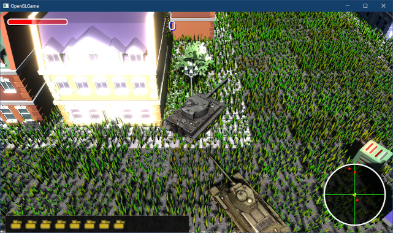

[OpenGL 3D 2022 Tips 第05回]

# まぶしさを表現する

## 習得目標

* 縮小バッファによる効率的なぼかしフィルタを作成できる。
* 縮小バッファを使ってブルームエフェクトを作成できる。

## 1. ブルームエフェクト

### 1.1 浮動小数点数フレームバッファ

強い光を出す物体やライト、またはそのようなライトに照らされた明るい物体があると、その周囲に光があふれだすような現象が起きます。

これは以下の2つの光学現象によって引き起こされます。

>1. 光の<ruby>回折<rt>かいせつ</rt></ruby>
>2. 空気中の分子や<ruby>塵<rt>ちり</rt></ruby>による散乱

これらの光学現象は「ブルーム」や「フレア」と呼ばれます。ブルームのような光学現象では、光の広がる範囲が「正規分布」することが分かっています。

正規分布は「ぼかしフィルタ」として実装できます。残る問題は、「強い光」や「明るい物体」をどうやって見分けるかということです。これは`FBO`のフォーマットを変更することで対応できます。

現在の`FBO`は、カラーバッファを`RGBA8`フォーマットで作成しています。`RGBA8`で表現できる明るさの範囲は`0～1`です。しかし、これは現実の明るさを再現するには範囲が狭すぎます。例えば、電球と太陽を直接見たときの明るさは次のとおりです。

>| 光源       | 明るさ(カンデラ)                       |
>|:----------:|---------------------------------------:|
>| 電球(100W) |                                    127 |
>| 太陽       |  3'150'000'000'000'000'000'000'000'000 |
>| 月         |                  6'400'000'000'000'000 |
>
>出典: `https://www.tlt.co.jp/tlt/lighting_design/design/basic/data/1_3.pdf`

太陽ヤバイ。

これほど明るさが違うのに、`RGBA8`フォーマットの`FBO`に書き込まれる明るさは、電球も太陽も`1`になります。`RGBA8`では、本来の明るさを表すことができないのです。

そこで、フォーマットを`RGBA16F`(アールジービーエー・じゅうろく・エフ)に変更することにします。`RGBA16F`は「16ビット浮動小数点数フォーマット」で、表現できる最大値は`65504`です。

`RGBA16F`を使っても、太陽の明るさを再現するには遠く及びません。しかし、電球と太陽の明るさの違いを表現することは可能です。

>**【RGBA8とRGBA16Fの使い分けについて】**<br>
>`RGBA16F`は各色16ビットのフォーマットなので、1ピクセルに8バイト(64ビット)必要です。`RGBA8`は各色8ビットなので、1ピクセルは4バイトで済みます。<br>
>これは必要なGPUメモリのサイズが倍になることを意味します。さらに、ピクセルを読み書きするときに、2倍のデータを扱う必要があります。これらの影響で、`RGBA8`に比べると`RGBA16F`の描画性能は低くなります。<br>
>GPUの性能を最大に引き出すことを目指すなら、`RGBA16F`フォーマットを使うのは本当に必要な場合だけに限るべきです。<br>
>なお、いいとこ取りを目指した`RGB10_A2UI`、`R11F_G11F_B10F`、`RGB9_E5`といったフォーマットも存在します。これらはアルファ値の精度を犠牲にすることで、サイズを4バイトに保ったまま`1`を超える数値を扱えるようになっています。

それでは`FBO`を`RGBA16F`に変更しましょう。`GLContext.cpp`を開き、`CreateImage2D`関数の定義に次のプログラムを追加してください。

```diff
     internalFormat = pixelFormat;
     break;
   }
+
+  // 浮動小数点数タイプが指定されていたら、内部形式も浮動小数点数にする
+  if (type == GL_HALF_FLOAT) {
+    switch (internalFormat) {
+    case GL_R8:    internalFormat = GL_R16F; break;
+    case GL_RGB8:  internalFormat = GL_RGB16F; break;
+    case GL_RGBA8: internalFormat = GL_RGBA16F; break;
+    }
+  } else if (type == GL_FLOAT) {
+    switch (internalFormat) {
+    case GL_R8:    internalFormat = GL_R32F; break;
+    case GL_RGB8:  internalFormat = GL_RGB32F; break;
+    case GL_RGBA8: internalFormat = GL_RGBA32F; break;
+    }
+  }

   // テクスチャ・オブジェクトを作成し、GPUメモリを確保する.
   glCreateTextures(GL_TEXTURE_2D, 1, &id);
```

次に`FramebufferObject.cpp`を開き、コンストラクタの定義を次のように変更してください。

```diff
 FramebufferObject::FramebufferObject(int w, int h, FboType type)
 {
   // カラーテクスチャを作成
   if (static_cast<int>(type) & 1) {
-    texColor.reset(new Texture("FBO(Color)", w, h, nullptr, GL_RGBA, GL_UNSIGNED_BYTE));
+    texColor.reset(new Texture("FBO(Color)", w, h, nullptr, GL_RGBA, GL_HALF_FLOAT));
     if (!texColor || !texColor->GetId()) {
       std::cerr << "[エラー]" << __func__ <<
```

OpenGLで使える浮動小数点数には、32bitの`GL_FLOAT`と16bitの`GL_HALF_FLOAT`(ジーエル・ハーフ・フロート)の2種類があります。フレームバッファに使う場合は16bitもあれば十分なので、`GL_HALF_FLOAT`を指定しました。

プログラムが書けたらビルドして実行してください。フォーマットを変えただけなので、見た目は分からないと思います。しかし、内部的には「`1`より大きい数値」が格納されているはずです。

### 1.2 <ruby>川瀬式<rt>かわせしき</rt></ruby>MGF(マルチプル・ガウシアン・フィルタ)

見栄えのよいブルームを作るには、ぼかしフィルタの範囲を拡大するか、何度もぼかしフィルタを実行する必要があります。

しかし、「ぼかしフィルタ」はあまり軽い処理ではないため、何度も実行するとゲームの動作速度が低下してしまいます。

見栄えのよいブルームを実現するには、動作速度を下げない程度の処理時間で、十分な広さをぼかすという、ちょっと聞くだけでは無理っぽいことをやらなくてはなりません。

そこで「川瀬式MGF(かわせしき・エムジーエフ、かわせしき・マルチプル・ガウシアン・フィルタ)」、と呼ばれるテクニックを使うことにします。

>川瀬氏によるGDC2004発表資料(日本語)。ブルーム(グレア)については44ページを参照。2004年当時の話なので、現在は解決している、またはより良い技術が見つかっている部分も多い点に注意。<br>
>`http://www.daionet.gr.jp/~masa/archives/GDC2004/GDC2004_PIoHDRR_JP.ppt`

「川瀬式MGF」は、名前に「マルチプル」とあるように複数回のぼかしフィルタを実行します。ただし、ぼかしフィルタを実行するたびに、面積を1/4に縮小したFBOへ書き込みます。

つまり元のフレームバッファサイズが1280x720の場合、まず640x360のカラーバッファに書き込み、2回目のぼかしでは640x360から320x180へ、3回目は320x180から160x90へというように、徐々に縮小していくわけです。

<p align="center">
<br>
[川瀬式MGFの実行例]
</p>

ぼかしフィルタを段階的に縮小していくのは、縮小によって以下の利点が得られるからです。

>**【利点】**
>
>* 描画するピクセル数が減るため、処理が早く完了する(1/4なら4倍早くなる)。
>* ぼかしフィルタを変えることなく、より広い範囲にぼかしを広げることができる(1/4なら4倍の面積をぼかすことができる)

もちろん、利点だけというわけにはいきません。縮小には次の欠点もあります。

>**【欠点】**
>
>* 細部の情報が失われる(1/4なら4ピクセルの平均になってしまう→情報量が1/4になる)

しかし、ぼかしフィルタの場合はこの欠点を無視できます。なぜなら、ぼかしの目的は「細部の情報をぼかす(失わせる)」ことだからです。情報量が減ることが利点に変わるわけです。

こうして十分な回数のぼかしを実行したら、すべてのカラーバッファを合計して平均を求め、最終画像に加算します。

<div style="page-break-after: always"></div>

まとめると、やることは次のとおりです。

>1. 元画像の1/4, 1/16, 1/64, ...の面積の`FBO`を作成。
>2. 「明るい成分」を1/4サイズの`FBO`に抽出。
>3. 2で抽出した「明るい成分」をぼかして、1段小さい`FBO`に書き込むことを繰り返す。
>4. 3でぼかした画像を、1段大きい`FBO`に加算することを繰り返す。
>5. 4で作成した画像を元画像に加算する。

### 1.3 ブルームエフェクト用のFBOを追加する

まずは、ブルームエフェクト用のFBOを作成しましょう。`GameEngine.h`を開き、
`GameEngine`クラスの定義に次のプログラムを追加してください。

```diff
   std::shared_ptr<FramebufferObject> fboColor0; // 等倍FBO
   std::shared_ptr<FramebufferObject> fboColor1; // 縮小用FBO
   std::shared_ptr<FramebufferObject> fboShadow; // 影描画用FBO
+  std::shared_ptr<FramebufferObject> fboBloom[7]; // ブルーム用FBO

   // 地面描画用
   glm::ivec2 mapSize = glm::ivec2(21, 21);
```

縮小バッファの枚数に決まりはありませんが、枚数が多いほど広い範囲をぼかすことができます。また、ぼかしフィルタの範囲はピクセル数単位なので、元の解像度が高いほど相対的にぼかし範囲がせまくなります。

そのため、元の解像度が高いほど枚数を増やすか、あるいは、最初の縮小で決まったサイズに変換する必要があります。本テキストではブルーム用FBOを7枚作成し、うち6枚を縮小バッファとして使います。

それではFBOを初期化しましょう。`GameEngine.cpp`を開き、`Initialize`関数にあるFBOを初期化するプログラムに、次のプログラムを追加してください。

```diff
       if (!p || !p->GetId()) {
         return false;
       }
     }
+
+    // ブルーム用FBOを初期化する
+    int bloomW = w;
+    int bloomH = h;
+    for (auto& p : engine->fboBloom) {
+      p.reset(new FramebufferObject(bloomW, bloomH, FboType::color));
+      if (!p || !p->GetId()) {
+        return false;
+      }
+      bloomW /= 2;
+      bloomH /= 2;
+    }

     // glTFファイル用バッファを初期化
     const size_t maxAnimeActorCount = 64;   // アニメーションするアクター数
```

ループの最後で縦横のサイズを`1/2`にすることで、段階的に小さな縮小バッファを作っています。

### 1.4 ポストエフェクト用の関数を定義する

現在、被写界深度エフェクトを`RenderUI`関数に入れています。ただ、ここにブルームエフェクトも追加すると、もう関数名と内容が全く合わなくなってしまいます。

そこで、ポストエフェクトを関数に分けます。`GameEngine.h`を開き、`GameEngine`クラスの定義に次のプログラムを追加してください。

```diff
   void RemoveDeadActors();
   void RenderDefault();
   void RenderSprite();
+  void RenderPostEffect();
   void RenderUI();
   void PostRender();
```

次に`GameEngine.cpp`を開き、`RenderUI`関数の定義にある「被写界深度とUI描画のあいだ」に、次のプログラムを追加してください。

```diff
     samplerDoF->Unbind(0);
     pipelineDoF->Unbind();
   }
+}
+
+/**
+* UIアクターを描画する
+*/
+void GameEngine::RenderUI()
+{
+  const Primitive& primPlane = GetPrimitive("Res/Plane.obj");
+
+  // 描画先をデフォルトのフレームバッファに戻す
+  glBindFramebuffer(GL_FRAMEBUFFER, 0);
+  glViewport(0, 0,
+    static_cast<GLsizei>(windowSize.x),
+    static_cast<GLsizei>(windowSize.y));
+
+  glDisable(GL_DEPTH_TEST);
+  glDisable(GL_CULL_FACE);

   glEnable(GL_BLEND);
   glBlendFunc(GL_SRC_ALPHA, GL_ONE_MINUS_SRC_ALPHA);
```

次に、元の`RenderUI`関数の名前を`RenderPostEffect`に変更してください。

```diff
   spriteRenderer.Draw(pipelineUI, matProj * matView);
 }

 /**
-* UIアクターを描画する
+* ポストエフェクトを描画する
 */
-void GameEngine::RenderUI()
+void GameEngine::RenderPostEffect()
 {
   const Primitive& primPlane = GetPrimitive("Res/Plane.obj");
+
+  /* 被写界深度 */
 
   // 縮小画像を作成
   {
```

最後に`Main.cpp`を開き、メインループに`RenderPostEffect`関数呼び出しを追加してください。

```diff
     engine.RenderDefault();
     engine.RenderSprite();
+    engine.RenderPostEffect();
     engine.RenderUI();
     engine.PostRender();
     engine.SwapBuffers();
```

プログラムが書けたらビルドして実行してください。特に問題なくゲーム画面が表示されていたら成功です。

### 1.5 明るい部分を取り出すシェーダを定義する

1.1節の変更により、カラーバッファに「`1`より大きい数値」を格納できるようになっています。次は`1`以上のピクセルだけを取り出します。そのために新しいシェーダーを作成します。

このシェーダーがやることは「ある値(あたい)を超える「明るい成分」だけを残し、残りは黒にする」です。なお、以後は「ある値」のことを「<ruby>閾値<rt>しきいち</rt></ruby>」と呼ぶことにします。

さて、単純に考えると、

>明るい成分 = 輝度 - 閾値

とすれば、目的を達せられるように思えます。実際、これは正しい方法のひとつです。しかし、例えば「わずかにオレンジ色を帯びた明るい赤`(2.0, 0.5, 0.0)`」の場合を考えてみましょう。

閾値を`1.0`とすると、式の結果は`(1.0, 0.0, 0.0)`です。緑成分が完全に失われ、赤成分だけになってしまっています。より正確な色を表現するためには、もう少し複雑な式にする必要がありそうです。

まず、明るさの定義を「RGBのうちもっとも明るい要素の明るさ」とします。そして、以下の式で「明るい成分の比率」を求めます。

>明るい成分の比率 = (明るさ - 閾値) / 明るさ ・・・式1

そして、元の色に「明るい成分の比率」を掛けた結果を「明るい成分」とします。

>明るい成分 = 元の色 * 明るい成分の比率 ・・・式2

この式ならより正確な色になるはずです。さきほどの「オレンジ色を帯びた赤」で計算してみましょう。RGBのうちもっとも明るいのは赤の`2.0`なので、これを「明るさ」とします。これを式1に代入すると、「明るい成分の比率」は`0.5`になります。

`0.5`を式2に代入すると、結果は`(1.0, 0.25, 0.0)`です。さっきは消えてしまった緑成分を残すことができました！

それではこの式をシェーダーにしていきます。`Res`フォルダに`BrightnessFilter.frag`(ブライトネス・フィルター・フラグ)という名前のフラグメントシェーダファイルを追加してください。

追加したファイルを開き、次のプログラムを追加してください。

```diff
+#version 450
+
+// 入力変数
+layout(location=1) in vec2 inTexcoord;
+
+// 出力変数
+out vec4 fragColor;
+
+// ユニフォーム変数
+layout(binding=0) uniform sampler2D texColor;
+
+const float threshold = 1.0; // 明るいと判定する閾値
+
+// フラグメントシェーダプログラム
+void main()
+{
+  // 読み取り座標をずらす距離を計算
+  vec2 offset = 0.75 / vec2(textureSize(texColor, 0));
+
+  // 簡易ぼかしフィルタ(4x4テクセルの加重平均を計算)
+  fragColor =  texture(texColor, inTexcoord - offset.xy);
+  fragColor += texture(texColor, inTexcoord + offset.xy);
+  fragColor += texture(texColor, inTexcoord - vec2(offset.x, -offset.y));
+  fragColor += texture(texColor, inTexcoord + vec2(offset.x, -offset.y));
+  fragColor *= 1.0 / 4.0; // 平均を求めるため1/4にする
+  fragColor.a = 1;
+
+  // RGBのうちもっとも明るい成分をピクセルの明るさとする
+  float brightness = max(fragColor.r, max(fragColor.g, fragColor.b));
+
+  // 明るい成分の比率を計算
+  float highBrightnessPart = max(brightness - threshold, 0.0);
+  float ratio = highBrightnessPart / max(brightness, 0.00001);
+
+  // 明るい成分を計算
+  fragColor.rgb *= ratio;
+}
```

最初に「簡易的なぼかしフィルタ」を実行します。これは4x4テクセルの平均を取るだけのフィルタです(テクセルは「テクスチャのピクセル」を意味するGC用語)。明るさ抽出時点では画像サイズが大きいので、ぼかし範囲は最小限にしています。

`offset`(オフセット)変数は、ぼかしフィルタを実行するために「読み取り座標をずらす距離」です。ずらす距離を1.0ではなく0.75テクセルにすることで、ガウスぼかし効果が得られます。

`offset`を求めたら、ぼかしフィルタを実行します。サンプラのフィルタモードを`GL_LINEAR`にしておくと、一度の読み取りで4つのテクセルの平均値が得られるようになります。4回の読み取ることで4x4テクセルの平均を求めています。

次にピクセルの明るさを計算します。ピクセルの明るさには「RGBのうちもっとも明るい成分」を使います。

最後に「明るい成分」を計算します。この計算自体は少し上で説明した式そのものですが、
`max`関数による処理を追加しています。`max(brightness - threshold, 0.0)`では、明るさの値を0以上にするために`max`関数を使っています。

これが必要なのは、`RGBA16F`にはマイナスの値を書き込むことができるからです。閾値以下を切り捨てる場合、`max`関数によって最小値を保証する必要があります。

次の行の`max(brightness, 0.00001)`は「ゼロによる除算」を避けるためのものです。
`brightness`は`0`になる可能性があるため、ゼロ除算が起こらないように微小な値を設定しています。

>**【ゼロ除算を避けるテクニック】**<br>
>ゼロ除算を避けるテクニックには、ここで使用した`max`関数の他に、「ごく小さな数値を足す」という方法もよく使われます。`if`を使うこともできますが、シェーダーにおける`if`は、処理速度を低下させる可能性が高いので、あまり使われません。

### 1.6 縮小シェーダを定義する

「ブルーム」は「ぼかしフィルタ」で再現します。ぼかしフィルタには「デュアルフィルタリング」と呼ばれる、縮小と拡大で異なるぼかしフィルタを組み合わせる方法を使います。

>デュアルフィルタリングについて、詳細は以下のURLを参照してください。<br>
>`https://developer.arm.com/documentation/102259/0100/Bloom`

まず、縮小用のぼかしシェーダから定義しましょう。プロジェクトの`Res`フォルダに
`Downsample.frag`(ダウンサンプル・フラグ)という名前のフラグメントシェーダファイルを追加してください。

追加したファイルを開き、次のプログラムを追加してください。

```diff
+#version 450
+
+// 入力変数
+layout(location=1) in vec2 inTexcoord;
+
+// 出力変数
+out vec4 fragColor;
+
+// ユニフォーム変数
+layout(binding=0) uniform sampler2D texColor;
+
+// フラグメントシェーダープログラム
+void main()
+{
+  // テクスチャ座標系における0.75ピクセルのサイズ
+  vec2 offset = 0.75 / vec2(textureSize(texColor, 0));
+
+  fragColor =  texture(texColor, inTexcoord - offset.xy);
+  fragColor += texture(texColor, inTexcoord + offset.xy);
+  fragColor += texture(texColor, inTexcoord - vec2(offset.x, -offset.y));
+  fragColor += texture(texColor, inTexcoord + vec2(offset.x, -offset.y));
+  fragColor *= 1.0 / 4.0;
+  fragColor.a = 1;
+}
```

このシェーダは`BrightnessFilter.frag`と同じことを行います。

次に、拡大用のぼかしシェーダを定義します。プロジェクトの`Res`フォルダに
`Upsample.frag`(アップサンプル・フラグ)という名前のフラグメントシェーダファイルを追加してください。

追加したファイルを開き、次のプログラムを追加してください。

```diff
+#version 450
+
+// 入力変数
+layout(location=1) in vec2 inTexcoord;
+
+// 出力変数
+out vec4 fragColor;
+
+// ユニフォーム変数
+layout(binding=0) uniform sampler2D texColor;
+
+// フラグメントシェーダープログラム
+void main()
+{
+  // テクスチャ座標系における0.5ピクセルのサイズ
+  vec2 offset = 0.5 / vec2(textureSize(texColor, 0));
+
+  fragColor =  texture(texColor, inTexcoord + vec2(-offset.x * 2, 0));
+  fragColor += texture(texColor, inTexcoord + vec2(-offset.x,     offset.y    )) * 2;
+  fragColor += texture(texColor, inTexcoord + vec2(0,             offset.y * 2));
+  fragColor += texture(texColor, inTexcoord + vec2(offset.x,      offset.y    )) * 2;
+  fragColor += texture(texColor, inTexcoord + vec2(offset.x * 2,  0));
+  fragColor += texture(texColor, inTexcoord + vec2(offset.x,     -offset.y    )) * 2;
+  fragColor += texture(texColor, inTexcoord + vec2(0,            -offset.y * 2));
+  fragColor += texture(texColor, inTexcoord + vec2(-offset.x,    -offset.y    )) * 2;
+  fragColor *= 1.0 / 12.0;
+  fragColor.a = 1;
+}
```

拡大シェーダは、縮小シェーダより広い範囲をぼかすようになっています。縮小と拡大で範囲に差があるのは、拡大するときは小さい画像から読み取ることになるため、相対的に広い範囲をぼかせるるからです。

<div style="page-break-after: always"></div>

### 1.7 ブルームエフェクト用のシェーダを読み込む

それでは、作成したシェーダを読み込みましょう。`GameEngine.h`を開き、`GameEngine`クラスの定義に次のプログラムを追加してください。

```diff
   std::shared_ptr<ProgramPipeline> pipeline;
   std::shared_ptr<ProgramPipeline> pipelineUI;
   std::shared_ptr<ProgramPipeline> pipelineDoF;
+  std::shared_ptr<ProgramPipeline> pipelineBrightnessFilter;
+  std::shared_ptr<ProgramPipeline> pipelineDownsample;
+  std::shared_ptr<ProgramPipeline> pipelineUpsample;
   std::shared_ptr<ProgramPipeline> pipelineInstancedMesh;
   std::shared_ptr<ProgramPipeline> pipelineStaticMesh;
```

次に`GameEngine.cpp`を開き、`Initialize`関数にあるシェーダを読み込むプログラムに、次のプログラムを追加してください。

```diff
       "Res/StaticMesh.vert", "Res/StaticMesh.frag"));
     engine->pipelineAnimatedMesh.reset(new ProgramPipeline(
       "Res/AnimatedMesh.vert", "Res/StaticMesh.frag"));
+
+    // ブルームエフェクト用のシェーダを初期化する
+    const struct {
+      std::shared_ptr<ProgramPipeline>& p;
+      const char* fragName;
+    } bloomShaders[] = {
+      { engine->pipelineBrightnessFilter, "Res/BrightnessFilter.frag" },
+      { engine->pipelineDownsample,       "Res/Downsample.frag" },
+      { engine->pipelineUpsample,         "Res/Upsample.frag" },
+    };
+    for (const auto [p, fragName] : bloomShaders) {
+      p.reset(new ProgramPipeline("Res/Simple.vert", fragName));
+      // Plane.objの半径は-0.5～+0.5なので、2倍して-1～+1にする
+      glm::mat4 m = glm::mat4(1);
+      m[0][0] = m[1][1] = 2;
+      p->SetUniform(Renderer::locMatTRS, m);
+    }

     engine->sampler = std::shared_ptr<Sampler>(new Sampler(GL_REPEAT));
     engine->samplerUI.reset(new Sampler(GL_CLAMP_TO_EDGE));
```

ぼかしシェーダのユニフォーム変数は変化しないので、初期化時点で設定してしまいます。これでシェーダの読み込みは完了です。

### 1.8 ブルームエフェクトを追加する

ブルームエフェクトは被写界深度エフェクトの後に追加します。そのために、被写界深度エフェクトの描画先を、デフォルトフレームバッファからブルーム用FBOに変更します。

`GameEngine.cpp`を開き、`RenderPostEffect`関数にある「描画先をデフォルトのフレームバッファに戻す」プログラムを次のように変更してください。

```diff
     fboColor0->BindColorTexture(0);
     primPlane.Draw();
   }

-  // 描画先をデフォルトのフレームバッファに戻す
-  fboColor0->Unbind();
-  glViewport(0, 0,
-    static_cast<GLsizei>(windowSize.x),
-    static_cast<GLsizei>(windowSize.y));
+  // 描画先を次のポストエフェクト用FBOに設定
+  fboBloom[0]->Bind();
-
-  glClear(GL_COLOR_BUFFER_BIT | GL_DEPTH_BUFFER_BIT);
+  glClear(GL_COLOR_BUFFER_BIT);
   glDisable(GL_DEPTH_TEST);
   glDisable(GL_CULL_FACE);
```

続いて、ブルームエフェクト用の縮小画像を作成します。被写界深度エフェクトの下に、次のプログラムを追加してください。

```diff
     samplerDoF->Unbind(0);
     pipelineDoF->Unbind();
   }
+
+  /* ブルームエフェクト */
+
+  {
+    glDisable(GL_DEPTH_TEST);
+    glDisable(GL_CULL_FACE);
+    glDisable(GL_BLEND);
+
+    samplerUI->Bind(0);
+
+    // 明るい部分を抽出
+    pipelineBrightnessFilter->Bind();
+    fboBloom[1]->Bind();
+    fboBloom[0]->BindColorTexture(0);
+    primPlane.Draw();
+
+    // 縮小画像を作成
+    pipelineDownsample->Bind();
+    for (size_t i = 1; i < std::size(fboBloom) - 1; ++i) {
+      fboBloom[i + 1]->Bind();
+      fboBloom[i]->BindColorTexture(0);
+      primPlane.Draw();
+    }
+  } // ブルームエフェクト
 }

 /**
 * UIアクターを描画する
```

縮小画像の作成は、縮小ぼかしシェーダを設定し、`for`文によって大きいFBOから小さいFBOへと縮小コピーを繰り返すことで行っています。

次に、縮小画像を拡大しつつ全て加算合成します。縮小画像を作成するプログラムの下に、次のプログラムを追加してください。

```diff
       fboBloom[i]->BindColorTexture(0);
       primPlane.Draw();
     }
+
+    // 縮小画像を逆順で合成
+    pipelineUpsample->Bind();
+    glEnable(GL_BLEND);
+    glBlendFunc(GL_ONE, GL_ONE);
+    for (size_t i = std::size(fboBloom) - 1; i > 1; --i) {
+      fboBloom[i - 1]->Bind();
+      fboBloom[i]->BindColorTexture(0);
+      primPlane.Draw();
+    }
+
+    // 明るさを調整して元画像と合成
+    const float bloomScale = 2.0f;
+    glBlendFunc(GL_CONSTANT_ALPHA, GL_ONE);
+    glBlendColor(0, 0, 0, bloomScale);
+    fboBloom[0]->Bind();
+    fboBloom[1]->BindColorTexture(0);
+    primPlane.Draw();
   } // ブルームエフェクト
 }
```

全てのぼかした縮小画像の明るさを加算したいので、アルファブレンドを有効にして、
`glBlendFunc`で係数を`GL_ONE`に設定してから`for`文で合成します。

これによって、元画像の明るい部分に広範囲のガウシアンフィルタをかけた状態になります(実際には加算合成なので、明るさは「縮小画像の枚数」倍になっています)。

最後に、元画像である`fblBloom[0]`に対してブルームを加算合成します。<br>
合成率は`bloomScale`(ブルーム・スケール)変数で指定しています。

今回は200%で合成していますが、これはブルームの影響を分かりやすくするためで、通常は100%以下に設定します。比率を大きくするとまぶしく見えやすくなります。

>`bloomScale`の値は自由に変更可能です。<br>
>表現したい画面に応じて値を変更するとよいでしょう。

最後に、描画結果をデフォルトフレームバッファに書き出します。「明るさを調整して元画像と合成」するプログラムの下に、次のプログラムを追加してください。

```diff
     fboBloom[0]->Bind();
     fboBloom[1]->BindColorTexture(0);
     primPlane.Draw();
+
+    // 描画結果をデフォルトのフレームバッファに書き出す
+    glBindFramebuffer(GL_FRAMEBUFFER, 0);
+    glViewport(0, 0,
+      static_cast<GLsizei>(windowSize.x),
+      static_cast<GLsizei>(windowSize.y));
+    glClear(GL_COLOR_BUFFER_BIT | GL_DEPTH_BUFFER_BIT);
+    glDisable(GL_BLEND);
+    pipelineUI->Bind();
+    fboBloom[0]->BindColorTexture(0);
+    primPlane.Draw();
   } // ブルームエフェクト
 }
```

プログラムが書けたらビルドして実行してください。明るい部分が白飛びしていたら成功です。

<p align="center">

</p>

<div style="page-break-after: always"></div>

<pre class="tnmai_assignment">
<strong>【課題01】</strong>
<code>bloomScale</code>の値を1.0に変更しなさい。あるいは、好きな値を設定しても構いません。
</pre>

>**【1章のまとめ】**
>
>* 浮動小数点数フレームバッファを使うと、1.0を超える明るさを扱える。
>* 多段階の縮小バッファを使うと効率的にぼかしを実行できる。
>* 明るい部分を適切に抽出するには工夫が必要となる。
>* ブルームエフェクトを使うと強い輝きを表現することができる。
