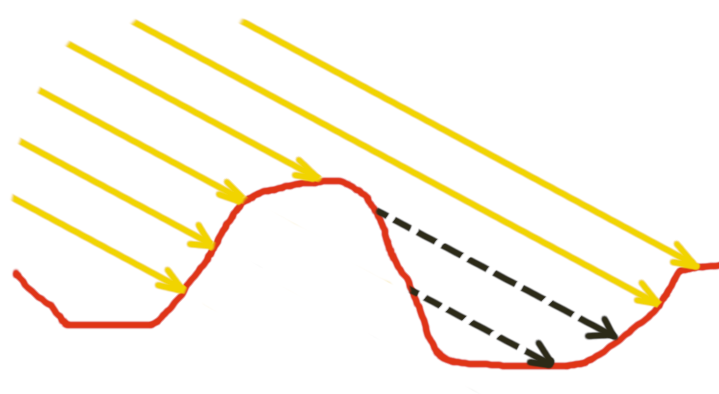
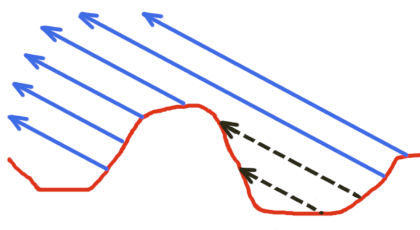
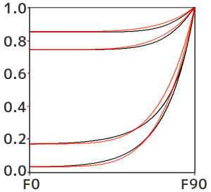
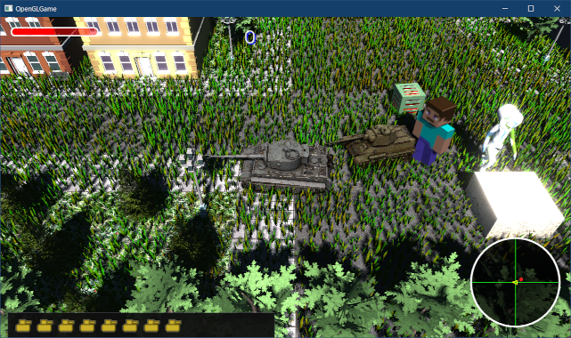

[OpenGL 3D 2022 Tips 第06回]

# <ruby>鏡面反射<rt>スペキュラ</rt></ruby>

## 習得目標

* Cook-Torranceモデルが拡散反射と鏡面反射で構成されていることを説明できる。
* 微小面分布項、幾何減衰項、フレネル項の意味を説明できる。
* ラフネスが各項に及ぼす影響を説明できる。

## 1. 拡散反射と鏡面反射

### 1.1 クック-トランス・モデル

物質に光を当てると、その一部は物質の内部に入り込み、内部の物質で反射を繰り返して再び外に飛び出します。これを拡散反射(かくさんはんしゃ)といいます。「ランバート反射」は拡散反射を表現する手法のひとつです。

さて、内部に入らなかった光はどうなるかというと、単純に表面で反射します。これを鏡面反射(きょうめんはんしゃ)といいます。鏡面反射は英語では`Specular`(スペキュラ)といいます。

鏡面反射による明るさは、光の入射角と視線方向に依存します。そのため、光が全方向に均等にちらばる拡散反射よりも再現が難しく、さまざまな手法が考案されています。

鏡面反射では、物体表面の<ruby>粗<rt>あら</rt></ruby>さを考慮する必要があります。物体表面の粗さは`roughness`(ラフネス)と呼ばれます。通常、ラフネスは`0`から`1`の範囲を取り、その値はマテリアルによって異なります。

ラフネスを考慮した鏡面反射を再現するために、`Cook`(クック)氏と`Torrance`(トランス)氏が考案した`Cook-Torrance`(クック・トランス)モデルを使います。このモデルは、

>物体表面は、完璧になめらかな微小平面(マイクロファセット)の集まりであり、次の式によって微小平面の物理学的特性を再現できる

という理論で、さらに物理的な正確性も満たしています。クックトランスモデルの式は次のとおりです。

>```c++
>反射光 = s * 拡散反射 + (1 - s) * 鏡面反射
>
>拡散反射 = ランバート反射
>
>鏡面反射 = 光の色 * (D * G * F) * (1 / 4(N・L)(N・V))
>```
>
>s = 拡散反射の比率
>D = 微小面分布項(Distribution)<br>
>G = 幾何減衰項(Geometric attenuation)<br>
>F = フレネル項(Fresnel)<br>
>N = 法線(Normal vector)<br>
>V = 視線の向き(View vector)<br>
>L = ライトの向き(Light vector)<br>
>1 / 4(N・V)(N・L) = 微小平面の密度

変数`s`があるため、拡散反射と鏡面反射の合計は常に`1`となります。これによって、「出射光の量が入射光の量を超えない」ことを保証します(つまり物理的に正しい)。

クックトランスモデルの「拡散反射」には、ランバート反射がそのまま利用できます。残る鏡面反射は`D`, `G`, `F`という3つの項と、微小平面の密度を表す係数によって定義されます。

`D`, `G`, `F`には、最初にクックとトランスが論文で示した以外にさまざまな関数が提案されています。実際、元論文の式は計算が複雑なため、リアルタイムアプリケーションには向いていません。

そこで、本テキストでは、`D`(微小面分布項)には`Blinn-Phong`(ブリン・フォン)、`G`(幾何減衰項)には`Smith masking function`(スミス・マスキング・ファンクション)、`F`(フレネル項)には`Schlick`(シュリック)の近似式を使います。

>**【Cook-Torranceの式はどうやってできたの？】**<br>
>式を導出する手順は、以下の論文を参照してください(論文名で検索)。<br>
>`Microfacet Models for Reflaction through Rough Surfaces`(元論文)<br>
>`PBR Diffuse Lighting for GGX+Smith Microsurfaces`(4(N・V)(N・L)の導出の説明)

### 1.2 <ruby>Blinn-Phong<rt>ブリン-フォン</rt></ruby> NDF

微小面分布項Dをあらわす関数のことを`NDF`(エヌディーエフ)といいます。`NDF`は`Normal Distribution Function`(ノーマル・ディストリビューション・ファンクション、法線分布関数)の短縮形です。

全ての微小平面の法線が、光を視点に反射する向きになっていると、D項の値は大きくなります。これはなめらかな表面で起きることです。対して、表面が粗いと微小平面の法線がばらばらになるため、D項の値は小さくなります。

`Blinn-Phong`では、物体表面の滑らかさ、視点、光の向きの3つを組み合わせることでD項を計算します。`Blinn-Phong`は比較的計算が簡単なうえ、それなりに現実に近い表現ができるので広く使われています。

なお、発表当初の`Blinn-Phong`は単に鏡面反射の明るさを表す式でした。これをNDFとして転用したものが`Blinn-Phong NDF`で、今回はこのNDFバージョンを使います。

>現在では、`Blinn-Phong`よりも計算コストはかかるけれど、より現実に近い表現ができる`GGX`や`GTR`というNDF(またはその発展形)が使われることが多いです。

さて、`Blinn-Phong NDF`は次の式で表されます。

>```c++
>D = C * (H・L)^p
>```
>
>C: 正規化係数<br>
>H: ライトの向きLと視線の向きVの中間ベクトル<br>
>p: 鏡面反射指数(きょうめんはんしゃしすう)

ここで、`・`は内積、`^`はべき乗を表します。鏡面反射指数pは「反射の鋭さ」をあらわすパラメータで、次の式で求められます。

`p = 2 / α^2 - 2`

ここで`α`(アルファ)はラフネスの2乗を表します。ラフネスから鏡面反射指数を求める式は無数にあり、上の式は一例に過ぎません。一般的には、ゲームエンジンが持つ表現力と、アーティストが求める扱いやすさによって決められます。

正規化係数Cは反射光の総量が常に1となるように補正するための値で、`(H・L)^p`を球積分(球の面積に対する積分)して求めます。めんどうな説明は省きますが、結果は次の式になります。

`C = (p + 2) / 2π`

>正規化係数Cは単独の`Blinn-Phong`と`Blinn-Phong NDF`で異なる値になります。扱う値が違うので(「明るさ」と「法線」)、球積分の結果が異なるためです。

とりあえず、`Blinn-Phong`の式をシェーダに組み込んでみましょう。鏡面反射の計算には視点の位置が必要となります。視点は毎フレーム変化する可能性があるのでユニフォーム変数として定義します。

`FragmentLighting.frag`を開き、次のユニフォーム変数定義を追加してください。

```diff
 layout(binding=2) uniform sampler2D texColor1_7[7];

 layout(location=100) uniform mat4 matShadow;
+layout(location=101) uniform vec4 cameraPosition;

 // 平行光源
 struct DirectionalLight {
```

それから、ラフネスを決めておく必要があります。今回は仮に`0.3`(比較的なめらか)とします。環境光を設定するプログラムの下に、次のプログラムを追加してください。

```diff
   shadow *= 1.0 / float(sampleCount);

   // 環境光を設定
   vec3 lightColor = ambientLight;
+
+  // Cook-Torranceモデルのパラメータ
+  float roughness = 0.3;
+  float alpha = roughness * roughness;
+  vec3 V = normalize(cameraPosition.xyz - inPosition); // 視線ベクトル
+  vec3 H = normalize(V + -light.direction); // 視線と光の向きのハーフベクトル
+
+  // Blinn-Phong NDFによって微小面分布Dを計算
+  float p = 2 / (alpha * alpha) - 2;
+  float C = (p + 2) / (2 * 3.14159265);
+  float dotNH = max(dot(worldNormal, H), 0);
+  float D = C * pow(dotNH, p);

   // ランバート反射による明るさを計算
   float cosTheta = max(dot(worldNormal, -light.direction), 0);
```

さて、微小平面モデルにおいて、入射光を視点に反射できる微小面は、法線が視線ベクトルとライトベクトルのちょうど中間にある微小面だけです。微小面は「完璧になめらか」なので、法線が少しでもずれていると目の方向に反射できないからです。

次の問題は、「入射光を視点に反射できる微小面の数」を求めることです。`Blinn-Phong NDF`では、物体表面の法線Nに近い法線を持つ微小面ほど数が多いと仮定します。そして、表面法線と微小平面の法線の内積によって微小面の数を表します。

これでD項が計算できるようになりました。

### 1.3 Smithの幾何減衰

続いて、幾何減衰項Gを求める式を追加します。G項は、鏡面反射に影響する微小平面の比率を`1`(全て見えている)から`0`(全て遮られている)で表します。

微小平面は様々な方向を向いているため、斜め方向から見ると互いを遮ります。この幾何学的な形状によって入射光または出射光が遮られる量を求めることが、幾何減衰項の目的です。

幾何減衰項には`Smith`(スミス)氏が考案した手法を使います。`Smith`の手法では、幾何減衰項を「入射光が遮られる量(シャドウイング)と、出射光が遮られる量(マスキング)の積」と定義します。

<p align="center">
 <br>
[左=シャドウイング 右=マスキング]
</p>

上図のように、シャドウイングやマスキングで遮られた微小平面は、光の反射に影響を与えません。つまり、G項は「光の反射に影響する微小平面の比率」を再現します。

`Smith`の手法にはD項の関数に対応するバリエーションが存在します。`Blinn-Phong NDF`の場合は`Smith-Beckmann`(ベックマン)の方法が適しています。

ただし、`Smith`の式はやや複雑で計算に時間がかかるため、`Schlick`氏が考案した以下の代替バージョンを使います。

>```c++
>G = GL * GV
>GL = (N・L) / ((N・L) * (1 - k) + k)
>GV = (N・V) / ((N・V) * (1 - k) + k)
>k = α * √(2 / π)
>```
>
>V = 視線の向き(View vector)<br>
>L = ライトの向き(Light vector)<br>
>α = ラフネスの2乗

`(1 - k) + k`の部分は、物体表面が粗いほど遮られる微小平面が増加することを意味します。粗いということはデコボコしているわけで、手前の起伏より奥にある微小平面が遮られる、というのは理解できると思います。

また、`(N・L)`や`(N・V)`は、光の向き(または視線)が物体表面に平行に近づくほど、遮られる微小平面が増加することを意味します。これは、デコボコした平面を上から見るより、横から見るほうが遮られる微小平面が増える、ということです。

「遮られる微小平面が増加する」ということは、言いかえると「鏡面反射に影響する微小平面が減少する」ということです。

それでは、D項を計算するプログラムの下に、次のプログラムを追加してください。

```diff
   float C = (p + 2) / (2 * 3.14159265);
   float dotNH = max(dot(worldNormal, H), 0);
   float D = C * pow(dotNH, p);
+
+  // Schlick-Beckman GSFによって幾何減衰項Dを計算
+  float k = alpha * 0.79788456;
+  float dotNL = max(dot(worldNormal, -light.direction), 0);
+  float dotNV = max(dot(worldNormal, V), 0);
+  float G1_l = dotNL / (dotNL * (1 - k) + k);
+  float G1_v = dotNV / (dotNV * (1 - k) + k);
+  float G = min(1, G1_l * G1_v);

   // ランバート反射による明るさを計算
   float cosTheta = max(dot(worldNormal, -light.direction), 0);
```

なお、`k`の値は「`Smith-Beckman GSF`をできるだけ再現できるような値」であり、物理現象としての意味はありません。

>3Dグラフィックスでは「同じ入力を与えたらだいたい同じ出力を返す2つの関数があるとき、それらは同じものとみなす」ということがよくあります。

### 1.4 フレネル反射

F項は「フレネル反射」を表します。フレネル反射は「ガラスや水面を垂直に見たときと、水平に近い角度で見たときで反射率が異なる」現象を再現します(何故そうなるのかは電磁気学の分野になるので割愛します)。

これには、`Fresnel`(フレネル)氏が提案した式を`Schlick`氏が近似した式を使います。

>```c++
>F = F0 + (1 - F0) * (1 - V・H)^5
>```
>
>F0: 物体表面を正面(0度の角度)から見たときの反射率(物質によって異なる)

F0の値は物質によって違い、特に金属(導電体)とそれ以外(誘電体)で大きく異なります。石や木材、プラスチック、ゴムなどの誘電体のF0は`0.02`～`0.05`、鉄や金銀のような導電体のF0は`0.5`～`1.0`です。

ただし、現実の物体のほとんどは、金属で作られていても表面塗装がしてある場合がほとんどです。その場合、光に影響するのは塗料の性質になり、金属は無視できます。

誘電体の平均的なF0には`0.04`がよく使われるので、本テキストでもとりあえず`0.04`として計算することにします。

>例外的に、水晶、ルビー、ダイヤモンドなどの宝石類は誘電体ですが、F0は`0.05`～`0.2`とさまざまです。

それでは、G項を計算するプログラムの下に、次のプログラムを追加してください。

```diff
   float G1_l = dotNL / (dotNL * (1 - k) + k);
   float G1_v = dotNV / (dotNV * (1 - k) + k);
   float G = min(1, G1_l * G1_v);
+
+  // Schlick近似式によってフレネル項Fを計算
+  float dotVH = max(dot(V, H), 0);
+  vec3 F0 = vec3(0.04);
+  vec3 F = F0 + (1 - F0) * pow(1 - dotVH, 5);

   // ランバート反射による明るさを計算
   float cosTheta = max(dot(worldNormal, -light.direction), 0);
```

次の図は、`Schlick`近似式がフレネルの式とどれくらい似ているかを示しています。

<p align="center">
<br>
[黒=Fresnelの式 赤=Schlickの式]<br>
<code>An Inexpensive BRDF Model for Physically-based Rendering</code>(Schlick 1994)
</p>

完全に一致しているとは言い難いですが、傾向が似ていることが見て取れると思います。

>**【F0は空気中と水中で異なる】**<br>
>F0の`0.04`という値は、空気中にある物体の場合です。フレネル反射は実際には「屈折率の異なる媒質の境界で、光線が反射・屈折を起こす場合の反射率・透過率を求める式」だからです。
>そのため、F0値は接触している物質によって異なります。実際のF0は、物体の屈折率`IOR`から求めることになります。`IOR`はさまざまなサイトで公開されているので、検索すれば大抵の物質の`IOR`が判明します。<br>
>なお、フレネルの式そのものの導出は`https://eman-physics.net/electromag/fresnel.html`などを参考にしてください。

### 1.5 3つの項をひとつにする

ここまでに計算したD, G, Fの3つをまとめて、クックトランスモデルを完成させましょう。とはいっても、1.1節に書いた式をほぼそのまま実装するだけです。F項を計算するプログラムの下に、次のプログラムを追加してください。

```diff
   float dotVH = max(dot(V, H), 0);
   vec3 F0 = vec3(0.04);
   vec3 F = F0 + (1 - F0) * pow(1 - dotVH, 5);
+
+  // クックトランスモデルによる鏡面反射を計算
+  vec3 specularColor = (D * G * F) * (1 / (4 * dotNL * dotNV + 0.00001));

   // ランバート反射による明るさを計算
   float cosTheta = max(dot(worldNormal, -light.direction), 0);
```

最後に、`fragColor`に鏡面反射の明るさを加算します。`fragColor`を計算するプログラムを、次のように変更してください。

```diff
   // ランバート反射による明るさを計算
   float cosTheta = max(dot(worldNormal, -light.direction), 0);
-  lightColor += light.color * cosTheta * (1.0 - shadow);
+  lightColor += light.color * cosTheta * (1.0 - shadow) * (1 - F);

   fragColor.rgb *= lightColor;
+  fragColor.rgb += specularColor * (1.0 - shadow);
 }
```

光の一部はフレネル反射されずに物体の中に入り込み、内部の分子で複雑に反射を繰り返して再び外に飛び出します。これが拡散反射に当たります。ということは、拡散反射されるのは「フレネル反射されなかった光」になるわけです。

この現象を再現するために、ランバート反射計算に`(1 - F)`を掛けています。`F`がフレネル反射される光の量なので、反射されなかった光の量は`1 - F`となります。

### 1.6 カメラ座標をユニフォーム変数にコピーする

あとひとつ、やるべきことが残っています。それは、カメラ座標を`cameraPosition`ユニフォーム変数にコピーすることです。`Renderer.h`を開き、`Renderer`クラスの定義に、次のロケーション番号を追加してください。

```diff
   static const GLint locTextureNo = 20;
   static const GLint locMatGroupModels = 30;
   static const GLint locMatShadow = 100;
+  static const GLint locCameraPosition = 101;
   static const GLint locMapSize = 101;
   static const GLint locCamera = 102;
```

次に`GameEngine.cpp`を開き、影用FBOの深度テクスチャをGLコンテキストにバインドするプログラムの下に、次のプログラムを追加してください。

```diff
   pipelineInstancedMesh->SetUniform(locMatShadow, matShadow);
   pipelineStaticMesh->SetUniform(locMatShadow, matShadow);
   fboShadow->BindDepthTexture(1);
+
+  // シェーダにカメラ座標を設定
+  const glm::vec4 cameraPosition(mainCamera.position, 1);
+  pipeline->SetUniform(Renderer::locCameraPosition, cameraPosition);
+  pipelineInstancedMesh->SetUniform(Renderer::locCameraPosition, cameraPosition);

   // アクターを描画する
   // 半透明メッシュ対策として、先に地面を描く
```

プログラムが書けたらビルドして実行してください。戦車を回転させてみて、反射光が急に明るくなる部分が現れたら成功です。

<p align="center">
<br>
[砲身とサイドスカート部分に白く反射する領域がある]
</p>

### 1.7 ラフネスをユニフォーム変数で受け取る

ラフネスは素材によって異なるはずです。そこで、ユニフォーム変数からラフネスを設定できるようにします。

これまで、マテリアルの情報は「色」と「テクスチャ番号」だけでしたが、テクスチャ番号のユニフォーム変数を拡張して、ラフネスも一緒にコピーするように変更します。

`FragmentLighting.vert`を開き、出力変数とユニフォーム変数の定義を次のように変更してください。

```diff
 layout(location=1) out vec2 outTexcoord;
 layout(location=2) out vec3 outNormal;
 layout(location=3) out vec3 outPosition;
-layout(location=4) out uint outTextureNo;
+
+// x: テクスチャ番号
+// y: ラフネス
+layout(location=4) out vec4 outMaterialParameters;

 out gl_PerVertex {
   vec4 gl_Position;
 };

 // ユニフォーム変数
 layout(location=0) uniform mat4 matTRS;
 layout(location=1) uniform mat4 matModel;
 layout(location=10) uniform vec4 materialColor[10];
-layout(location=20) uniform uint materialTextureNo[10];
+
+// x: テクスチャ番号
+// y: ラフネス
+layout(location=20) uniform vec4 materialParameters[10];
+ 
 layout(location=30) uniform mat4 matGroupModels[32];
```

次に`main`関数の定義を次のように変更してください。

```diff
   outTexcoord = vTexcoord;
   outNormal = worldNormal;
   outPosition = vec3(matGM * vec4(vPosition, 1.0));
-  outTextureNo = materialTextureNo[materialNo];
+  outMaterialParameters = materialParameters[materialNo];
   gl_Position = matTRS * (matGroup * vec4(vPosition, 1.0));
 }
```

続いて`FragmentLighting.frag`を開き、入力変数の定義を次のように変更してください。

```diff
 layout(location=1) in vec2 inTexcoord;
 layout(location=2) in vec3 inNormal;
 layout(location=3) in vec3 inPosition;
-layout(location=4) in flat uint inTextureNo;
+
+// x: テクスチャ番号
+// y: ラフネス
+layout(location=4) in vec4 inMaterialParameters;

 // 出力変数
 out vec4 fragColor;
```

>**【新しい変数を定義しない理由】**<br>
>歴史的な理由で、GPUはvec4を基本単位として動作するように作られています。そのため、複数のパラメータをひとつのvec4にまとめたほうが効率よく処理できます。

次に、`main`関数にあるテクスチャを読み込むプログラムを、次のように変更してください。

```diff
 // フラグメントシェーダプログラム
 void main()
 {
   vec4 tc = vec4(1.0, 1.0, 1.0, 1.0);
-  switch (inTextureNo) {
+  switch (uint(inMaterialParameters.x)) {
   case 0:  tc = texture(texColor0, inTexcoord); break;
   case 1:  tc = texture(texColor1_7[0], inTexcoord); break;
```

パラメータをまとめるには同じ型でなくてはならないので、テクスチャ番号も`float`型になってしまっています。そこで、`uint`にキャストするように変更しました。

```diff
   // 環境光を設定
   vec3 lightColor = ambientLight;

   // Cook-Torranceモデルのパラメータ
-  float roughness = 0.3;
+  float roughness = inMaterialParameters.y;
   float alpha = roughness * roughness;
   vec3 V = normalize(cameraPosition.xyz - inPosition); // 視線ベクトル
```

これで、ユニフォーム変数からラフネスを設定できるようになりました。

<pre class="tnmai_assignment">
<strong>【課題01】</strong>
インスタンシング用に<code>InstancedMesh.vert</code>を作成している場合、この頂点シェーダにも<code>FragmentLighting.vert</code>と同じ変更を行ってください。
</pre>

### 1.8 Material構造体にラフネスを追加する

次に、`Material`構造体にラフネスを追加します。`Primitive.h`を開き、`Material`構造体の定義に次のプログラムを追加してください。

```diff
     std::string name;               // マテリアル名
     glm::vec4 color = glm::vec4(1); // ディフューズ色
     std::shared_ptr<Texture> tex;   // テクスチャ
+    float roughness = 0.5f;         // 表面の粗さ
   };
```

ところで、MLTファイルには「マテリアル表面のなめらかさ」を表す`Ns`というパラメータが存在します。`Ns`は鏡面反射指数(シェーダの`p`変数)の値に相当するので、`p`からラフネスを求める計算によって、ラフネスを得ることができます。

それでは、MTLファイルの読み込みプログラムに`Ns`を読み込む機能を追加しましょう。`Primitive.cpp`を開き、`LoadMaterial`関数の定義に次のプログラムを追加してください。

```diff
       const std::string textureName = foldername + p;
       m.tex = engine.LoadTexture(textureName.c_str());
     }
+    else if (strcmp(ctype, "Ns") == 0) { // 鏡面反射指数
+      float ns;
+      if (sscanf(p, " %f", &ns) != 1) {
+        std::cerr << "[警告]" << __func__ << ":鏡面反射指数の読み取りに失敗.\n" <<
+          "  " << mtlname << "(" << lineNo << "行目): " << line << "\n";
+      } else {
+        // Blinn-Phong鏡面反射の正規化係数を計算
+        // 鏡面反射指数pを求める式(p = 2 / roughness^4 - 2)の逆を計算をする
+        // 0除算を避けるために最小値を制限する
+        m.roughness = std::max(sqrt(sqrt(2 / (ns + 2))), 0.001f);
+      }
+    }
   }

   // 最後に読み取ったマテリアルを配列に追加
```

これで、MTLファイルからラフネスを取得できるようになりました。

### 1.9 テクスチャ番号の取得関数を修正する

ひとつのユニフォーム変数にテクスチャ番号とラフネスをまとめたので、テクスチャ番号を取得する関数も、ラフネスに対応さセル必要があります。`Primitive.h`を開き、`TextureIndexList`型の定義を次のように変更してください。

>型名を右クリックして「名前の変更」を使うと簡単でしょう。

```diff
 bool CopyData(GLuint writeBuffer, GLsizei unitSize,
   GLsizei offsetCount, size_t count, const void* data);

 using TextureList = std::vector<std::shared_ptr<Texture>>;
-using TextureIndexList = std::vector<glm::uint>;
+using MaterialParameterList = std::vector<glm::vec4>;
 TextureList GetTextureList(const std::vector<Mesh::Material>& materials);
-TextureIndexList GetTextureIndexList(const std::vector<Mesh::Material>& materials,
-  const TextureList& textures);
+MaterialParameterList GetMaterialParameterList(
+  const std::vector<Mesh::Material>& materials, const TextureList& textures);

 #endif // PRIMITIVE_H_INCLUDED
```

次に`Primitive.cpp`を開き、`GetTextureIndexList`(「名前の変更」を使った場合は`GetMaterialParameterList`)関数の定義を次のように変更してください。

```diff
 /**
-* マテリアルが使うテクスチャの番号一覧を取得する
+* マテリアルのパラメータ一覧を取得する
 */
-TextureIndexList GetTextureIndexList(
+MaterialParameterList GetMaterialParameterList(
   const std::vector<Mesh::Material>& materials, const TextureList& textures)
 {
-  TextureIndexList indices(materials.size(), 0);
-  for (int m = 0; m < materials.size(); ++m) {
-      for (int i = 0; i < textures.size(); ++i) {
-      if (textures[i] == materials[m].tex) {
-        indices[m] = i;
-        break;
-      }
-    }
-  }
+  MaterialParameterList parameterList(materials.size());
+  std::transform(materials.begin(), materials.end(), parameterList.begin(),
+    [&textures](const Mesh::Material& m) {
+      glm::vec4 param(0, m.roughness, 0, 0);
+      for (int i = 0; i < textures.size(); ++i) {
+        if (textures[i] == m.tex) {
+          param.x = static_cast<float>(i);
+          break;
+        }
+      }
+      return param;
+    });
-  return indices;
+  return parameterList;
 }

 /**
 * MTLファイルからマテリアルを読み込む
```

次に`Renderer.h`を開き、`MeshRenderer`クラスの定義を次のように変更してください(ここでも「名前の変更」を使うと簡単です)。

```diff
   bool materialChanged = true;
   TextureList textures;
-  TextureIndexList textureIndices;
+  MaterialParameterList materialParameters;
   std::vector<glm::vec4> colors;
   std::vector<glm::mat4> matGroupModels; // グループ用の座標変換行列(2021_21で追加)
```

続いて`Renderer.cpp`を開き、`MeshRenderer::Draw`関数の定義を次のように変更してください。

```diff
       colors[i] = materials[i].color;
     }
     textures = GetTextureList(materials);
-    textureIndices = GetTextureIndexList(materials, textures);
+    materialParameters = GetMaterialParameterList(materials, textures);
   }

   // モデル行列とMVP行列をGPUメモリにコピーする
   pipeline.SetUniform(locMatTRS, matMVP);
   if (actor.layer == Layer::Default) {
     pipeline.SetUniform(locMatModel, matModel);

     // マテリアルデータを設定
     pipeline.SetUniform(locMaterialColor, colors.data(), colors.size());
-    pipeline.SetUniform(locTextureNo,
-      textureIndices.data(), textureIndices.size());
+    pipeline.SetUniform(locMaterialParameters,
+      materialParameters.data(), materialParameters.size());

     // グループ行列を設定
     const std::vector<glm::mat4> m = CalcGroupMatirices();
```

<pre class="tnmai_assignment">
<strong>【課題02】</strong>
<code>InstancedMeshRenderer</code>クラスを作成している場合、<code>InstancedMeshRenderer::Draw</code>関数にも上のプログラムと同じ変更を行ってください。
</pre>

それから、`PrimitiveRenderer`クラスにも修正が必要です。`PrimitiveRenderer::Draw`関数を次のように変更してください。

```diff
     pipeline.SetUniform(locMatModel, matModel);

     // マテリアルデータを設定
-    const glm::uint texture = 0;
+    const Mesh::Material mtl;
+    const glm::vec4 param(0, mtl.roughness, 0, 0);
     pipeline.SetUniform(locMaterialColor, glm::vec4(1));
-    pipeline.SetUniform(locMaterialTexture, &texture, 1);
+    pipeline.SetUniform(locMaterialParameters, &param, 1);

     // グループ行列を設定
     constexpr glm::mat4 m[32] = {
```

これで、MTLファイルから読み込んだラフネスが反映されるようになりました。

プログラムが書けたらビルドして実行してください。戦車を回転させたときの輝きが弱くなっていたら成功です。

<p align="center">

</p>

<pre class="tnmai_assignment">
<strong>【課題03】</strong>
MTLファイルの<code>Ns</code>パラメータは、エクスポートに使用したツールによって大きく異なります。Mayaや3DS Maxは小さい値、Blenderは大きい値を出力する傾向があります。
エクスポート時の設定によっては<code>Ns</code>が存在しないこともあります。そのため、MTLファイルを直接編集して<code>Ns</code>を設定するほうが確実です。
ということなので、手始めに<code>Tiger_I.mtl</code>の<code>Ns</code>の値を200に変更してください。
200はだいたいラフネス0.3に相当します。また、ラフネス0.5に対応する<code>Ns</code>は30です。また、Tiger_I以外のモデルについても、適当な<code>Ns</code>を設定しなさい。
</pre>

>**【Nsが画面に反映されないときは】**<br>
>アクターのモデルを設定するとき、`GetPrimitive`関数を使うと自動的に`PrimitiveRenderer`が使われます。しかし、`PrimitiveRenderer`はマテリアルに対応していないので`Ns`は反映されません。
>`LoadMesh`関数を使うか、手動で`MeshRenderer`を設定してください。

<div style="page-break-after: always"></div>

>**【1章のまとめ】**
>
>* クックトランスモデルは、微小面分布項D、幾何減衰項G、フレネル項Fと、微小面の密度を表す係数で表される。
>* クックトランスモデルは物理的な正確性を満たす(出射光の量が入射光の量を超えない)。
>* 鏡面反射の値はラフネスによって大きく変化する。
>* OBJファイルの場合、ラフネスはMTLファイルの`Ns`パラメータから計算できる。
