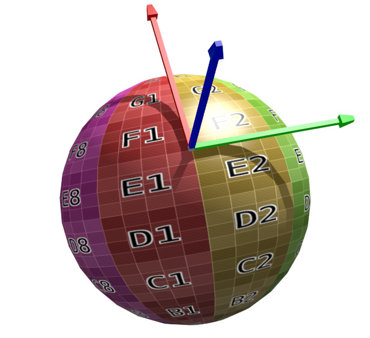

[OpenGL 3D 2022 Tips 第07回]

# 法線と接線と従接線

## 習得目標

* 法線マッピングの効果と用途を説明できる。
* タンジェント空間の特徴を説明できる。
* TBN行列を乗算したあと、正規化が必要な理由を説明できる。

## 1. 法線マッピング

### 1.1 なぜ法線マッピングを行うのか

布地の繊維、アスファルトの凹凸(おうとつ)、水面に立つさざなみなど、現実世界には微細な凹凸が数多く存在します。人間は、物体表面にこうした詳細情報があることに慣れているため、凹凸の感じられない物体は作り物だと感じてしまいます。

もちろん、3Dモデルに実際の凹凸を作り込むことができれば問題は解決します。しかし、微細な凹凸を再現するためには膨大な頂点数が必要なため、現実的ではありません。

3Dグラフィックス性能が十分ではなかった頃は、これらの凹凸はカラーテクスチャに直接描き込むことで再現していました。

しかし、カラーテクスチャに描き込まれた凹凸は、どこから見ても、またどのような光の当たり方をしても陰影が変化しません。そのため、すぐにまやかしの陰影であることがバレてしまいます。

「法線マッピング」はこの問題を解決するために生まれました。法線マッピングの基本的な考え方は次のようなものです。

>凹凸が陰影を生むのは法線方向が異なるからだ。つまり、法線さえ再現できれば実際に凹凸を作る必要はないはずだ。

というものです。

法線の再現には、カラーのかわりに「法線の変化量(摂動)」を記録したテクスチャを使います。法線を記録したテクスチャのことを「法線テクスチャ」といいます。

### 1.2 シェーダに法線テクスチャサンプラを追加する

法線テクスチャに記録する法線(の摂動)には、以下の2種類が存在します。

| 名前 | 記録する法線の種類 |
|:-----|:-----|
| オブジェクト空間法線マッピング | モデル座標系(オブジェクト空間)の法線 |
| タンジェント空間法線マッピング | 図形に接する平面を基準とする座標系(タンジェント空間)の法線 |

実装は「オブジェクト空間法線マッピング」のほうが簡単です。そのかわり、「モデルの変形に対応できない」、「テクスチャの再利用が難しい」という欠点があります。

「タンジェント空間法線マッピング」は、実装は少し複雑になりますが、それ以外の欠点はありません。そのため、多くの法線テクスチャはタンジェント空間用に作られています。本テキストでも「タンジェント空間法線マッピング」を実装します。

さて、タンジェント空間の特徴は「図形に接する平面を基準とする座標系」という点です。この平面の法線`N`は、頂点法線と一致します。また、空間を定義する残りの2軸は「タンジェント`T`」と「バイタンジェント`B`」と呼ばれます。

<p align="center">
<br>
[緑=タンジェント(T) 赤=バイタンジェント(B) 青=頂点法線(N)]
</p>

タンジェント空間法線マッピングでは、法線テクスチャの値をタンジェント空間に変換することでワールド法線を計算します。

法線の値は、カラーテクスチャと同じくRGBカラーに変換されて法線テクスチャに記録されます。多くの法線テクスチャが明るい青紫色になるのは、この変換の影響です。

<div style="page-break-after: always"></div>

タンジェント空間法線マッピングの実装手順は次のとおりです。<br>
シェーダ側でやること:

>1. フラグメントシェーダーに法線テクスチャのサンプラを追加。
>2. テクスチャから法線を読み取る。
>3. 法線をポリゴン平面の空間(タンジェント空間)からワールド空間に変換。

CPPプログラム側でやること:

>1. `Material`構造体に法線テクスチャ変数を追加。
>2. MTLファイルから法線テクスチャを取得。
>3. マテリアルパラメータに法線テクスチャ番号を設定。
>4. `Draw`関数内で法線テクスチャをバインド。

それでは、シェーダを法線テクスチャに対応させましょう。まずテクスチャサンプラを追加します。これは、カラーテクスチャと同様に配列にします。名前は`texNormal0_7`(テックス・ノーマル・ゼロ・トゥ・セブン)とします。

`FragmentLighting.frag`を開き、サンプラの定義に次のプログラムを追加してください。

```diff
 layout(binding=0) uniform sampler2D texColor0;
 layout(binding=1) uniform sampler2D texShadow;
 layout(binding=2) uniform sampler2D texColor1_7[7];
+layout(binding=9) uniform sampler2D texNormal0_7[8];

 layout(location=100) uniform mat4 matShadow;
 layout(location=101) uniform vec4 cameraPosition;
```

法線テクスチャの番号は、マテリアルパラメータの未使用領域に割り当てます。
`inMaterialParameters`ユニフォーム変数のコメントに、次のコメントを追加してください。

```diff
 layout(location=3) in vec3 inPosition;
 // x: テクスチャ番号
 // y: ラフネス
+// z: 法線テクスチャ番号
 layout(location=4) in vec4 inMaterialParameters;

 // 出力変数
```

次に、法線を変換する関数を定義します。関数名は`ComputeWorldNormal`(コンピュート・ワールド・ノーマル)とします。`poissonDisk`配列の定義の下に、次のプログラムを追加してください。

```diff
   vec2( 0.19984126, 0.78641367 ), 
   vec2( 0.14383161, -0.14100790 ) 
 };
+
+/**
+* ワールド法線を計算する
+*
+* @param V ビュー(視線)ベクトル
+*/
+vec3 ComputeWorldNormal(vec3 V)
+{
+  // 法線テクスチャを読み取る
+  vec3 normal = vec3(0, 0, 1);
+  switch (uint(inMaterialParameters.z)) {
+  case 0:  normal = texture(texNormal0_7[0], inTexcoord).rgb; break;
+  case 1:  normal = texture(texNormal0_7[1], inTexcoord).rgb; break;
+  case 2:  normal = texture(texNormal0_7[2], inTexcoord).rgb; break;
+  case 3:  normal = texture(texNormal0_7[3], inTexcoord).rgb; break;
+  case 4:  normal = texture(texNormal0_7[4], inTexcoord).rgb; break;
+  case 5:  normal = texture(texNormal0_7[5], inTexcoord).rgb; break;
+  case 6:  normal = texture(texNormal0_7[6], inTexcoord).rgb; break;
+  case 7:  normal = texture(texNormal0_7[7], inTexcoord).rgb; break;
+  }
+}

 // フラグメントシェーダプログラム
 void main()
```

この関数の先頭では法線テクスチャを読み取ります。法線テクスチャの値がないと話が進まないからです。フラグメントシェーダでは変数を添え字に使えないので、カラーテクスチャと同じように`switch`文で代用しています。

次に、法線テクスチャが有効かどうかをチェックします。法線テクスチャを読み取るプログラムの下に、次のプログラムを追加してください。

```diff
   case 6:  normal = texture(texNormal0_7[6], inTexcoord).rgb; break;
   case 7:  normal = texture(texNormal0_7[7], inTexcoord).rgb; break;
   }
+
+  // テクスチャの有効性を判定する
+  // 値が小さすぎる場合、テクスチャが設定されていないとみなして頂点法線を返す
+  vec3 N = normalize(inNormal);
+  if (dot(normal, normal) <= 0.0001) {
+    return N;
+  }
 }

 // フラグメントシェーダプログラム
```

テクスチャが設定されていない場合、R=0, G=0, B=0が返されます。そこで、`dot`関数で「長さの2乗」を計算し、結果が十分に小さい場合はテクスチャが設定されていないと判断します。

### 1.3 法線テクスチャの値を-1～+1に変換する

次に、法線テクスチャの値を`-1`～`+1`に変換します。テクスチャの有効性を判定するプログラムの下に、次のプログラムを追加してください。

```diff
   if (dot(normal, normal) <= 0.01) {
     return N;
   }
+
+  // 8bit値であることを考慮しつつ0～1を-1～+1に変換
+  normal = normal * (255.0 / 127.0) - (128.0 / 127.0);
 }

 // フラグメントシェーダプログラム
```

一般に、法線テクスチャにはカラーテクスチャと同じ`GL_RGB8`または`GL_RGBA8`が使われます。これらは各色`0`～`255`の値になっていますが、法線の取りうる範囲は`-1`～`1`です。

そこで、`-1`～`1`を`-128`～`127`に変換し、さらに`128`を足して`0`～`255`に変換します。テクスチャにはこの値が書き込まれます。その後、シェーダで読み込むときに`0`～`1`に変換されます。

このような仕組みのため、テクスチャから読み込んだ値を本来の法線に戻すには`128`を引く必要があります。実際には読み込んだ時点で`0`～`1`に変換されているので、「`255`倍して
`128`を引く」という手順を踏みます。

また、法線としては`-128`～`127`ではなく、`-1`～`+1`になっていてほしいので、さらに「`127`で割る」必要があります。なお、上記のプログラムでは実行時の除算を避けるために、除算を定数式に組み込んでいます。

>**【カラー以外を扱えるテクスチャフォーマットについて】**<br>
>最近のシステムでは`-1`～`+1`を記録できるテクスチャフォーマットが使えます。それらのフォーマットは、既存のフォーマットより効率的に法線を扱うことができます。
>法線をそのまま記録できるフォーマットを使う場合、この節で行った計算は不要です。

<div style="page-break-after: always"></div>

### 1.4 TBN行列を作成する

タンジェント空間法線マッピングの場合、法線テクスチャには「ポリゴン平面を基準とした法線」を記録します。この方法では法線`(0, 0, 1)`をポリゴン平面(タンジェント空間)の法線とみなします。

空間の定義が異なるために、タンジェント空間の法線をそのままではワールド空間の法線として使うことはできません。そこで、タンジェント空間の法線をワールド空間の法線に変換します。

この変換は「TBN行列」と呼ばれる行列を使って行います。TBN(ティービーエヌ)は`Tangent`
(タンジェント)、`Bi-tangent`(バイ・タンジェント)、`Normal`(ノーマル)の頭文字です。

このうち「ノーマル」は頂点法線のことです。「タンジェント」は「接線(せっせん)」、バイタンジェントは「従接線(じゅうせっせん、もうひとつの接線のこと)」を意味します。

タンジェントとバイタンジェントは頂点法線に直交する単位ベクトルです。しかし、ほとんどの場合、タンジェントとバイタンジェントは直交しません。

TBN行列を作成するには偏微分(へんびぶん)を計算する`dFdx`(ディーエフ・ディーエックス)、
`dFdy`(ディーエフ・ディーワイ)関数を使います。

「偏微分」と聞くと難しそうですが、この関数が実際に行うことは

>ある値について、隣のピクセルで計算された値との差分を返す

というものです。

例えば、描画座標`gl_FragCoord.x`を`dFdx`関数の引数に与えた場合、戻り値は常に`1`です。現在処理中のピクセルの`gl_FragCoord.x`が`100`だとすると、隣のピクセルの
`gl_FragCoord.x`は`101`に決まっているからです。

>こんなことができるのは、`dFdx`と`dFdy`が「隣のピクセルで計算された値を知る能力」を持っている、ちょっと特殊な関数だからです。

さて、`dFdx`と`dFdy`を使って何をするかというと、ワールド座標系のXZ軸ベクトルおよびテクスチャ座標系のUV軸ベクトルを求めます。その後、これらの方向ベクトルからタンジェント空間の軸を求めます。

まず、ビューベクトルおよびテクスチャ座標のピクセル差分を取得しましょう。<br>
法線を`-1`～`+1`に変換するプログラムの下に、次のプログラムを追加してください。

>変数名`dp1`や`duv1`の`d`は`delta`(デルタ、差分)の頭文字です。

```diff
   // 8bit値であることを考慮しつつ0～1を-1～+1に変換
   normal = normal * (255.0 / 127.0) - (128.0 / 127.0);
+
+  // 隣接ピクセル間のベクトルを取得
+  vec3 dp1 = dFdx(-V);
+  vec3 dp2 = dFdy(-V);
+  vec2 duv1 = dFdx(inTexcoord);
+  vec2 duv2 = dFdy(inTexcoord);
 }

 // フラグメントシェーダプログラム
```

次に、方向ベクトルからワールド座標系のタンジェントとバイタンジェントを計算します。偏微分を求めるプログラムの下に、次のプログラムを追加してください。

>`perp`は`perpendicular`(パーペンディキュラー、「直角」「垂直」という意味)の短縮形です。

```diff
+
+  // タンジェント空間からワールド空間に変換する行列を計算
+  vec3 dp2perp = cross(dp2, N);
+  vec3 dp1perp = cross(N, dp1);
+  vec3 T = dp2perp * duv1.x + dp1perp * duv2.x;
+  vec3 B = dp2perp * duv1.y + dp1perp * duv2.y;
+  float invMax = inversesqrt(max(dot(T, T), dot(B, B)));
+  mat3 TBN = mat3(T * invMax, B * invMax, N);
 }

 // フラグメントシェーダプログラム
```

>ここで使っている法線の計算は、以下のBlogで公開されているシェーダプログラムを利用しています。
>
>The Tenth Planet<br>
>Followup: Normal Mapping Without Precomputed Tangents<br>
>`http://www.thetenthplanet.de/archives/1180`

さて、偏微分の値はモデルまでの距離と拡大率の影響を受けるため、`T`と`B`の長さは状況によって異なります。これらは方向ベクトルなので正規化しなくてはなりません。しかし、単純に正規化するだけでは解決できない問題があります。

それは、ほとんどのポリゴンが「テクスチャ座標でゆがんだ拡大縮小を行っている」ことです。テクスチャマッピングでは、立体を平面に展開する過程でどうしても歪みが生じるからです。

`T`と`B`を個別に正規化すると、この「本来あるべき歪み」がなくなってしまいます。<br>
しかし、ベクトルを正規化しないかぎり、実際のタンジェント、バイタンジェントと一致させられません。

この難問に対して、上記Blogの作者Christian(クリスチャン)が出した答えは、「どちらか長い方のベクトルに合わせる」というものでした。

上記のプログラムでは`invMax`変数を使って計算している部分です。

この方法は、どちらか一方は正規化されて正しいベクトルになり、そのうえで相対的な長さの比率は維持されます。これは完璧な方法ではありませんが、ほとんどの場合で良好な`T`と`B`が得られます。

### 1.5 ワールド法線を計算する

TBN行列が手に入ったので、ワールド法線を計算しましょう。TBN行列を計算するプログラムの下に、次のプログラムを追加してください。

```diff
   vec3 B = dp2perp * duv1.y + dp1perp * duv2.y;
   float invMax = inversesqrt(max(dot(T, T), dot(B, B)));
   mat3 TBN = mat3(T * invMax, B * invMax, N);
+
+  // ワールド法線を計算する
+  return normalize(TBN * normal);
 }

// フラグメントシェーダプログラム
```

「すべてのベクトルの長さが1、かつ互いに直交している行列」のことを「正規直交行列(せいきちょっこうぎょうれつ)」と言います。モデル行列やビュー行列は正規直交行列です。

正規直交行列と単位ベクトルを掛けると、結果は単位ベクトルになります。そのため、正規化は不要です。

しかし、一般にTBN行列は正規直交行列**ではありません**。今回のプログラムでも、`T`と`B`のどちらかは正規化されないので、「すべてのベクトルの長さが1」という条件を満たしません。

これは、TBN行列を掛けて得られたワールド法線が、**単位ベクトルにならない**ことを意味します。こういう理由があるので、上記のプログラムでもTBN行列と乗算した後に正規化しているのです。

>**【要点】**<br>
>正規直交しない行列を掛けたら正規化すること。

それでは、作成した`ComputeWorldNormal`関数を使ってワールド法線を計算しましょう。
`main`関数の定義を次のように変更してください。

```diff
   fragColor = inColor * tc;

-  // ワールド座標系の法線を正規化
-  vec3 worldNormal = normalize(inNormal);
+  // ワールド座標系の法線を計算
+  vec3 V = normalize(cameraPosition.xyz - inPosition); // 視線ベクトル
+  vec3 worldNormal = ComputeWorldNormal(V);

  // 面が裏向きの場合、法線の向きを逆にする.
  if (gl_FrontFacing == false) {
```

変数`V`は、Cook-Torranceモデルのパラメータと同じものです。定義が重複するので、元からあるほうを削除します。Cook-Torranceモデルのパラメータを計算するプログラムを、次のように変更してください。

```diff
   // Cook-Torranceモデルのパラメータ
   float roughness = inMaterialParameters.y;
   float alpha = roughness * roughness;
-  vec3 V = normalize(cameraPosition.xyz - inPosition); // 視線ベクトル
   vec3 H = normalize(V + -light.direction); // 視線と光の向きのハーフベクトル

   // Blinn-Phong NDFによって微小面分布Dを計算
```

これで、法線テクスチャからワールド法線を計算できるようになりました。

### 1.6 法線テクスチャを読み込む機能を追加する

ここからはCPPプログラム側を変更していきます。「`Material`構造体に法線テクスチャ変数を追加」するところからやっていきましょう。`Primitive.h`を開き、`Material`構造体に次のプログラムを追加してください。

```diff
     std::string name;               // マテリアル名
     glm::vec4 color = glm::vec4(1); // ディフューズ色
     std::shared_ptr<Texture> tex;   // テクスチャ
+    std::shared_ptr<Texture> texNormal; // 法線テクスチャ
     float roughness = 0.5f;         // 表面の粗さ
   };
```

次に、MTLファイルから法線テクスチャ名を取得し、法線テクスチャを読み込みます。法線テクスチャ名は、`bump`(バンプ)または`map_bump`(マップ・バンプ)構文で指定されます。

法線テクスチャの読み込み方法は、通常のカラーテクスチャと同じです。`Primitive.cpp`を開き、`LoadMaterial`関数の定義に次のプログラムを追加してください。

```diff
       const std::string textureName = foldername + p;
       m.tex = engine.LoadTexture(textureName.c_str());
     }
+    else if (strcmp(ctype, "bump") == 0 || strcmp(ctype, "map_bump") == 0) { // 法線テクスチャ
+      for (; *p == ' ' || *p == '\t'; ++p) {} // 先頭の空白を除去
+      const std::string textureName = foldername + p;
+      m.texNormal = engine.LoadTexture(textureName.c_str());
+    }
     else if (strcmp(ctype, "Ns") == 0) { // 鏡面反射指数
       float ns;
```

### 1.7 マテリアルパラメータに法線テクスチャ番号を設定する

続いて、マテリアルパラメータに法線テクスチャ番号を設定します。そのために、まずマテリアルが使っている法線テクスチャの一覧を取得できるようにします。`Primitive.h`を開き、

```diff
 using TextureList = std::vector<std::shared_ptr<Texture>>;
 using MaterialParameterList = std::vector<glm::vec4>;
 TextureList GetTextureList(const std::vector<Mesh::Material>& materials);
+TextureList GetNormalTextureList(const std::vector<Mesh::Material>& materials);
 MaterialParameterList GetMaterialParameterList(
-  const std::vector<Mesh::Material>& materials, const TextureList& textures);
+  const std::vector<Mesh::Material>& materials, const TextureList& textures,
+  const TextureList& texNormals);

 #endif // PRIMITIVE_H_INCLUDED
```

`GetNormalTextureList`(ゲット・ノーマル・テクスチャ・リスト)は法線テクスチャの一覧を取得する関数です。この関数で取得した法線テクスチャ一覧は、
`GetMaterialParameterList`関数の引数として使用します。

それでは、`GetNormalTextureList`関数の定義を作成しましょう。`Primitive.cpp`を開き、`GetTextureList`関数の定義の下に、次のプログラムを追加してください。

```diff
   }
   return textures;
 }
+
+/**
+* マテリアルで使われている法線テクスチャの一覧を取得する
+*/
+TextureList GetNormalTextureList(
+  const std::vector<Mesh::Material>& materials)
+{
+  TextureList textures;
+  for (const auto& e : materials) {
+    if (!e.texNormal) {
+      continue;
+    }
+    const auto itr = std::find(textures.begin(), textures.end(), e.texNormal);
+    if (itr == textures.end()) {
+      textures.push_back(e.texNormal);
+    }
+  }
+  return textures;
+}

 /**
 * マテリアルが使うテクスチャの番号一覧を取得する
```

次に、`GetMaterialParameterList`関数を法線テクスチャ一覧に対応させます。
`GetMaterialParameterLsit`関数の定義を次のように変更してください。

```diff
 * マテリアルが使うテクスチャの番号一覧を取得する
 */
 MaterialParameterList GetMaterialParameterList(
- const std::vector<Mesh::Material>& materials, const TextureList& textures)
+ const std::vector<Mesh::Material>& materials, const TextureList& textures,
+ const TextureList& texNormals)
 {
   MaterialParameterList parameterList(materials.size());
   std::transform(materials.begin(), materials.end(), parameterList.begin(),
     [&textures, &texNormals](const Mesh::Material& m) {
       glm::vec4 param(0, m.roughness, 0, 0);
       for (int i = 0; i < textures.size(); ++i) {
         if (textures[i] == m.tex) {
           param.x = static_cast<float>(i);
           break;
         }
       }
+      for (int i = 0; i < texNormals.size(); ++i) {
+        if (texNormals[i] == m.texNormal) {
+          param.z = static_cast<float>(i);
+          break;
+        }
+      }
       return param;
     });
```

`GetMaterialParameterList`関数に引数を追加したので、呼び出し側の修正もしなくてはなりません。`Renderer.h`を開き、`MeshRenderer`クラスの定義に次のプログラムを追加してください。

```diff
   bool materialChanged = true;
   TextureList textures;
+  TextureList texNormals;
   MaterialParameterList materialParameters;
   std::vector<glm::vec4> colors;
```

続いて`Renderer.cpp`を開き、`MeshRenderer::Draw`関数の定義を次のように変更してください。

```diff
       colors[i] = materials[i].color;
     }
     textures = GetTextureList(materials);
+    texNormals = GetNormalTextureList(materials);
-    materialParameters = GetMaterialParameterList(materials, textures);
+    materialParameters = GetMaterialParameterList(materials, textures, texNormals);
   }
 
   // モデル行列とMVP行列をGPUメモリにコピーする
```

これで、法線テクスチャ番号がシェーダに送られるようになりました。

<pre class="tnmai_assignment">
<strong>【課題01】</strong>
上記のプログラムを参考にして、<code>InstancedMeshRenderer</code>クラスの<code>Draw</code>関数の定義に、法線テクスチャ番号を設定する機能を追加しなさい。
</pre>

### 1.8 法線テクスチャをサンプラに割り当てる

番号だけ送って、肝心の法線テクスチャを割り当てないのでは片手落ちです。次は、法線テクスチャを割り当てるプログラムを追加しましょう。

テクスチャの種類が増えてきたので、テクスチャ番号を定数として定義するように変更します。
`Renderer.h`を開き、`Renderer`クラスの定義に次のプログラムを追加してください。

```diff
   static const GLint locMapSize = 101;
   static const GLint locCamera = 102;
+
+  static constexpr GLuint colorBindingPoints[] = { 0, 2, 3, 4, 5, 6, 7, 8 };
+  static constexpr GLuint shadowBindingPoint = 1;
+  static constexpr GLuint normalBindingPoints[] = { 9, 10, 11, 12, 13, 14, 15, 16 };
+  static constexpr size_t colorBindingPointSize = std::size(colorBindingPoints);
+  static constexpr size_t normalBindingPointSize = std::size(normalBindingPoints);

   Renderer() = default;
   virtual ~Renderer() = default;
```

`static constexpr`(スタティック・コンスト・エクスプル)は、C++17から利用可能になった「スタティックメンバ定数」を定義するキーワードです。

`static const`では配列の定義と宣言を分ける必要がありましたが、`static constexpr`では配列であっても、宣言と定義が同時に書けるように強化されています。

次に`Renderer.cpp`を開き、`MeshRenderer::Draw`関数の定義を次のように変更してください。

```diff
     const std::vector<glm::mat4> m = CalcGroupMatirices();
     pipeline.SetUniform(locMatGroupModels, m.data(), m.size());
   }

+  // カラーテクスチャをバインド
-  const GLuint bindingPoints[] = { 0, 2, 3, 4, 5, 6, 7, 8 };
-  const size_t size = std::min(textures.size(), std::size(bindingPoints));
+  const size_t size = std::min(textures.size(), colorBindingPointSize);
   for (int i = 0; i < size; ++i) {
-    textures[i]->Bind(bindingPoints[i]);
+    textures[i]->Bind(colorBindingPoints[i]);
   }
+
+  // 法線テクスチャをバインド
+  const size_t normalSize = std::min(texNormals.size(), normalBindingPointSize);
+  for (int i = 0; i < normalSize; ++i) {
+    texNormals[i]->Bind(normalBindingPoints[i]);
+  }
+  // 使わない法線テクスチャユニットにはデフォルトテクスチャを割り当てる
+  if (normalSize < normalBindingPointSize) {
+    glBindTextures(
+      static_cast<GLuint>(normalBindingPoints[0] + normalSize),
+      static_cast<GLsizei>(normalBindingPointSize - normalSize), nullptr);
+  }

   mesh->primitive.Draw();
 }
```

これで、法線テクスチャをシェーダから読み取れるようになりました。

<pre class="tnmai_assignment">
<strong>【課題02】</strong>
上記のプログラムを参考にして、<code>InstancedMeshRenderer</code>クラスの<code>Draw</code>関数の定義に、法線テクスチャをバインドする機能を追加しなさい。
</pre>

<div style="page-break-after: always"></div>

### 1.9 法線テクスチャを用意する

タイガーI戦車、T-34戦車のモデルには、法線テクスチャが含まれています。カラーテクスチャ名に`normal`, `nm`, `nml`のような単語を追加した名前が法線テクスチャです。例えば、タイガーI戦車の場合は`PzVI_Tiger_I_NM.dds`という名前です。

<pre class="tnmai_assignment">
<strong>【課題03】</strong>
<code>PzVI_Tiger_I_NM.dds</code>をVisual Studioで開き、画像形式を「32bit BGRA」に変更してから(これをやらないとTGAに変換できない)、TGA形式としてプロジェクトの<code>Res</code>フォルダに保存しなさい。
同様に、キャタピラ用の法線テクスチャをTGAファイルに変換し、プロジェクトの<code>Res</code>フォルダに保存しなさい。
</pre>

TGAファイルが用意できたら、MTLファイルに法線テクスチャの設定を追加します。タイガーI戦車のMTLファイルを開き、次のテキストを追加してください。

```diff
 d 1.000000
 illum 2
 map_Kd PzVI_Tiger_I_track.tga
+bump PzVI_Tiger_I_track_NM.tga

 newmtl Material_1.003
 Ns 96.078431
 Ka 0.000000 0.000000 0.000000
 Kd 0.800000 0.800000 0.800000
 Ks 0.000000 0.000000 0.000000
 Ni 1.000000
 d 1.000000
 illum 2
 map_Kd PzVl_Tiger_I.tga
+bump PzVI_Tiger_I_NM.tga
```

法線テクスチャの構文を追加したら、プロジェクトをビルドして実行してください。タイガーI戦車に細かい凹凸が追加されていたら成功・・・なんですが、カメラが遠くて分かりにくいですね。それと、木の表示がおかしくなる場合があるようです。

<p align="center">

</p>

### 1.10 PrimitiveRendererに法線テクスチャのバインド解除を追加する

表示がおかしくなるのは、`PrimitiveRenderer`を使っているオブジェクトです。現状、これらは法線テクスチャに対応していませんが、フラグメントシェーダは`MeshRenderer`と同じものを使っています。

そのため、最後にバインドした法線テクスチャが使われて、表示に影響をおよぼしているのです。これを防ぐにはバインドを解除します。

`Renderer.cpp`を開き、`PrimitiveRenderer::Draw`関数の定義に、次のプログラムを追加してください。

```diff
   if (tex) {
     tex->Bind(0); // テクスチャを割り当てる
   }
+
+  // 法線テクスチャにデフォルトテクスチャを割り当てる
+  glBindTextures(normalBindingPoints[0], 1, nullptr);

   prim.Draw();  // プリミティブを描画する
 }
```

なお、`StaticMeshRenderer`と`AnimatedMeshRenderer`は専用のフラグメントシェーダを使うので、法線テクスチャの設定は不要です。

プログラムが書けたらビルドして実行してください。表示が正常に戻っていたら成功です。

<p align="center">

</p>

### 1.11 法線テクスチャの効果を確認する

おかしな表示がなくなったのはいいのですが、法線テクスチャの効果はやっぱりよくわかりませんね。これは視点が遠すぎるせいです。

そこで、カメラの位置を近づけることにします。<br>
`GameManager.cpp`を開き、`UpdateCamera`関数の定義を次のように変更してください。

```diff
       glm::rotate(glm::mat4(1), target->rotation, glm::vec3(0, 1, 0));
     const glm::vec3 tankFront = matRot * glm::vec4(0, 0, 1, 1);
     Camera& camera = engine.GetCamera();
-    camera.position = target->position + glm::vec3(0, 20, 20);
+    camera.position = target->position + glm::vec3(0, 8, 8);
     camera.target = target->position;
```

それから、キーで法線テクスチャの有無を切り替えて、違いを比較できるようにします。
`Renderer.cpp`を開き、`MeshRenderer::Draw`関数の定義を次のように変更してください。

```diff
     textures[i]->Bind(colorBindingPoints[i]);
   }

   // 法線テクスチャをバインド
-  const size_t normalSize = std::min(texNormals.size(), normalBindingPointSize);
+  size_t normalSize = std::min(texNormals.size(), normalBindingPointSize);
+  if (GameEngine::Get().GetKey(GLFW_KEY_N)) {
+    normalSize = 0;
+  }
   for (int i = 0; i < normalSize; ++i) {
     texNormals[i]->Bind(normalBindingPoints[i]);
```

このプログラムは、`N`キーを押しているあいだ法線テクスチャを無効化します。

プログラムが書けたらビルドして実行してください。車体を回転させたときに、法線テクスチャによる立体感が失われないことに注目してください。

全体に細かいディテールが追加されるのですが、特に、車輪、エンジングリル(車体後部のあみの部分)、履帯の違いが分かりやすいと思います。`N`キーを押したり離したりして、法線テクスチャの効果を確認してください。

このように、法線テクスチャを使うと、ポリゴンで表現するとポリゴン数が大幅に増えてしまうような、細かいパーツの立体感を再現することができます。

<p align="center">
 <br>
[左=法線テクスチャあり 右=法線テクスチャなし]
</p>

<pre class="tnmai_assignment">
<strong>【課題04】</strong>
法線テクスチャの効果を確認し終えたら、1.11節で行った変更を元に戻しなさい。
</pre>

<pre class="tnmai_assignment">
<strong>【課題05】</strong>
T-34戦車に法線テクスチャを設定しなさい。
</pre>

>**【1章のまとめ】**
>
>* 法線マッピングを使うと、衣服のしわや、機械の微細な凹凸のような、ポリゴンでは表現しにくい特徴を再現できる。
>* 法線マッピングには法線テクスチャを使う。
>* 法線テクスチャに記録されているの「タンジェント空間」の値なので、TBN行列を使ってワールド空間に変換しなくてはならない。
>* タンジェント空間は、で、タンジェント軸とバイタンジェント軸がそれぞれテクスチャ座標系のUVと一致する空間。
>* TBN行列は正規直交行列ではないので、乗算後に正規化する必要がある。
