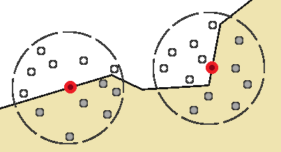
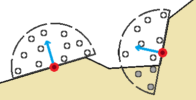
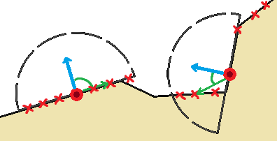
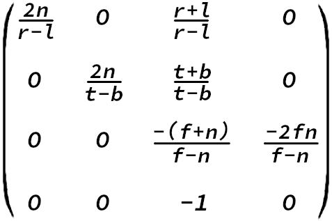
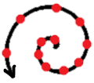
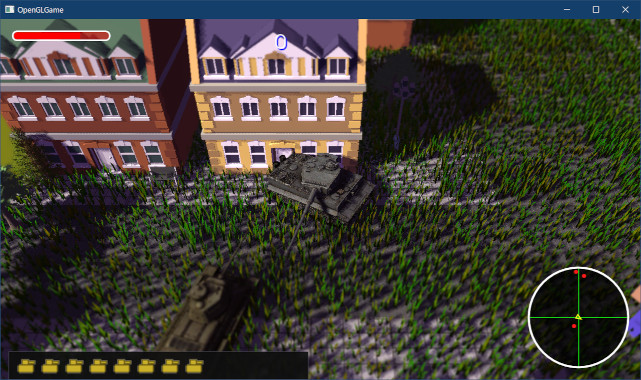
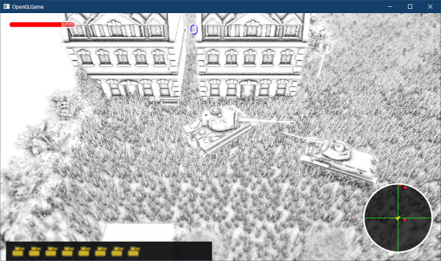
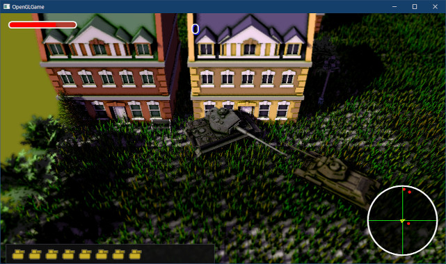

[OpenGL 3D 2022 Tips 第08回]

# アンビエントオクルージョン

## 習得目標

* アンビエントオクルージョンの概念を説明できる。
* 深度バッファからビュー座標系の深度値を復元するコードが書ける。
* 偏微分関数`dFdx`、`dFdy`の機能を説明できる。
* ブレンド式、係数、定数カラーを設定するコードが書ける。

## 1. 環境遮蔽(アンビエントオクルージョン)

### 1.1 アンビエントオクルージョン(AO)について

鏡面反射と法線マップを追加したことで、より現実感のある画像を表示できるようになりました。今回は、さらに現実感を高めるために「アンビエント・オクルージョン」という処理を追加します。

アンビエントオクルージョンを日本語に訳すと「環境遮蔽(かんきょうしゃへい)」となります。部屋のすみっこや入り組んだ地形、オブジェクトの継ぎ目などが周囲よりも暗くなる現象を再現します。

アンビエントオクルージョンは主に環境光に影響する技法です。「環境光」は全方位からピクセルに到達する光を表現します。このとき、周囲に物体があれば、光はその物体に遮られてピクセルには到達できません。こうした、

>環境光が周囲の「環境」に「遮蔽」される比率

を再現するのがアンビエントオクルージョンというわけです。

ところで、「アンビエントオクルージョン」は長すぎるので、以後はAO(エーオー)と呼ぶことにします。

<div style="page-break-after: always"></div>

### 1.2 SSAO(スクリーン・スペース・アンビエントオクルージョン)

物体の位置が変化しない場合、AOは事前に計算することが可能です。しかし、動く物体がある空間ではそうはいきません。さらに、AO用のデータを保持するメモリも必要となります。

ゲーム実行中に計算すれば問題はなくなりますが、正確なAOの計算には非常に時間がかかります。そのため、ゲーム実行中に計算することは当分できないだろうと考えられていました。

しかし、2007年にCrytek(クライテック)社という会社が「SSAO(スクリーン・スペース・アンビエントオクルージョン)」という技術を開発しました。

そして、実際に「Crysis(クライシス)」というゲームの実行中にAOを再現して見せたことで、状況は一変しました。現代では、ほぼすべてのゲームエンジンにSSAOが実装されています。

SSAOでは、深度バッファの情報からAOを計算します。Crytekの方法では、対象ピクセルを中心とした球体内の座標について、その座標の深度値が深度バッファの深度値より遠くにある場合に遮蔽されていると判定します。

この判定を複数のランダムな座標で行い、値の平均をピクセルの遮蔽率とします。ただ、この方法で高品質なAOを再現するには、調査するピクセル数(これを「サンプル点」、「サンプリング・ポイント」といいます)をかなり増やさなくてはなりません。

<p align="center">
<br>
Crytekの手法
</p>

しかし、サンプル点を増やすと処理速度が低下します。そのため、Crysisではわずか16個のサンプル点を使い、ぼかし処理によって粗さをごまかしていました。

その後、ピクセルの後ろ側からは光が到達しないことを考慮して、調査範囲を球体ではなく半球とする方法や、ピクセルに対して線対称の座標の深度値から、ピクセルがその谷間になっているかどうかを調べる方法などが考案されています。

<p align="center">
<br>
サンプル点を減らすために、範囲を半球に限定した手法
</p>

今回は、NVidia社のMcGuire氏が考案した「SAO(スケーラブル・アンビエント・オブスキュランス)」という、比較的新しい方法を使うことにしました。

>`obscurance`と`occlusion`はどちらも「隠す」とか「塞ぐ」という意味です。

SAOでは、対象ピクセルからサンプル点へ向かうベクトルと、対象ピクセルの法線がなす角を調べます。そして、角度がきついほど強く遮蔽されていると判断します。

<p align="center">
<br>
サンプル点との角度差を遮蔽率とする手法(SAO)
</p>

>**【SSAOをもっと詳しく知るには】**<br>
>SSAOの種類と考え方については、以下のURLが参考になるでしょう。<br>
>`https://ambientocclusion.hatenablog.com/entry/2013/11/07/152755`

### 1.3 SAOシェーダを追加する

それでは、SAOを計算するシェーダを作成しましょう。最初に、ユニフォーム変数のロケーション番号を決めます。`Renderer.h`を開き、`Renderer`クラスの定義に次のプログラムを追加してください。

```diff
   static const GLint locMaterialParameters = 20;
   static const GLint locMatGroupModels = 30;
   static const GLint locMatShadow = 100;
+  static const GLint locRadiusScaleIntensity = 100;
   static const GLint locCameraPosition = 101;
   static const GLint locMapSize = 101;
+  static const GLint locMatInvProj = 101;
   static const GLint locCamera = 102;

   static constexpr GLuint colorBindingPoints[] = { 0, 2, 3, 4, 5, 6, 7, 8 };
```

次に、プロジェクトの`Res`フォルダに`sao.frag`という名前のテキストファイルを追加してください。追加したファイルを開き、次のプログラムを追加してください。

```diff
+#version 450
+
+// 入力変数
+layout(location=1) in vec2 inTexcoord;
+
+// 出力変数
+out vec4 outColor;
+
+// ユニフォーム変数
+layout(binding=0) uniform sampler2D texDepth; // 深度テクスチャ
+
+// x: 透視投影の拡大率
+// y: サンプリング半径
+// z: AOの強度
+// w: (未使用)
+layout(location=100) uniform vec4 radiusScaleIntensity;
+
+// 逆プロジェクション行列
+layout(location=101) uniform mat4 matInvProj;
+
+// x: 1.0 / スクリーンの幅
+// y: 1.0 / スクリーンの高さ
+// z: nearプレーンまでの距離
+// w: farプレーンまでの距離
+layout(location=102) uniform vec4 camera;
+
+#define NUM_SAMPLES (11) // サンプル数
+#define NUM_SPIRAL_TURNS (7) // サンプル点の回転回数
+#define PI (3.14159265) // 円周率
+#define TWO_PI (PI * 2.0) // 2π(=360度)
+
+/**
+* SAO(Scalable Ambient Obscurance)により遮蔽項を求める
+*/
+void main()
+{
+}
```

ここでは必要な変数を定義しています。SAOは深度テクスチャからAOを計算するので、深度テクスチャは必須です。`radiusScaleIntensity`(レイディウス・スケール・インテンシティ)には、SAOを制御する各種パラメータを設定します。

`matInvProj`(マット・インブ・プロジェ)にはプロジェクション行列の逆行列、`camera`にはカメラのパラメータを設定します。これらは、深度値からピクセルのビュー座標を復元するために使います。

`NUM_SAMPLES`(ナム・サンプルズ)は「サンプリング回数」です。この値を大きくするほど処理時間が長くなりますが、AOの精度は向上します。

`NUM_SPIRAL_TURNS`(ナム・スパイラル・ターンズ)は「360度内のサンプル数」です。SAOの工夫の一つに「サンプル点の座標を螺旋状に配置する」という点があります。この値を大きくすると螺旋が緩やかに、小さくすると螺旋が急になります。

SAOの論文によると、「サンプル数未満の素数を指定すると、SAOの品質が向上する」そうです。

<div style="page-break-after: always"></div>

### 1.4 深度値を復元する関数を定義する

次に、SAOの計算に必要な関数を定義します。SAOのというか、SSAOの計算はビュー座標系で行います。深度テクスチャの値は、NDC座標系の値を`0`～`1`の範囲になるように変形したものです。

そのため、深度テクスチャから元の深度値を復元するには、プロジェクション行列とGPUが行うのと逆の計算をしなくてはなりません。プログラムを見やすくするため、この計算を関数として定義します。

関数名は`GetDepthVS`(ゲット・デプス・ブイエス)とします(`VS`は「ビュー・スペース」の短縮形)。`NUM_SPIRAL_TURNS`マクロ定数の定義の下に、次のプログラムを追加してください。

```diff
 #define PI (3.14159265) // 円周率
 #define TWO_PI (PI * 2.0) // 2π(=360度)
+
+/**
+* 深度バッファの値からビュー空間の深度値を復元
+*/
+float GetDepthVS(vec2 uv)
+{
+  float near = camera.z;
+  float far = camera.w;
+  float depth = texture(texDepth, uv).x * 2.0 - 1.0;
+  return 2.0 * near * far / (near + far - depth * (far - near));
+}

 /**
 * SAO(Scalable Ambient Obscurance)により遮蔽項を求める
```

`glm::perspective`関数は以下の行列を返します。ここで、`n`はニア平面までの距離、`f`はファー平面までの距離です。また、`l`と`r`は表示範囲の左右の長さ、`t`と`b`は上下の長さを表します。

<p align="center">

</p>

この行列に、座標ベクトル`(x, y, z, 1)`を乗算したとします。このとき、返される深度値`z'`の値は

>`z' = -(f+n)/(f-n) * z + -2fn/(f-n)`

となります。分かりにくいので`-(f+n)/(f-n)`を`A`、`-2fn/(f-n)`を`B`とすると、

>`z' = Az + B`

となります。この値はクリップ座標系の深度値です。GPUはこれを`w'`の値で割ってNDC座標系の深度値を計算します。`w' = -1 * z`なので、

>`z' = -A - Bz`

となります。これがNDC座標系の深度値です。この値は`-1`～`+1`の範囲を取りますが、深度バッファには`0`～`1`の値しか格納できません。深度バッファに格納する値を`D`とすると、次の計算によって深度バッファに格納する値を得ます。

>`D = z' * 0.5 - 0.5`

`GetDepthVS`関数は、この計算を逆方向に行うことでビュー座標系の深度値を求めています。

>この節の内容は、以下のURLを参考にしました。<br>
>https://stackoverflow.com/questions/6652253/getting-the-true-z-value-from-the-depth-buffer

### 1.5 ビュー座標を計算する関数定義する

次に、「UV座標と深度値からピクセルのビュー座標を計算」する関数を定義します。関数名は`GetPositionVS`(ゲット・ポジション・ブイエス)とします。`GetDepthVS`関数の定義の下に、次のプログラムを追加してください。

```diff
   float depth = texture(texDepth, uv).x * 2.0 - 1.0;
   return 2.0 * near * far / (near + far - depth * (far - near));
 }

+/**
+* ビュー座標系の座標を計算
+*/
+vec3 GetPositionVS(vec2 uv, float depth)
+{
+  // ファー平面上のビュー座標を求める
+  vec4 tmp = matInvProj * vec4(uv * 2.0 - 1.0, -1.0, 1.0);
+  vec3 farPlaneVS = tmp.xyz / tmp.w;
+
+  // 視点からピクセルへ向かうベクトルを求める
+  vec3 ray = normalize(farPlaneVS);
+
+  // ビュー座標を求める
+  return ray * depth;
+}

 /**
 * SAO(Scalable Ambient Obscurance)により遮蔽項を求める
```

`GetPositionVS`関数は、テクスチャ座標と深度値から「ピクセルのビュー座標」を計算します。

NDC座標系のXY座標はテクスチャ座標から計算できます。Z座標を`-1`とすると、ファー平面上の座標になります。これに逆プロジェクション行列を掛けて`w`で除算します。

すると、視点からピクセル座標を通る直線と、ファー平面の交点のビュー座標が得られます。
また、ビュー座標系の視点座標は常に原点にあります。つまり、得られたビュー座標は「視点からピクセルへ向かうベクトル」でもあるわけです。

このベクトルを正規化し、深度値を掛けることでピクセルのビュー座標が求まります。

>**【wで除算している理由】**<br>
>簡単に言うと、<br>
>「NDC座標は`w`で除算した値なので、ビュー座標系に戻すには`w`を乗算する必要がある」<br>
>からです。NDC座標に逆プロジェクション行列を掛けた結果の`w'`値は、プロジェクション行列で計算される`w`の逆数(`w' = 1/w`)になります。<br>
>そして、「`1/w`で割る」ことは「`w`を掛ける」ことと同じです。

### 1.6 ピクセルの座標と法線を求める

それでは、SAOの本体に取り掛かりましょう。最初に、対象ピクセルのビュー座標と法線を求めます。`main`関数に次のプログラムを追加してください。

```diff
 */
 void main()
 {
+  // ピクセルのビュー座標と法線
+  float depth = GetDepthVS(inTexcoord);
+  vec3 positionVS = GetPositionVS(inTexcoord, depth);
+  vec3 normalVS = normalize(cross(dFdx(positionVS), dFdy(positionVS)));
 }
```

座標は`GetDepthVS`と`GetPositionVS`で求められます。法線は`dFdx`(ディー・エフ・ディーエックス)関数と`dFdy`(ディー・エフ・ディーワイ)関数を使って求めます。

この2つは「指定された式について、隣のピクセルのフラグメントシェーダの計算結果との差分を返す」という、特殊な関数になっています。

<pre class="tnmai_code"><strong>【書式】</strong><code>
X方向の差分 dFdx(差分を求めたい式);
</code></pre>

<pre class="tnmai_code"><strong>【書式】</strong><code>
Y方向の差分 dFdy(差分を求めたい式);
</code></pre>

`dFdx`はX軸方向の差分、`dFdy`はY軸方向の差分をそれぞれ返します。上記のプログラムでは「ビュー座標の差分」を求めています。これはオブジェクトの表面に平行なベクトルに相当します。

そして、表面に平行な2つのベクトルが手に入ったら、あとは外積を使えば法線を求めることができます。

>**【dFdx, dFdyの挙動】**<br>
>フラグメントを描画するとき、GPUは2x2ピクセルをまとめて処理します(高速化のため)。dFdx関数はこの2x2ピクセルのX方向の差分、dFdy関数はY方向の差分を返します。4つのピクセルp00, p01, p10, p11が次のように並んでいるとします。
>
>| 行＼列 |   | 0   | 1   |
>|:------:|:-:|:---:|:---:|
>| 0      |   | p00 | p01 |
>| 1      |   | p10 | p11 |
>
>dFdxは、0行目のピクセルについて`p01 - p00`、1行目のピクセルについて`p11 - p10`を返します。dFdyは0列目のピクセルについて`p10 - p00`、1列目のピクセルについて`p11 - p01`を返します。<br>
>隣り合う2ピクセルが同じ値になることに注意してください。また、環境やパラメータ設定によっては、0行目と1行目、あるいは0列目と1列目で同じ値が返されることがあります。

### 1.7 サンプリングの半径と開始角度を求める

続いて、サンプリングを行う範囲の半径と、サンプリングの開始角度を求めます。ピクセルのビュー座標と法線を求めるプログラムの下に、次のプログラムを追加してください。

```diff
   float depth = GetDepthVS(inTexcoord);
   vec3 positionVS = GetPositionVS(inTexcoord, depth);
   vec3 normalVS = normalize(cross(dFdx(positionVS), dFdy(positionVS)));
+
+  // ワールド座標系とスクリーン座標系のサンプリング半径
+  float radiusWS = radiusScaleIntensity.x;
+  float radiusSS = radiusWS * radiusScaleIntensity.y / depth; 
+
+  // 回転の開始角度
+  // フラグメントごとに開始角度をずらすと見た目が良くなる
+  ivec2 iuv = ivec2(gl_FragCoord.xy);
+  float startAngle = (3 * iuv.x ^ iuv.y + iuv.x * iuv.y) % 257;
 }
```

SAOのサンプル点は、次のように螺旋状に選択されます。

<p align="center">

</p>

さらに、ピクセルごとに螺旋の開始角度を変えて、少ないサンプル数でもそれなりの品質が得られるようになっています。

開始角度に規則性があると画面上に境界線として見えてしまうため、ある程度ランダムな値を選ぶ必要があります。しかし、シェーダでは乱数を生成することができません。また、毎フレーム異なる乱数になってしまうとちらつきが発生します。

今回は、AlchemyAO(アルケミー・エーオー)というAO手法で使われた式を使って、ランダムっぽい値を求めています。この式は、排他的論理和と乗算によって、ピクセルスクリーン座標からランダムっぽい数値を作り出します。

>`乱数? = 3 * X ^ Y + X * Y`

スクリーン座標の乗算なので、結果はかなり大きな数値になります。これはちょっと問題です。というのも、Intel系のGPUには「三角関数に巨大な数値を渡すと不正確な結果を返す」という仕様があるからです。その対策として`257`の剰余を求めています。

>257は素数です。何か困ったことがあったら素数に頼りましょう。

### 1.8 サンプリングを行うループを追加する

続いて、サンプリングを行うループを追加します。開始角度を求めるプログラムの下に、次のプログラムを追加してください。

```diff
   // フラグメントごとに開始角度をずらすと見た目が良くなる
   ivec2 iuv = ivec2(gl_FragCoord.xy);
   float startAngle = (3 * iuv.x ^ iuv.y + iuv.x * iuv.y) % 257;
+
+  vec2 pixelScale = cameraInfo.xy;
+  float r2 = radiusWS * radiusWS;
+  float occlusion = 0;
+  for (int i = 0; i < NUM_SAMPLES; ++i) {
+    // サンプル点の角度と距離を求める
+    float ratio = (float(i) + 0.5) * (1.0 / float(NUM_SAMPLES));
+    float angle = ratio * float(NUM_SPIRAL_TURNS) * TWO_PI + startAngle;
+    vec2 unitOffset = vec2(cos(angle), sin(angle)); 
+    ratio *= radiusSS;
+
+    // サンプル点のビュー座標を求める
+    vec2 uv = inTexcoord + ratio * unitOffset * pixelScale;
+    vec3 samplePositionVS = GetPositionVS(uv, GetDepthVS(uv));
+
+    // サンプル点へのベクトルと法線のコサインを求める
+    const float bias = 0.01; // 直角に近い角度を除外するための係数
+    vec3 v = samplePositionVS - positionVS;
+    float vv = dot(v, v);
+    float vn = max(dot(v, normalVS) - bias), 0.0);
+
+    // サンプル点までの距離とコサインからAOを求める
+    float f = max(r2 - vv, 0.0);
+    occlusion += f * f * f * vn / (vv + 0.01);
+  }
 }
```

まず螺旋上のサンプル点を求めます。サンプル点の座標は、インデックス`i`が大きくなるにつれて中心から遠ざかります。これは`ratio`(レシオ)変数であらわされます。

`unitOffset`(ユニット・オフセット)はピクセル中心からサンプル点へ向かうベクトルです。これに`ratio`と`pixelSize`(=1ピクセルのサイズ)を掛けることで、テクスチャ座標系におけるサンプル点までのベクトルが求まります。

サンプル点のテクスチャ座標が求まったら、`GetPositionVS`関数でサンプル点のビュー座標を求めます。

そして、ビュー座標系において「サンプル点へ向かうベクトルと法線のコサイン」を求めます。ベクトルが法線に近づくほど、強く遮蔽されていると考えられるからです。

ここで`max`関数によって値を0以上にしているのは、90°を超える角度からの影響を無効化するためです。

ループの最後では、遮蔽率を求めて`occlusion`(オクルージョン)変数に加算します。ただ、この時点では`vn`(ブイエヌ)変数にはベクトルの長さが含まれたままなので値が大きすぎます。

そこで、`vv`(ブイブイ、長さの2乗)で割ることで値を小さくしています。

>これは正規化ではないことに注意してください。正規化する場合は`sqrt(vv)`で割る必要がありますが、`sqrt`は処理に時間がかかります。<br>
>しかし、ここでは「大きすぎない値にすること」が目的です。<br>そのため、正規化にはこだわらなかったようです。

最後の行の`f * f * f`の部分は、距離が離れると急速にAOを弱くするための式です。`f`は「半径の2乗 - 長さの2乗」なので、この3乗ということは「円の外側のサンプル点になるほど急速にAOが弱くなる」ことを意味します。

また、「サンプル点までの距離」を使うことによって、座標が遠く離れている場合はAOがゼロになります。これはSAOの重要な特徴のひとつです。サンプル点が遠く離れている場合、遮蔽とは無関係なオブジェクトである可能性が高いからです。

そのようなサンプル点はピクセルを遮蔽していないと考えられるため、AOに影響させてはいけません。SAOの手法であれば、このようなピクセルから影響を受けることはありません。

なお`vv + 0.01`の部分は、0除算を回避するための対策です。

>この式は「見た目がそれらしくなるように」選ばれただけで、物理的な意味や正確性はあまり考慮されていません。`vv`で割ることも含めて、単に「それっぽかったから採用した」ということのようです。

### 1.9 AOの平均を求める

最後に、AOの平均値を求めます。`for`ループの下に次のプログラムを追加してください。

```diff
     float f = max(r2 - vv, 0.0);
     occlusion += f * f * f * vn / (vv + 0.01);
   }
+
+  // 平均値を求め、AOの強さを乗算する
+  float intensity = radiusScaleIntensity.z;
+  occlusion = max(0.0, 1.0 - occlusion * intensity * (1.0 / NUM_SAMPLES));
+  outColor = vec4(occlusion);
 }
```

平均値を求めるには`1.0 / NUM_SAMPLES`を乗算します。これでSAOシェーダは完成です。

### 1.10 ゲームエンジンにライトの制御機能を追加する

AOの役割は「環境光の影響を減らす」ことです。そのため、3Dモデルにライティングを行うときにはすでに分かっていなくてはなりません。

しかし、SSAOは深度バッファを使う技法なので、「3Dモデルを描画したあと」でなければ使えません。そのため、ゲームエンジンなどでは「ディファードレンダリング」や「Zプリパス」という手法で、ライティングの前に深度バッファを描画しています。

ただ、本テキストではこれらの技法を使っていません。そこで、別の方法を考えます。現在のライティングでは、ピクセルの明るさは次のように計算されます。

>ピクセル色 = 拡散反射(ディフューズ) + 鏡面反射(スペキュラ) + 環境光(アンビエント)

ここにAOを加えたものが次です。

>ピクセル色 = 拡散反射 + 鏡面反射 + (環境光 * AO)

AO項を使うと、環境光は次のように考えることができます。

>環境光 = (環境光 * AO) + (環境光 * (1 - AO))

そして、式を変形すると次のようになります。

>環境光 * AO = 環境光 - (環境光 * (1 - AO))

このように考えることで、`環境光 * (1 - AO)`の部分をポストプロセスとして、後から実行できることが分かります。つまり、

>1. ピクセル色 = 拡散反射 + 鏡面反射 + 環境光
>2. ピクセル色 -= 環境光 * (1 - AO)

のように、分けて実行するわけです。

この方法では、「環境光」を2ヶ所から参照できなくてはなりません。そこで、現在シェーダに組み込んでいるライトの情報を、ゲームエンジンに移動させます。

プロジェクトの`Src`フォルダに`Light.h`(ライト・エイチ)とい名前のヘッダファイルを追加してください。追加したファイルを開き、次のプログラムを追加してください。

```diff
+/**
+* @file Light.h
+*/
+#ifndef LIGHT_H_INCLUDED
+#define LIGHT_H_INCLUDED
+#include <glm/vec3.hpp>
+
+// 平行光源
+struct DirectionalLight
+{
+  glm::vec3 direction = { 0.7f, -0.6f, -0.4f }; // ライトの向き
+  glm::vec3 color = { 1.7f, 1.7f, 1.4f }; // ライトの色(明るさ)
+};
+
+#endif // LIGHT_H_INCLUDED
```

>自分で決めたライトのパラメータがある場合、その値を`direction`と`color`の初期値に設定してください。

次に`GameEngine.h`を開き、追加した`Light.h`をインクルードしてください。

```diff
 #include "Camera.h"
 #include "FramebufferObject.h"
 #include "Sprite.h"
+#include "Light.h"
 #include <GLFW/glfw3.h>
 #include <unordered_map>
```

続いて、`GameEngine`クラスの定義に次のプログラムを追加してください。

```diff
   std::shared_ptr<FramebufferObject> fboShadow; // 影描画用FBO
   std::shared_ptr<FramebufferObject> fboBloom[7]; // ブルーム用FBO
+
+  // ライト
+  DirectionalLight directionalLight; // 平行光源
+  glm::vec3 ambientLight = { 0.3f, 0.2f, 0.4f }; // 環境光

   // 地面描画用
   glm::ivec2 mapSize = glm::ivec2(21, 21);
```

設定次第ですが、基本的にはAOが影響するのは環境光だけです。そのため、環境光に大きめの値を設定するとAOの影響が分かりやすくなります。

それから、これらのパラメータを取得、または設定するメンバ関数を追加します。メインカメラを取得するメンバ関数の定義の下に、次のプログラムを追加してください。

```diff
   * メインカメラを取得する
   */
   Camera& GetCamera() { return mainCamera; }
   const Camera& GetCamera() const { return mainCamera; }
+
+  // 平行光源の取得・設定
+  const DirectionalLight& GetDirectioalLight() const { return directionalLight; }
+  void SetDirectionalLight(const DirectionalLight& d) {
+    directionalLight.direction = glm::normalize(d.direction);
+    directionalLight.color = d.color;
+  }
+
+  // 環境光の取得・設定
+  const glm::vec3& GetAmbientLight() const { return ambientLight; }
+  void SetAmbientLight(const glm::vec3& a) { ambientLight = a; }
 
   // コライダーの表示・非表示を切り替える
   void ShowCollider(bool flag) { showCollider = flag; }
```

### 1.11 ライトをユニフォーム変数にする

次に、ライトのパラメータをユニフォーム変数で置き換えます。`FragmentLighting.frag`を開き、ライト用の変数を次のように変更してください。

```diff
   vec3 direction; // ライトの向き
   vec3 color;     // ライトの色(明るさ)
 };
-DirectionalLight light = {
-  { 0.70,-0.59,-0.41 },
-  { 1.94, 1.65, 1.24 },
-};
+layout(location=110) uniform DirectionalLight light;
 // 環境光の色(明るさ)
-vec3 ambientLight = { 0.15, 0.10, 0.20 };
+layout(location=112) uniform vec3 ambientLight;

 // 影をぼかすためのサンプリング座標.
 const int sampleCount = 16;
```

ユニフォーム変数の型には「構造体」を指定できます。組み込み型とは異なる点は、構造体のメンバごとに連番のロケーション番号が割り当てられることです。

`DirectionalLight`構造体の場合、`direction`メンバにはロケーション番号`110`、`color`メンバにはロケーション番号`111`が割り当てられます。これは、`ambientLight`のロケーション番号を`112`にしている理由でもあります。

<pre class="tnmai_assignment">
<strong>【課題01】</strong>
<code>FragmentLighting.frag</code>の変更を参考にして、<code>GroundShader.frag</code>と
<code>StaticMesh.frag</code>にあるlight変数とambientLight変数を、ユニフォーム変数に変更しなさい。
</pre>

続いて、C++側にロケーション番号を定義します。`Renderer.h`を開き、`Renderer`クラスの定義に次のプログラムを追加してください。

```diff
   static const GLint locMapSize = 101;
   static const GLint locMatInvProj = 101;
   static const GLint locCamera = 102;
+
+  static const GLint locDirectionalLight = 110;
+  static const GLint locAmbientLight = 112;

   static constexpr GLuint colorBindingPoints[] = { 0, 2, 3, 4, 5, 6, 7, 8 };
   static constexpr size_t colorBindingPointSize = std::size(colorBindingPoints);
```

>**【ロケーション番号を連番にしない理由】**<br>
>番号を`103`からではなく`110`からとしたのは、意味の異なるユニフォーム変数を追加しやすくするためです。今後ユニフォーム変数を追加したくなったとき、単純に次の番号を指定していくと、番号順が
>
>「座標変換用の変数→ライト用変数→座標変換用の変数→ライト用変数」
>
>のようになる可能性があります。しかし、同じ意味を持つ変数は連続したロケーション番号に割り当てたほうが、`for`文などで扱いやすくなります。また、番号を間違える可能性も下がります。

今回追加したユニフォーム変数は`vec3`型です。そこで、`ProgramPipeline`クラスには
`vec3`型のユニフォーム変数を扱う機能を追加します。`ProgramPipeline.h`を開き、「ユニフォーム変数の設定」プログラムに次のプログラムを追加してください。

```diff
   bool IsValid() const;

   // ユニフォーム変数の設定
   bool SetUniform(GLint, const glm::mat4&) const;
+  bool SetUniform(GLint, const glm::vec3&) const;
   bool SetUniform(GLint, const glm::vec4&) const;
```

続いて`ProgramPipeline.cpp`を開き、`mat4`型をコピーする`SetUniform`メンバ関数の定義の下に、次のプログラムを追加してください。

```diff
   }
   return true;
 }
+
+/**
+* ユニフォーム変数にデータをコピーする
+*/
+bool ProgramPipeline::SetUniform(GLint location, const glm::vec3& data) const
+{
+  glGetError(); // エラー状態をリセット.
+
+  const GLuint program = GetProgram(location);
+  glProgramUniform3fv(program, location, 1, &data.x);
+  if (glGetError() != GL_NO_ERROR) {
+    std::cerr << "[エラー]" << __func__ << ":ユニフォーム変数の設定に失敗.\n";
+    return false;
+  }
+  return true;
+}

 /**
 * ユニフォーム変数にデータをコピーする
```

それでは、ライトのパラメータをユニフォーム変数にコピーしましょう。`GameEngine.cpp`を開き、`RenderDefault`メンバ関数に次のプログラムを追加してください。

```diff
   pipelineInstancedMesh->SetUniform(locMatShadow, matShadow);
   pipelineStaticMesh->SetUniform(locMatShadow, matShadow);
   fboShadow->BindDepthTexture(1);
+
+  // シェーダにライトを設定
+  const ProgramPipeline* pipelineListForLight[] = {
+    pipeline.get(),
+    pipelineGround.get(),
+    pipelineInstancedMesh.get(),
+    pipelineStaticMesh.get(),
+    pipelineAnimatedMesh.get(),
+  };
+  for (auto* e : pipelineListForLight) {
+    e->SetUniform(Renderer::locDirectionalLight + 0, directionalLight.direction);
+    e->SetUniform(Renderer::locDirectionalLight + 1, directionalLight.color);
+    e->SetUniform(Renderer::locAmbientLight, ambientLight);
+  }

   // シェーダにカメラ座標を設定
   const glm::vec4 cameraPosition(mainCamera.position, 1);
```

設定するシェーダと項目が複数あるため、配列と`for`文を組み合わせることで処理をまとめてみました。

>追加していないシェーダがある場合、`pipelineListForLight`配列から削除してください。

プログラムが書けたらビルドして実行してください。ライトをユニフォーム変数にする前と同じ見た目になっていたら成功です。

<p align="center">

</p>

### 1.12 影の方向を設定する

影の向きは平行光源と一致します。そこで、影の向きを`directionalLight`メンバ変数から取得するように変更します。`GameEngine.cpp`を開き、`RenderDefault`メンバ関数の定義を次のように変更してください。

```diff
       shaderGroup[i].push_back(e.get());
     }
   }
-
-  // 平行光源の向き
-  const glm::vec3 lightDirection = glm::normalize(glm::vec4(3,-2,-2, 0));

   // 影用プロジェクション行列を作成
   const glm::mat4 matShadowProj =
     glm::ortho(-50.0f, 50.0f, -50.0f, 50.0f, 10.0f, 300.0f);
 
   // 影用ビュー行列を作成
   const glm::vec3 shadowCameraTarget = mainCamera.target;
   const glm::vec3 shadowCameraPos =
-    shadowCameraTarget - glm::vec3(lightDirection) * 100.0f;
+    shadowCameraTarget - directionalLight.direction * 100.0f;
   const glm::mat4 matShadowView =
     glm::lookAt(shadowCameraPos, shadowCameraTarget, glm::vec3(0, 1, 0));
```

これで、平行光源の方向と影の向きが一致するようになります。

プログラムが書けたらビルドして実行してください。影の方向がライトの向きと一致しているように見えていたら成功です。

<p align="center">

</p>

### 1.13 SAOシェーダを読み込む

それでは、AOの実装に戻りましょう。AOは専用の関数で実行します。`GameEngine.h`を開き、
`GameEngine`クラスの定義に次のプログラムを追加してください。

```diff
   void RemoveDeadActors();
   void RenderDefault();
   void RenderSprite();
+  void RenderAmbientOcclusion();
   void RenderPostEffect();
   void RenderUI();
```

次に、SAOシェーダ用のプライベートメンバ変数を追加してください。

```diff
   std::shared_ptr<ProgramPipeline> pipelineInstancedMesh;
   std::shared_ptr<ProgramPipeline> pipelineStaticMesh;
   std::shared_ptr<ProgramPipeline> pipelineAnimatedMesh;
+  std::shared_ptr<ProgramPipeline> pipelineSAO;
   std::shared_ptr<Sampler> sampler;
   std::shared_ptr<Sampler> samplerUI;
```

続いて、`GameEngine.cpp`を開き、`Initialize`メンバ関数にある「ブルームエフェクト用のシェーダを初期化する」プログラムを、次のように変更してください。

```diff
     engine->pipelineAnimatedMesh.reset(new ProgramPipeline(
       "Res/AnimatedMesh.vert", "Res/StaticMesh.frag"));

-    // ブルームエフェクト用のシェーダを初期化する
+    // ポストエフェクト用のシェーダを初期化する
     const struct {
       std::shared_ptr<ProgramPipeline>& p;
       const char* fragName;
-    } bloomShaders[] = {
+    } postEffectShaders[] = {
       { engine->pipelineBrightnessFilter, "Res/BrightnessFilter.frag" },
       { engine->pipelineDownsample,       "Res/Downsample.frag" },
       { engine->pipelineUpsample,         "Res/Upsample.frag" },
+      { engine->pipelineSAO,              "Res/sao.frag" },
     };
-    for (const auto [p, fragName] : bloomShaders) {
+    for (const auto [p, fragName] : postEffectShaders) {
       p.reset(new ProgramPipeline("Res/Simple.vert", fragName));
       // Plane.objの半径は-0.5～+0.5なので、2倍して-1～+1にする
```

SAOシェーダも初期化方法は同じなので、ポストエフェクト用に名前を変更して使い回すことにしました。

### 1.14 AOを描画する関数を定義する

AOはライトの明るさを変化させるものなので、他のポストエフェクトより前、通常描画の直後に描画する必要があります。そこで、`RenderDefault`メンバ関数の定義に次のプログラムを追加してください。

```diff
   RenderShaderGroups(shaderGroup, renderingList, matProj * matView);

   // 深度テクスチャの割り当てを解除する
   fboShadow->UnbindDepthTexture(1);
+
+  // アンビエントオクルージョンを描画する
+  RenderAmbientOcclusion();

   // コライダーを表示する(デバッグ用)
   if (showCollider) {
```

それでは、`RenderAmbientOcclusion`(レンダー・アンビエントオクルージョン)メンバ関数を定義しましょう。`RenderSprite`メンバ関数の定義の下に、次のプログラムを追加してください。

```diff
   spriteRenderer.Update(GetActors(Layer::Sprite), matView);
   spriteRenderer.Draw(pipelineUI, matProj * matView);
 }
+
+/**
+* アンビエントオクルージョンを描画する
+*/
+void GameEngine::RenderAmbientOcclusion()
+{
+  glDisable(GL_DEPTH_TEST);
+  glDisable(GL_CULL_FACE);
+  glDisable(GL_BLEND);
+
+  primitiveBuffer->BindVertexArray();
+  pipelineSAO->Bind();
+  samplerUI->Bind(0);
+
+  // AO制御用パラメータをユニフォーム変数にコピー
+  const float radius = 1; // ワールド座標系におけるAOのサンプリング半径(メートル)
+  const float scale = 1; // 「深度値の取りうる範囲」、「AOを効かせたい距離」によって調整
+  const float intensity = 1; // AOの強さ(適当に気分で決める)
+  pipelineSAO->SetUniform(Renderer::locRadiusScaleIntensity,
+    glm::vec4(radius, mainCamera.zFar * scale, intensity / pow(radius, 6.0f), 0));
+
+  // カメラパラメータをユニフォーム変数にコピー
+  pipelineSAO->SetUniform(Renderer::locCamera,
+    glm::vec4(1.0f / mainCamera.screenSize, mainCamera.zNear, mainCamera.zFar));
+
+  // 逆プロジェクション行列をユニフォーム変数にコピー
+  const glm::mat4& matProj = mainCamera.GetProjectionMatrix();
+  pipelineSAO->SetUniform(Renderer::locMatInvProj, glm::inverse(matProj));
+
+  // AOを描画
+  fboColor0->BindDepthTexture(0); // 深度テクスチャをバインド
+  const Primitive& primPlane = GetPrimitive("Res/Plane.obj");
+  primPlane.Draw();
+}

 /**
 * ポストエフェクトを描画する
```

SAOシェーダに必要なパラメータのうち、深度値やビュー座標の計算に必要なものはカメラオブジェクトから取得できます。

それ以外のAOの範囲や強さを制御するパラメータには、適当な値を設定します。今回作成したSAOシェーダは、これらのパラメータに`1`を設定した状態が基本となるように設計してあります。

例えば`intensity`(インテンシティ、強度)は、ユニフォーム変数にコピーする直前に「`radius`(レイディウス)の6乗」で除算しています。これは論文の実装をそのまま使っています。

>実際にそれらしい表示になることから「注意深く選ばれた値」なのは間違いありません<br>
>(物理的な根拠はあまりなさそうですが)。

プログラムが書けたらビルドして実行してください。次のように、輪郭部分や谷になった部分が黒っぽくなった白黒の画像が表示されていたら成功です。

<p align="center">

</p>

さえぎるものが近くにあるピクセルほど黒く、さえぎるものがないピクセルは白く表示されています。白黒の画像とはいえ、戦車や建物の立体感が再現されていることが分かりますね。

### 1.15 環境光を減算する

最後に、AOを使って環境光を弱めましょう。AOが強い部分ほど大きく減算させたいので、AOの白黒を反転させておく必要があります。つまり、`1 - AO`が出力されるようにします。

`sao.frag`を開き、平均値を求めるプログラムを次のように変更してください。


```diff
   // 平均値を求め、AOの強さを乗算する
   float intensity = radiusScaleIntensity.z;
-  occlusion = max(0.0, 1.0 - occlusion * intensity * (1.0 / NUM_SAMPLES));
+  occlusion = min(1.0, occlusion * intensity * (1.0 / NUM_SAMPLES));
   outColor = vec4(occlusion);
 }
```

`max`関数が`min`関数に置き換えられている点に注意してください。

さて、これまでのアルファブレンドでは「加算合成」を使っていました。しかし今回は減算したいので、式の種類を変更しなくてはなりません。ブレンド式を変更するには
`glBlendEquation`(ジーエル・ブレンド・イクエーション)関数を使います。

`GameEngine.cpp`を開き、`RenderAmbientOcclusion`メンバ関数の定義を次のように変更してください。

```diff
 void GameEngine::RenderAmbientOcclusion()
 {
   glDisable(GL_DEPTH_TEST);
   glDisable(GL_CULL_FACE);
-  glDisable(GL_BLEND);
+  glEnable(GL_BLEND);
+  glBlendEquation(GL_FUNC_REVERSE_SUBTRACT);
+  glBlendFunc(GL_CONSTANT_COLOR, GL_ONE);
+  glBlendColor(ambientLight.r, ambientLight.g, ambientLight.b, 1);

   primitiveBuffer->BindVertexArray();
   pipelineUI->Bind();
```

<pre class="tnmai_code"><strong>【書式】</strong><code>
void glBlendEquation(ブレンド式の種類);
</code></pre>

`glBlendEquation`関数には以下の5種類の式を指定できます。ここで、S = フラグメントシェーダから出力された色, D = 描画先の画面の色とします。

| 名前 | ブレンド式 |
|:----:|:-----------|
| <ruby>GL_FUNC_ADD<rt>ジーエル・ファンク・アド</rt></ruby> | S \* ソース係数 + D \* ディスティネーション係数 |
| <ruby>GL_FUNC_SUBTRACT<rt>ジーエル・ファンク・サブトラクト</rt></ruby> | S \* ソース係数 - D \* ディスティネーション係数 |
| <ruby>GL_FUNC_REVERSE_SUBTRACT<rt>ジーエル・ファンク・リバース・サブトラクト</rt></ruby> | D \* ディスティネーション係数 - S \* ソース係数 |
| <ruby>GL_MIN<rt>ジーエル・ミン</rt></ruby> | min(S \* ソース係数, D \* ディスティネーション係数) |
| <ruby>GL_MAX<rt>ジーエル・マックス</rt></ruby> | max(S \* ソース係数, D \* ディスティネーション係数) |

これらのうち、今回使うのは`GL_FUNC_REVERSE_SUBTRACT`です。この名前を使うと、フレームバッファからシェーダが出力した値を減算できます。

上の表に書かれている「ソース係数」と「ディスティネーション係数」は、`glBlendFunc`<br>
(ジーエル・ブレンド・ファンク)関数で指定します。

<pre class="tnmai_code"><strong>【書式】</strong><code>
void glBlendFunc(ソース係数, ディスティネーション係数);
</code></pre>

指定できる名前は次のとおりです。`S.`と`D.`に続く文字は`r=赤`, `g=緑`, `b=青`, `a=透明度`を表します。

| 名前 | カラーの値 | 透明度の値 |
|:-----|:---|:---|
| <ruby>GL_ZERO<rt>ジーエル・ゼロ</rt></ruby> | (0, 0, 0) | 0 |
| <ruby>GL_ONE<rt>ジーエル・ワン</rt></ruby> | (1, 1, 1) | 1 |
| <ruby>GL_SRC_COLOR<rt>ジーエル・ソース・カラー</rt></ruby> | (S.r, S.g, S.b) | S.a |
| <ruby>GL_SRC_ALPHA<rt>ジーエル・ソース・アルファ</rt></ruby> | (S.a, S.a, S,a) | S.a |
| <ruby>GL_ONE_MINUS_SRC_ALPHA<rt>ジーエル・ワン・マイナス・ソース・アルファ</rt></ruby> | (1-S.a, 1-S.a, 1-S.a) | 1-S.a |
| <ruby>GL_DST_COLOR<rt>ジーエル・デスト・カラー</rt></ruby> | (D.r, D.g, D.b) | D.a |
| <ruby>GL_DST_ALPHA<rt>ジーエル・デスト・アルファ</rt></ruby> | (D.a, D.a, D.a) | D.a |
| <ruby>GL_CONSTANT_COLOR<rt>ジーエル・コンスタント・カラー</rt></ruby> | `glBlendColor`で指定 | `glBlendColor`で指定 |

>上記以外にもさまざまな名前を指定できます。詳細は次のURLを参照してください。<br>
>`https://registry.khronos.org/OpenGL-Refpages/gl4/html/glBlendFunc.xhtml`

今回は「ソース係数」に`GL_CONSTANT_COLOR`、「ディスティネーション係数」に`GL_ONE`を指定します。`GL_CONSTANT_COLOR`の係数は`glBlendColor`(ジーエル・ブレンド・カラー)関数で指定します。

<pre class="tnmai_code"><strong>【書式】</strong><code>
void glBlendColor(赤, 緑, 青, アルファ);
</code></pre>

`glBlendColor`関数で設定する係数のことを「定数カラー」といいます。

>**【定数カラーの制限】**<br>
>定数カラーに設定できる範囲は`0.0`～`1.0`です。マイナスや1を超える値は設定できません。

さて、上記のプログラムでは、`glBlendColor`関数の引数に環境光を指定しています。結果として、ブレンド式は次のようになります。

>最終色 = フレームバッファの色 * 1 - シェーダからの出力 * 環境光

ここで「シェーダからの出力」が`1 - AO`ならば、式は次のようになります。

>最終色 = フレームバッファの色 - (1 - AO) * 環境光

これは1.10節に登場した2の式そのものです。

>1. ピクセル色 = 拡散反射 + 鏡面反射 + 環境光
>2. ピクセル色 -= 環境光 * (1 - AO)

これでようやく、やりたかったことができるようになりました。

### 1.16 ブレンド式をデフォルトに戻す

AOの描画が終わったら、ブレンド式をデフォルトに戻さなくてはなりません。そうしないと、以後のアルファブレンドは全て減算式で描画されてしまいます。<br>
`RenderAmbientOcclusion`メンバ関数の末尾に、次のプログラムを追加してください。

```diff
   fboColor0->BindDepthTexture(0); // 深度テクスチャをバインド
   const Primitive& primPlane = GetPrimitive("Res/Plane.obj");
   primPlane.Draw();
+
+  glBlendEquation(GL_FUNC_ADD);
+  glBlendColor(0, 0, 0, 1);
 }

 /**
 * ポストエフェクトを描画する
```

プログラムが書けたらビルドして実行してください。窓の周囲や屋根の継ぎ目、戦車の砲塔と車体の間など、入り組んだ部分が少し暗くなっていたら成功です。

<p align="center">

</p>

<pre class="tnmai_assignment">
<strong>【課題02】</strong>
<code>RenderAmbientOcclusion</code>メンバ関数にあるAO制御用パラメータを変更して、AOの見た目を自分好みに調整しなさい。
<code>sao.frag</code>にあるNUM_SAMPLESやNUM_SPIRAL_TURNSの値を増やしてみるのも良いでしょう。
</pre>

<div style="page-break-after: always"></div>

>**【1章のまとめ】**
>
>* 「周囲にオブジェクトが存在することで光が届きにくくなる現象」を再現する技法のことを「アンビエントオクルージョン」という。
>* 深度バッファを利用して、画面座標系でAOを計算する技法をSSAO(スクリーンスペース・アンビエントオクルージョン)という。
>* SAO(スケーラブル・アンビエント・オブスキュランス)はSSAOの一種。「サンプル点へ向かうベクトルと法線のなす角」をAOとみなすことで、少ないサンプル数でも比較的高品質なAOを実現できる。
>* サンプル点が遠く離れている(深度値の差が大きい)場合、AOに影響しないオブジェクトの可能性が高い。SSAOでは、遠く離れたサンプル点の影響を受けないようにする工夫が必要となる。
>* 深度バッファには、いくつかの計算によって変換された深度値が格納されている。元の深度値に戻すには、逆変換を行わなくてはならない。
>* `dFdx`、`dFdy`関数を使うと、隣接するピクセルのフラグメントシェーダで計算された値を参照できる。
>* ブレンド式を自由に設定するには、`glBlendEquation`, `glBlendFunc`, `glBlendColor`関数を使う。
